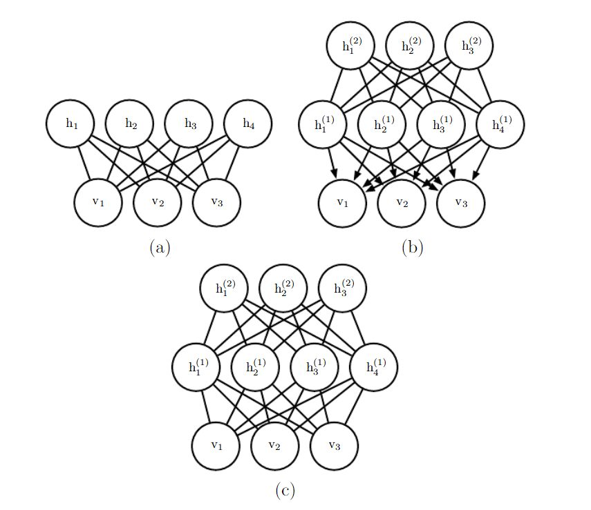

# 深度生成模型

### 玻尔兹曼机
在d维二值随机向量$x \in \left \{ 0,1 \right \}^{d}$上定义玻尔兹曼机。玻尔兹曼机是一种基于能量的模型，意味着我们可以使用能量函数定义联合概率分布：$$P\left ( x \right )=\frac{exp\left ( -E\left ( x \right ) \right )}{Z}$$其中$E(x)$是能量函数，Z是确保$\sum _{x}P(x)=1$的配分函数，玻尔兹曼机的能量函数如下：
$$E(x)=-x^{T}Ux-b^{T}x$$U是模型参数的权重矩阵，b是偏置向量。
这限制了观察到的变量和权重矩阵描述的变量之间相互作用的类型。具体来说，这意味着一个单元的概率由其他单元值的线性模型（逻辑回归）给出
具有隐藏单元（潜变量）的玻尔兹曼机不再局限于建模变量之间的线性关系。相反，玻尔兹曼机变成了离散变量上概率质量函数的万能近似器
正式地，将单元x分解为两个子集：可见单元v和潜在（或隐藏）单元h。能量函数变为：
$$E(v,h)=-v^{T}Rv-v^{T}Wh-h^{T}Sh-b^{T}v-c^{T}h$$
玻尔兹曼机的学习算法通常基于最大似然，配分函数都很难处理，最大似然梯度必须使用深度学习18章的技术来近似。

### 受限玻尔兹曼机
深度概率模型中最常见的组件之一。

RBM是包含一层可观察变量和单层潜变量的无向概率图模型。RBM可以堆叠起来组成更深的模型。（就像个全连接层，但它是个二分图。。。）
该模型的一个重要方面是在任何两个可见单元之间或任何两个隐藏单元之间没有直接的相互作用（因此称为"受限"，一般的玻尔兹曼机可以具有任意连接）
令观察曾有一组$n_{v}$个二值随机变量组成，我们统称为向量v。我们将$n_{h}$个二值随机变量的潜在或隐藏层记为向量h。
也是基于能量的模型，其联合概率分布由能量函数指定：$$P(v=v,h=h)=\frac{1}{Z}exp\left ( -E\left ( v,h \right ) \right )$$RBM的能量函数由下给出：
$$E(v,h)=-b^{T}v-c^{T}h-v^{T}Wh$$Z是配分函数的归一化常数：$$Z=\sum_{v}\sum _{h}exp\left \{ -E(v,h) \right \}$$
Z的计算很难处理，难解的配分函数Z意味着归一化联合概率分布$P(v)$也难以评估。

##### 1、条件分布
虽然$p(v)$难解，但RBM的二分图结构具有非常特殊的性质，其条件分布$P(h|v)$和$P(v|h)$是因子的，并且计算和采样是相对简单的。
从联合分布中导出条件分布是直观的：
$$P(h|v)=\frac{P(h,v)}{P(v)}=\frac{1}{P(v)} \frac{1}{Z} exp \left \{  b^{T}v+c^{T}h+v^{T}Wh \right \}$$ $$=\frac{1}{Z^{'}}exp \left \{ c^{T}h+v^{T}Wh \right \}=\frac{1}{Z'}exp \left \{ \sum _{j=1}^{n_{h}}c^{T}_{j}h_{j}+\sum _{n_{h}}^{j=1}v^{T}W_{:,j}h_{j} \right \}$$ $$= \frac{1}{Z^{'}} \prod _{j=1}^{n_{h}}exp\left \{ c^{T}_{j}h_{j}+v^{T}W_{:,j}h_{j} \right \}$$ $P(v)$可以视为常数。将向量h上的联合概率分布写成单独元素$h_{j}$上（为归一化）分布的乘积。
现在，原问题变成了对单个二值$h_{j}$上的分布进行归一化的简单问题。
$$P(h_{j}=1|v)=\frac{\widetilde{P}(h_{j}=1|v)}{\widetilde{P}(h_{j}=0|v)+\widetilde{P}(h_{j}=1|v)}$$ $$=\frac{exp\left \{ c_{j}+v^{T}W_{:,j} \right \}}{exp\left \{ 0 \right \} +exp \left \{ c_{j}+v^{T}W_{:,j} \right \}}=\sigma (c_{j}+v^{T}W_{:,j})$$

可以将关于隐藏层的完全条件分布表达为因子形式：
$$P(h|v)=\prod _{j=1}^{n_{h}}\sigma \left ( \left ( 2h-1 \right )\odot \left ( c+W^{T}v \right ) \right )_{j}$$同理$P(v|h)$的因子形式分布如下：$$P(v|h)=\prod _{i=1}^{n_{v}}\sigma \left ( \left ( 2v-1 \right )\odot \left ( b+Wh \right ) \right )_{i}$$

##### 2、训练受限玻尔兹曼机
因为RBM允许高效计算$\widetilde{P}(v)$的估计和微分，并且还允许高效地（以块吉布斯采样的形式）进行MCMC采样，所以我们很容易地使用深度学习第18章中训练具有难以计算配分函数模型的技术来训练RBM，这包括CD、SML（PCD）、比率匹配等。与深度学习中使用的其他无向模型相比，RBM可以相对直接地训练，因为我们可以以闭解形式计算$P(h|v)$。其他一些深度模型，比如深度玻尔兹曼机，同时具备难处理的配分函数和难以推断的难题。

### 深度信念网络
（deep belief network，DBN）
深度新年网络是具有若干潜变量层的生成模型。潜变量通常是二值的，而可见单元可以是二值或实数。在一般模型中，每层的单个连接到每个相邻层中的每个单元（没有层内连接）。顶部两层之间的连接是无向的，而所有其他层之间的连接是有向的，箭头指向最接近数据的层。

(a)受限玻尔兹曼机 (b) 深度信念网络 (c)深度玻尔兹曼机
具有l个隐藏层的DBN包含l个权重矩阵：$W^{(1)},\cdots,W^{(l)}$，同时也包含l+1个偏置向量：$b^{(0)},\cdots,b^{(l)}$，其中$b^{(0)}$是可见层的偏置。DBN表示的概率分布如下：
$$P(h^{(l)},h^{(l-1)}) \propto exp(b^{(l)^{T}}h^{(l)}+b^{(l-1)^{T}}h^{(l-1)}+h^{(l-1)^{T}}W^{(l)}h^{(l)}),$$ $$P(h_{i}^{(k)}=1|h^{(k+1)})=\sigma \left ( b_{i}^{(k)}+W_{:,i}^{(k+1)^{T}}h^{(k+1)} \right ) \forall i,\forall k\in 1,\cdots,l-2,$$ $$P\left ( v_{i}=1|h^{(1)} \right )=\sigma \left ( b_{i}^{(0)}+ W_{:,i}^{(1)^{T}}h^{{1}}\right ) \forall i$$在实值可见单元的情况下，替换：$$v \sim N(v;b^{(0)}+W^{(1)^{T}}h^{(1)},\beta ^{-1})$$ $\beta$为对角形式，只有一个DBN的隐藏层是RBN

### 有向生成网络

#### sigmoid 信念网络

#### 可微生成网络

#### 变分自编码器

$$
P_{\theta}(x)=\int P_{\theta}(z)P_{\theta}(x|z)dz
$$

通过附加的隐变量$z$对x的密度函数建模，这个密度函数是积分形式，无法对其直接优化。

$P_{\theta}(z)$是先验分布，尽量选用简单模型

$P_{\theta}(x|z)$可以用神经网络来对其建模

我们的目标是最大$P_{\theta}(x)$

后验分布$P_{\theta}(z|x)=\frac{P_{\theta}(x|z)P_{\theta}(z)}{P_{\theta}(x)}$，该后验分布仍然难解

定义一个额外的解码器网络$q_{\phi}(z|x)$去逼近$P_{\theta}(z|x)$(近似推断)
$$
\begin{equation}
\begin{aligned}
logP_{\theta}(x)&=E_{z\sim q_{\phi}(z|x)}logP_{\theta}(x)\\
&=E_{z\sim q_{\phi}(z|x)}log(\frac{P_{\theta}(x|z)P_{\theta}(z)}{P_{\theta}(z|x)})\\
&=E_{z\sim q_{\phi}(z|x)}log(\frac{P_{\theta}(x|z)P_{\theta}(z)q_{\phi}(z|x)}{P_{\theta}(z|x)q_{\phi}(z|x)})\\
&=E_{z\sim q_{\phi}(z|x)}logP_{\theta}(x|z)-E_{z\sim q_{\phi}(z|x)}log\frac{q_{\phi}(z|x)}{P_{\theta}(z)}+E_{z\sim q_{\phi}(z|x)}log\frac{q_{\phi}(z|x)}{P_{\theta}(z|x)}\\
&=E_{z\sim q_{\phi}(z|x)}logP_{\theta}(x|z)-D_{KL}(q_{\phi}(z|x)||P_{\theta}(z))+D_{KL}(q_{\phi}(z|x)||P_{\theta}(z|x))
\end{aligned}
\end{equation}
$$
上式的结果中第一项是尽量准确地重构我们的输入数据；第二项是缩短近似后验分布与先验分布的距离，希望隐变量z的分布遵循我们所希望的分布；第三项是大于或等于0的。

我们令
$$
L(x,\theta,\phi)=E_{z\sim q_{\phi}(z|x)}logP_{\theta}(x|z)-D_{KL}(q_{\phi}(z|x)||P_{\theta}(z))
$$
$L(x,\theta,\phi)$是可计算的下界$L(x,\theta, \phi) \leq logP_{\theta}(x)$ ,所以得到：
$$
\theta^{*},\phi^{*}=argmax_{\theta,\phi}\sum_{i=1}^{N}L(x^{(i)},\theta,\phi)
$$
生成自编码器方法是优雅的，并且易于实现。他也获得了出色的结果，是生成式建模中的最先进方法之一。它的主要缺点是从在图像熵训练的变分自编码群中采样的样本往往有些模糊。原因尚不清楚。问题不是VAE特有的，而是与优化对数似然或$D_{KL}(P_{data}||P_{model})$的生成模型共享的。现代VAE模型另一个麻烦的问题是，它们倾向于仅使用z维度中的小子集。

[VAE tensorflow实现](<https://github.com/altosaar/variational-autoencoder/blob/master/train_variational_autoencoder_tensorflow.py>)

#### 生成对抗网络

从一个简单的随机噪声中采样，比如高斯分布

生成器网络：尝试骗过生成器，通过产生一些很想真实图片的图片

判别器网络：尝试区别真实图片和假图片

minimax objective function:
$$
min_{\theta_{g}}max_{\theta_{d}}[E_{x \sim P_{data}}\underbrace{logD_{\theta_{d}}(x)}_{1}+E_{z \sim P(x)}log(1-\underbrace{D_{\theta_{d}}(G_{\theta_{g}}(z)))}_{2}]
$$
1：这是判别器网络在输入为真实数据（训练数据）时的输出；

2：判别器网络对于生成器网络生成数据的输出。

判别器网络的目的是（通过$\theta_{d}$）最大化目标函数，希望判别器能够明显区分真实图片和伪造图片

生成器网络的目的是（通过$\theta_{g}$）最小化目标函数，希望$G(z)$能够骗过判别器

***训练GANs***：

minimax objective function
$$
min_{\theta_{g}}max_{\theta_{d}}[E_{x \sim P_{data}}logD_{\theta_{d}}(x)+E_{z \sim P(x)}log(1-D_{\theta_{d}}(G_{\theta_{g}}(z)))]
$$
替换为：

1. 对判别器网络做梯度上升
   $$
   max_{\theta_{d}}[E_{x \sim P_{data}}logD_{\theta_{d}}(x)+E_{z \sim P(x)}log(1-D_{\theta_{d}}(G_{\theta_{g}}(z)))]
   $$

2. 

$$
min_{\theta_{g}}E_{z \sim P(z)}log(1-D_{\theta_{d}}(G_{\theta_{g}}(z)))
$$

实际上，优化生成器目标不是工作的很好。  

为了解决这个问题，第2步换成对生成器网络做梯度上升，目标函数如下：
$$
max_{\theta_{g}}E_{z \sim P(z)}log(D_{\theta_{d}}(G_{\theta_{g}}(z)))
$$
同样是希望骗过判别器，但现在在坏采样处拥有更高的梯度信号，工作得更好。

联合训练两个网络是具有挑战性的，可能是不稳定的。选择具有更好损失环境的目标有助于培训，这是一个活跃的研究领域。

[gan zoo](<https://github.com/hindupuravinash/the-gan-zoo>)

[训练GANs的小技巧](<https://github.com/soumith/ganhacks>)

GANS对超参数非常挑剔，并且需要训练许多轮。