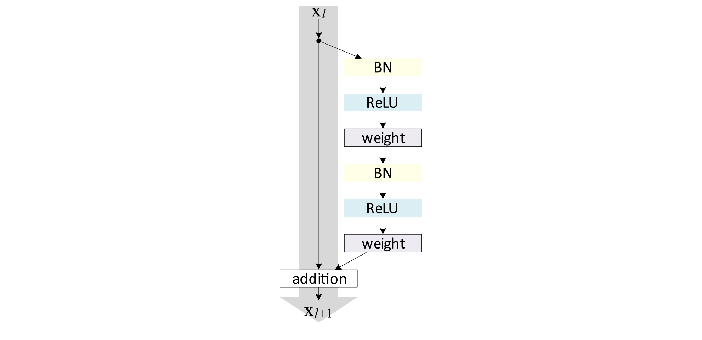
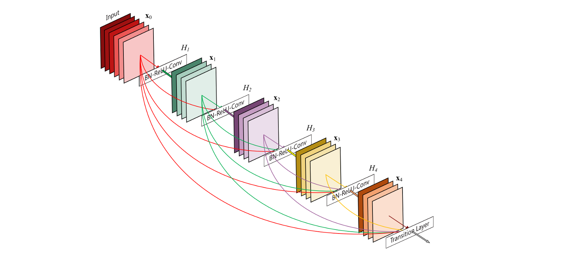

### ResNets, HighwayNets, and DenseNets

#### 为什么更深的一般网络无法有效工作
> 传统网络越深入，性能就会迅速下降。这个问题源于神经网络是如何通过反响传播来训练的。当网络被训练时，梯度信号必须在网络中向后传播，从顶层一直传播到最下层，以确保网络适当地更新自己。对于传统的网络，当它通过网络的每一层时，这个梯度会稍微减少。对于只有几层的网络，这不是问题。然而，对于一个由几十层以上的网络来说，当信号再次到达网络的起点是，梯度基本上就消失了。（非常接近于0）所以问题是设计一个网络，在这个网络中梯度可以更容易地到达网络的所有层，这既是以下先进的体系结构状态背后的目标：ResNets，HighwayNets和DenseNets

#### Residual Network
> 残差网络（ResNet）是一种神经网络结构，它以最简单的方式解决梯度消失问题。
> 在传统网络中，层的激活定义如下：
> $$y=f(x)$$
> 这里的$f(x)$可以是卷积，矩阵乘法，批归一化（BN）等，当梯度被反向传播时，梯度总是通过$f(x)$，这可能会由于涉及的非线性造成麻烦（梯度变得更小了）。而残差网络的每一层实现如下：
> $$y=f(x)+x$$
> $+x$就是捷径。它允许梯度直接向后传递，通过叠加这些层，梯度理论上可以跳过所有中间层，到达底部，而不会减小。虽然这是直觉，但是实际的实现要复杂一些。
> 在ResNet的最新版本中，$f(x)+x$采用了这种形式：
> 
> tensorflow实现如下：
```python
import tensorflow as tf
import numpy as np
import tensorflow.contrib.slim as slim

total_layers = 25 # 指定我们的网络有多深
units_between_stride = total_layers/5

def resUnit(input_layer, i):
    with tf.variable_scope("res_unit"+str(i)):
        part1 = slim.batch_norm(input_layer, activation_fn=None)
        part2 = tf.nn.relu(part1)
        part3 = slim.conv2d(part2, 64, [3, 3], activation_fn=None)
        part4 = slim.batch_norm(part3, activation_fn=None)
        part5 = tf.nn.relu(part4)
        part6 = slim.conv2d(part5, 64, [3, 3], activation_fn=None)
        output = input_layer + part6
        return output
    
tf.reset_default_graph()

input_layer = tf.placeholder(shape=[None, 32, 32, 3], dtype=tf.float32, name='input')
label_layer = tf.placeholder(shape=[None], dtype=tf.int32)
label_on = slim.layers.one_hot_encoding(label_layer, 10)

layer1 = slim.conv2d(input_layer, 64, [3, 3], normalizer_fn=slim.batch_norm, scope='conv_' + str(0))
for i in range(5):
    for j in range(units_between_stride):
        layer1 = resUnit(layer1, j + (i*units_between_stride))
    layer1 = slim.conv2d(layer1, 64, [3, 3], stride=[2, 2], normalizer_fn=slim.batch_norm, scope="conv_s_"+str(i))

top = slim.conv2d(layer1, 10, [3, 3], normalizer_fn=slim.batch_norm, activation_fn=None, scope='conv_top')

output = slim.layers.softmax(slim.layers.flatten(top))

loss = tf.reduce_mean(-tf.reduce_sum(label_oh*tf.log(output) + 1e-10, reducion_indices=[1]))
trainer = tf.train.AdamOptimizer(learning_rate=0.001)
update = trainer.minimize(loss)
```
#### Highway Network
> Highway Network保留了ReNet中的方法，但增加了一个可学习的参数，以确定每个层在多大程度上应该时跳过连接或非线性连接。Highway Network的层定义如下：
> $$y=H(x,W_{H})*T(x, W_{T})+x*(1-T(x,W_{T}))$$
> $y=H(x,Wh)$指代传统层，$y=H(x,Wh)+x$指代残差单元，$T(x,Wt)$确定信息应该在多大程度上通过主通路或跳过通路发送，tensorflow实现如下：
```python
import tensorflow as tf
import numpy as np
import tensorflow.contrib.slim as slim

total_layers = 25
units_between_stride = total_layers/5

def highwayUnit(input_layer, i):
    with tf.variable_scope("highway_unit"+str(i)):
        H = slim.conv2d(input_layer, 64, [3, 3])
        T = slim.conv2d(input_layer, 64, [3, 3], 
                        biases_initializer=tf.constant_initializer(-1.0), activation_fn=tf.nn.sigmoid)
        # 将偏置初始化为负，促使网络跳过连接
        output= H*T + input_layer*(1.0-T)
        return output

tf.reset_default_graph()

input_layer = tf.placeholder(shape=[None, 32, 32, 3], dtype=tf.float32, name='input')
label_layer = tf.placeholder(shape=[None], dtype=tf.int32)
label_oh = slim.layers.one_hot_encoding(label_layer, 10)

layer1 = slim.conv2d(input_layer, 64, [3, 3], normalizer_fn=slim.batch_norm, scope='conv_'+str(0))
for i in range(5):
    for j in range(units_between_stride):
        layer1 = highwayUnit(layer1, j+(i*units_between_stride))
    layer1 = slim.conv2d(layer1, 64, [3, 3], stride=[2, 2], normalizer_fn=slim.batch_norm, scope='conv_s_'+str(i))

top = slim.conv2d(layer1, 10, [3, 3], normalizer_fn=slim.batch_norm, activation_fn=None, scope='conv_top')

output = slim.layers.softmax(slim.layers.flatten(top))
trainer = tf.train.AdamOptimizer(learning_rate=0.001)
update = trainer.minimize(loss)
```

#### Dense Netwoks
> 如果从上一层跳过连接可以提高性能，为什么不及那个每一层连接到另一层？通过这种方式，总有一条信息通过网络向后传递的直接路径
> 
> DenseNet依赖于层的堆叠，从数学上看如下：
> $$y=f(x,x-1,x-2\cdots x-n)$$
> 这种架构在前向和后向设置中都有直观的意义。在前馈设置中，任务除了从高层特征激活中受益，还从底层特征激活中受益。例如，在对对象进行分类时，网络的较低层可能决定图像中的边缘，而较高的层将决定更大范围的特征，如人脸的存在。在某些情况下，能够使用关于边缘的信息可以帮助在复杂场景中确定正确的对象。在后向的情况下，将所有层连接起来允许我们快速地将梯度发送到网络中它们各自的位置。
> 在实现DenseNet时，我们不能把所有东西都连接起来。只有高度和宽度相同的层才可以堆叠。所以我们将一组卷积层密集地堆叠起来，然后应用一个striding或者pooling层，然后密集地堆叠另一组卷积层，等等。这可以在tensorflow中实现，如下所示：
```python
import tensorflow as tf
import numpy as np
import tensorflow.contrib.slim as slim

total_layers = 25
units_between_stride = total_layer/5

def denseBlock(input_layer, i, j):
    with tf.variable_scope("dense_unit"+str(i)):
        nodes = []
        a = slim.conv2d(input_layer, 64, [3, 3], normalizer_fn=slim.batch_norm)
        nodes.append(a)
        for z in range(j):
            b = slim.conv2d(tf.concat(nodes, 3), 64, [3, 3], normalizer_fn=slim.batch_norm)
            nodes.apppend(b)
        return b

tf.reset_default_graph()

input_layer = tf.placeholder(shape=[None, 32, 32, 3], dtype=tf.float32, name='input')
label_layer = tf.placeholder(shape=[None], dtype=tf.int32)
label_oh = slim.layers.one_hot_encoding(label_layer, 10)

layer1 = slim.conv2d(input_layer, 64, [3, 3], normalizer_fn=slim.batch_norm, scope='conv_'+str(0))
for i in range(5):
    layer1 = denseBlock(layer1, i, units_between_stride)
    layer1 = slim.conv2d(layer1, 64, [3, 3], stride=[2, 2], normalizer_fn=slim.batch_norm, scope='conv_s_'+str(i))

top = slim.conv2d(layer1, 10, [3, 3], normalizer_fn=slim.batch_norm, activation_fn=None, scope='conv_top')
output = slim.layers.softmax(slim.layers.flatten(top))

loss = tf.reduce_mean(-tf.reduce_sum(label_oh*tf.log(output)+1e-10, reduction_indices=[1]))
trainer = tf.train.AdamOptimizer(learning_rate=0.001)
update = trainer.minimize(loss)
```

