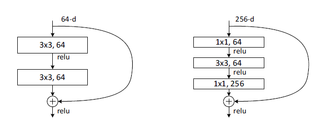
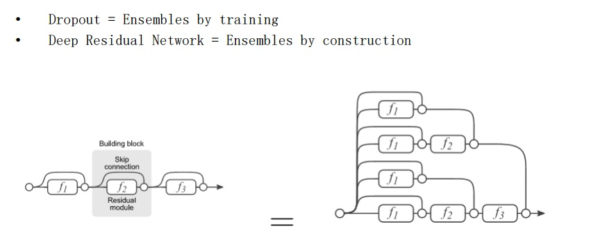

### ResNet

> 梯度消失和梯度爆炸是训练更深的网络十分困难的最主要原因。在残差网络提出之前，这个问题主要是通过规范化初始化和中间归一化层来缓解的，它使得具有数十层的网络通过反向传播和随机梯度下降开始收敛。当更深层次的网络开始收敛时，一个退化问题出现了：随着网络深度的增加，精确度达到饱和，然后迅速退化。这种退化并不是由于过拟合引起的，在一个合适的深度模型中增加更多的层会导致更高的训练误差。
> 和残差并没有什么关系
> H(x)是若干堆叠层（不一定是整个网络）要拟合的基础映射，x表示第一层的输入，F(x)是由多个非线性层表示的函数。假设多个非线性层可以渐进地逼近复杂函数，那么这就等于它们可以渐进地逼近残差函数（这不是残差函数。。。。）H(x)-x。因此，让这些层逼近残差函数$F(x):=H(x)-x$，而不是期望堆叠层数逼近H(x)。原来的函数就变成了F(x)+x。
> 如果增加的层可以被构建为恒等映射，那么更深的模型具有不超过其较浅版本的训练错误率。退化问题表明，求解器在通过多个非线性层来近似恒等映射方面有困难。利用残差学习重构，如果恒等映射是最优的，那么求解器可以简单地将多个线性层的权重毕竟0以接近恒等映射。
> 实际上，恒等映射不太可能是最佳的，但重构将有助于此问题做预处理。如果最优函数比0映射更接近恒等映射，那么求解器根据输入的恒等映射会更容易发现扰动，而不是将其作为一个全新的函数来学习。
> 捷径连接既不涉及外部参数也没有增加计算复杂度。如果f(x)和x的维度不相等（改变输入/输出通道），可以通过捷径连接执行线性投影$W_{s}$来匹配尺寸：
> $$y=F(x,{w_{i}})+w_{s}x$$
> 如果F只有一层公式就与线性层相似：$y=W_{1}x+x$,这样没有任何优势。
> ResNet在早期阶段提供更快的收敛来简化优化
> （一种理解）：
上面F是求和前网络映射，H是从输入到求和后的网络映射。
比如把5映射到5.1，
那么引入残差前是F'(5)=5.1，
引入残差后是H(5)=5.1, H(5)=F(5)+5, F(5)=0.1。
这里的F'和F都表示网络参数映射，引入残差后的映射对输出的变化更敏感。比如原来是从5.1到5.2，映射F'的输出增加了1/51=2%，而对于残差结构从5.1到5.2，映射F是从0.1到0.2，增加了100%。明显后者输出变化对权重的调整作用更大，所以效果更好。
残差的思想都是去掉相同的主体部分，从而突出微小的变化，看到残差网络我第一反应就是差分放大器...

恒等捷径VS投影捷径
> 投影捷径对解决退化问题并不重要，恒等捷径连接对于不增加瓶颈体系结构的复杂性非常重要
> 
> 无参数恒等捷径连接对于瓶颈架构非常重要。如果将图5（右）中的恒等捷径连接替换为投影，可以看到时间复杂度和模型大小加倍，这是因为该捷径连接到两个高纬度末端。所以恒等捷径连接可以为瓶颈设计提供更加高效的模型

> 观点来自[Residual Networks Behave Like Ensembles of
Relatively Shallow Networks](https://arxiv.org/pdf/1605.06431.pdf)
>残差网络并不是一个真正意义上极深的网络，而是隐式地由指数个大部分为浅层网络叠加而成的。由此该论文指出，查看网络之后除了可以看width和depth，其实还有另外一个维度就是multiplicity。该文章中比较关键的一个理论证明插图如下：

这样，残差网络和dropout有类似的功能，其实也可以用上面的图，一条路径就代表这一个网络的话，那么就是和dropout类似的，这样集成正则化的方式，也是能有效采用这样的加深网络的方式来提升模型性能。

```python
# resnet_v1

def res_block_v1(x, input_filter, output_filter):
    res_x = Conv2D(kernel_size=(3, 3), filters=output_filter, strides=1, padding="same")(x)
    res_x = BatchNormalization()(res_x)
    res_x = Activation("relu")(res_x)
    res_x = Conv2D(kernel_size=(3, 3), filters=output_filter, strides=1, padding="same")(res_x)
    res_x = BatchNormalization()(res_x)
    if input_filter == output_filter:
        identity = x
    else:
        identity = Conv2D(kernel_size=(1, 1), filters=output_filter, strides=1, padding="same")(x)
    x = keras.layers.add([identity, res_x])
    output = Activation("relu")(x)
    return output

def resnet_v1(x):
    x = Conv2D(kernel_size=(3, 3), filters=16, strides=1,padding="same", activation="relu")(x)
    x = res_block_v1(x, 16, 16)
    x = res_block_v1(x, 16, 32)
    x = Flatten()(x)
    outputs = Dense(10, activation="softmax", kernel_initializer="he_normal")(x)
    return outputs

```

```python
# resnet_v2

def res_block_v2(x, input_filter, output_filter):
    res_x = BatchNormalization()(x)
    res_x = Activation("relu")(res_x)
    res_x = Conv2D(kernel_size=(3, 3), filters=output_filter, strides=1, padding="same")(res_x)
    res_x = BatchNormalization()(res_x)
    res_x = Activation("relu")(res_x)
    res_x = Conv2D(kernel_size=(3, 3), filters=out_filter, strides=1, padding="same")(res)
    if input_filter == output_filter:
        identity = x
    else:
        identity = Conv2D(kernel_size=(1, 1), filters=out_filter, strides=1, padding="same")(x)
    output = keras.layers.add([identity, res_x])
    return output

def resnet_v2(x):
    x = Conv2D(kernel_size=(3, 3), filters=16, strides=1, padding="same", activation="relu")(x)
    x = res_block_v2(x, 16, 16)
    x = res_block_v2(x, 16, 32)
    x = BatchNormalization()(x)
    x = Flatten()(x)
    outputs = Dense(10, activation="softmax", kernel_size="he_normal")(y)
    return outputs
```

