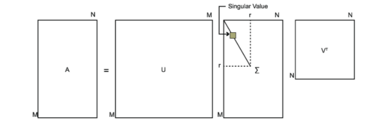

# SVD分解
奇异值分解(Singular Value Decomposition)
是机器学习领域广泛应用的算法，不光用于降维算法中的特征分解，还可以用于推荐系统，以及自然语言处理等领域，是很多机器学习算法的基石。

### 1.特征值和特征向量
>特征值和特征向量的定义如下:
$$A x=\lambda x$$
A - nxn的矩阵 x - n维向量 $\lambda$是矩阵A的一个特征值
x是矩阵A的特征值$\lambda$所对应的特征向量
求出特征值和特征向量，就可以将矩阵A特征分解。
若求出了矩阵A的n个特征值$$\lambda_{1}\leq \lambda _{2}\leq \cdots \leq \lambda _{n}$$，以及这n个特征值所对应的特征向量$\left \{ \omega _{1},\omega _{2},\cdots ,\omega_{n}\right \}$,如果这n个特征值所对应的特征向量线性无关，那么矩阵A就可以用以下的特征分解表示：
$$A=\omega \Sigma \omega^{-1}$$
$\omega$是这n个特征向量张成的特征矩阵，$\Sigma$是这n个特征值为主对角线的nxn维矩阵
一般会把$\omega$的这n个特征向量标准化，即满足$\left \| \omega \right \|_{2}=1$,也满足$\omega_{i}^{T} \omega_{i}=1$，此时这个n个特征向量为标准正交基，满足$\omega^{T} \omega=1$，即$\omega^{T}=\omega^{-1}$
这样特征分解表达式可以写为：
$$A=\omega \Sigma \omega^{T}$$
如果要进行特征分解，矩阵A必须为方阵，若A不是方阵，就需要用到SVD了

### 2.SVD的定义
> SVD也是对矩阵进行分解，SVD不要求分解的矩阵为方阵。假设我们的矩阵A是一个mxn的矩阵，那么我们定义矩阵的A的SVD为：
$$A = U\Sigma V^{T}$$

将A的转置和A做矩阵乘法，会得到nxn的方阵$A^{T}A$，对该方阵做特征分解，得到的特征值和特征向量满足下式：
$$\left ( A^{T}A \right )v_{i}=\lambda _{i}v_{i}$$
这样得到矩阵$A^{T}A$的n个特征值和对应的特征向量v了，将所有特征向量张成一个nxn的矩阵V，就是SVD公式中的v矩阵了。v中的特征向量叫做A的右奇异向量
将A和A的转置做矩阵乘法，会得到mxm的方阵$AA^{T}$，得到的特征值和特征向量满足下式：
$$\left ( AA^{T}\right ) u_{i}=\lambda_{i} u_{i}$$
这样就可以得到对应的m个特征值和特征向量了，将所有特征向量张成一个mxm的矩阵U，就是我们SVD公式里面的U矩阵了。U中的每个特征向量为A的左奇异向量。
对于$\Sigma$只需要求出每个奇异值$\sigma$就可以了。
我们注意到：
$$A=U \Sigma V^{T} \Rightarrow AV=U\Sigma \Rightarrow Av_{i}=\sigma_{i}u_{i} \Rightarrow \sigma_{i}=Av_{i}/u_{i}$$
这样就可以求出我们的每个奇异值，进而求出奇异值矩阵$\Sigma$。
关于上面解法的证明：
$$A=U\Sigma V^{T} \Rightarrow A^{T}=V\Sigma^{T}U^{T} \Rightarrow A^{T}A=\left ( V\Sigma^{T}U^{T}\right ) U\Sigma V^{T} = V\Sigma^{2} V^{T} $$
进一步可知：
$$\sigma_{i}=\sqrt \lambda_{i}$$
我们可以直接用上式求出奇异值（注意奇异值是都是非负） 

### 3.SVD的一些性质
> 对于奇异值，它和特征分解中的特征值类似，在奇异值矩阵中也是按照从大到小排列，而且奇异值的减少特别快，在很多情况下，前10%甚至1%的奇异值的和就占了全部的奇异值的和的99%以上的比例。我们可以用最大的k个的奇异值和对应的左右奇异向量来近似描述矩阵。也就是说：
$$A_{mxn}=U_{mxn}\Sigma_{mxn}V_{nxn}^{T} \approx U_{mxk}\Sigma_{kxk}V_{kxn}^T$$
k要比n小很多，也就是一个大的矩阵A可以用三个小的矩阵$U_{mxk}$,$\Sigma_{kxk}$,$V_{kxn}^{T}$来表示。

这样SVD可以用于PCA降维，数据压缩和去噪，也可以用于推荐算法，将用户和喜好对应的矩阵做特征分解，进而得到隐含的用户需求来做推荐

### 4.SVD用于PCA
在[PAC原理总结](pca.md)中，需要找到样本协方差矩阵$XX^{T}$的最大的d个特征向量，然后用这最大的d个特征向量张成的矩阵来做低维投影降维。这个过程中需要先计算出协方差矩阵$XX^{T}$，当样本数多样本特征多的时候，这个计算量是很大的。
PCA需要的是协方差矩阵$XX^{T}$最大的d个特征向量张成的矩阵。有一些SVD的实现算法可以不求出$XX^{T}$也可以也能求出我们的右奇异矩阵V。V就是我们在PCA中需要的降维后的坐标系矩阵。
左奇异矩阵有什么用？
假设我们的样本是mxn的矩阵x，如果我们通过SVD找到了矩阵$XX^{T}$最大的d个特征向量张成的mxd维矩阵U，则我们如果进行以下处理：$$X_{dxn}^{'}=U_{dxm}^{T}X_{mxn}$$可以得到一个dxn的矩阵x'，这个矩阵和原来的矩阵相比，行数从m减到了d，可见对行数进行了压缩。也就是说，左奇异矩阵可以用于行数的压缩，右奇异矩阵可以用于特征维度的压缩。

### 5.SVD小结
SVD的缺点是分解出的矩阵解释性往往不强。