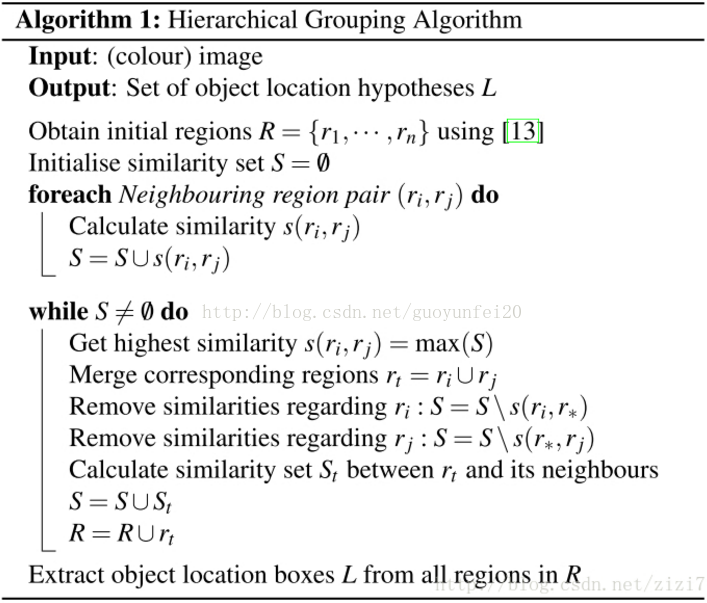

综述：目标检测的深度学习算法

目标检测模型相对于图像分类模型的显著优势就是提供了目标的定位

数据集：
+ [ PASCAL Visual Object Classification (PASCAL VOC)](http://host.robots.ox.ac.uk/pascal/VOC/)
+ ImageNet dataset
+ [ Common Objects in COntext (COCO) dataset](http://cocodataset.org/#home)

Intersect over Union（IoU）：
用于评估我们的预测边界框与地面真实边界框有多相似。比较两个盒子重叠面积占两个盒子总面积的比例

The formula for calculating IoU is as follows:

Calculating Overlapping Region：

Calculating Combined Region：
Combined Region = Area(boxA) + Area(boxB) - Overlapping Region

性能度量：
目标检测的挑战同时是一个回归和分类的任务。首先，为了评估空间精度，我们需要删除置信度较低的框（通常，模型输出的框比实际对象多得多）。然后使用Intersect over Union（IoU），它对应于预测框和真实框之间的重叠区域。IoU越高，对于给定的对象，框的预测位置就越好。通常，保持所有边界框的IoU大于某个阈值。
用于目标检测的常用度量称为mean average precision(mAP)。它只是在任务的所有分类中计算得到的平均精度（Average Precisions）的均值。（The mAP metric avoids to have extreme specialization in few classes and thus weak performances in others）

mAP得分一般值针对固定的IoU计算的，但是边界框的数量越多，候选框的数量就越多。

####Region-based Convolutional Network (R-CNN)
在目标检测时，为了定位到目标的具体位置，通常会把图像分成许多子块，然后把子块作为输入，送到目标识别的模型中。分子快最直接的方法叫做滑动窗口法（sliding window approach）。滑动窗口的方法就是按照子块的大小在整幅图像上穷举所以自图像块。（复杂度太高）

selective search（选择性搜索）：

选择性搜索算法使用[Efficient Graph-Based Image Segmentation](http://people.cs.uchicago.edu/~pff/papers/seg-ijcv.pdf)论文中的方法产生初始的分割区域作为输入。

被检测的区域根据各种颜色空间和相似性度量来合并

[RCNN 模型](http://islab.ulsan.ac.kr/files/announcement/513/rcnn_pami.pdf)：用select search检测候选区域，用深度学习找出这些区域的目标

这些区域被调整大小以匹配CNN的输入，我们从中提取4096维的特征向量，将特征向量输入多分类器，生成属于每个类的概率。这个特征向量还被喂给一个线性回归器，以适应区域的边界框形状，从而减少定位误差。

[Fast RCNN 模型](https://arxiv.org/pdf/1504.08083.pdf): 减少与分析所有区域所需的大量模型相关的时间消耗。一个具有多个卷积层的CNN将整个图像作为输入，而不是对每个区域使用CNN（R-CNN）。
用the selective search方法在生成的特征映射上检测出Region of Interests（RoIs） 。在形式上，利用RoI池化层来减小特征图的大小，得到为超参数的固定高度和宽度的有效RoI区域。每个RoI层喂给全连接层来创建特征向量。向量用softmax分类器来预测观察目标，用线性回归来调整边框位置。

整张图片被喂给CNN模型来检测特征映射上的Rol区域，每个区域使用RoI池化层分离然后喂给全连接层得到向量，在把向量喂给softmax分类器来检测目标，把向量喂给线性回归器来修改边框的坐标。

[Faster R-CNN 模型](https://arxiv.org/pdf/1506.01497.pdf):
用selective search检测区域在计算上时昂贵的。这里引出了Region Proposal Network(RPN)来直接生成区域，预测边框和检测目标。Faster RCNN 结合RPN和Fast R-CNN 模型。
CNN模型将整张图片作为输入并产生特征映射。3x3大小的窗口滑动所有的特征映射并输出特征向量到两个全连接层中，一个用于回归一个用于分类。

Faster R-CNN使用RPN来避免the selective search方法，加速了训练和测试过程，并提高了性能

[Region-based Fully Convolutional Network (R-FCN)](https://arxiv.org/pdf/1605.06409.pdf):
作者将这两个基本步骤合并到一个模型中，以同时考虑对象检测(位置不变)及其位置(位置变化)。ResNet-101模型将数据作为初始输入，最后一层输出特征映射，每一层都专门用于检测某个位置的类别。（比如某一层专门用来检测猫或者香蕉等等）这些特征映射被称为position-sensitive maps因为它们考虑了特定对象的空间定位。

同时，需要运行RPN来生成ROI，我们剪切每个ROI并计算每个区域的得分来确定最可能的目标。
R-FCN比Faster R-CNN更加快

[You Only Look Once (YOLO)](https://arxiv.org/pdf/1506.02640.pdf):
YOLO模型直接在单个网络在单次评估中预测边框和分类概率，YOLO允许实时预测

The Non-Maximum Suppression(NMS)方法应用在网络的最后。它包括将同一对象的高度重叠的边界框合并到一个单独的框中。

[Single-Shot Detector(SSD)](https://arxiv.org/pdf/1512.02325.pdf):
使用端到端CNN架构一次性预测所以的边界框和类概率。利用网络不同位置卷积层的特征映射来预测边界框，它们由一个带有3x3的滤波器的特殊卷积层（称为额外特征层）处理，生成一组边界框，类似于Faster R-CNN的anchor boxes

[YOLO9000 and YOLOv2](https://arxiv.org/pdf/1612.08242.pdf)

[Neural Architecture Search Net(NASNet)](https://arxiv.org/pdf/1611.01578.pdf):

它学习模型的体系结构以优化层数，同时提高给定数据集的准确性。
该方法应用于空间目标检测。

[Mask Region-based Convolutional Network (Mask R-CNN)](https://arxiv.org/pdf/1703.06870.pdf)

[YOLOv3](https://pjreddie.com/media/files/papers/YOLOv3.pdf)

[RetinaNet](https://arxiv.org/pdf/1708.02002.pdf)

Conclusion:
