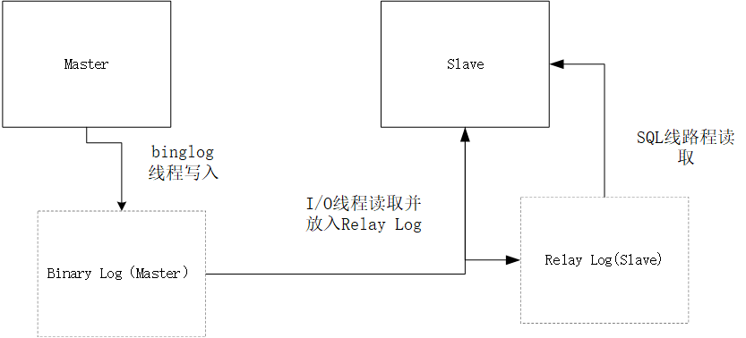

 [TOC]

# MySQL

## 数据库原理

### 数据库的三范式是什么？反范式是什么

数据库范式是**为解决关系数据库中数据冗余、更新异常、插入异常、删除异常问题而引入的**。简单的理解，数据库范式可以避免数据冗余，减少数据库的空间，并且减轻维护数据完整性的麻烦。

+ 第一范式（1NF）：强调属性的原子性约束，要求属性具有原子性，不可再分解
+ 第二范式（2NF）：第二范式，强调记录的唯一性约束，表必须有一个主键，并且没有包含在主键中的列必须完全依赖于主键，而不能只依赖于主键的一部分。
  + 版本表（版本编码，版本名称，产品编码，产品名称），其中主键是（版本编码，产品编码），这个场景中，数据库设计并不符合第二范式，因为产品名称只依赖于产品编码
+ 第三范式（3NF):强调属性冗余性的约束，即非主键列必须直接依赖于主键。
  + 订单表（订单编码，顾客编码，顾客名称），其中主键是（订单编码），这个场景中，顾客编码、顾客名称都完全依赖于主键，因此符合第二范式，但是顾客名称依赖于顾客编码，从而间接依赖于主键

**反模式**：

范式可以避免数据冗余，减少数据库的空间，减轻维护数据完整性的麻烦。

但通过数据库范式化设计，将导致数据库业务**涉及的表变多**，并且可能需要将涉及的业务表进行多表连接查询，这样将导致性能变差，且不利于分库分表。因此，出于性能优先的考量，可能在数据库的结构中需要使用反模式的设计，即**空间换取时间**，采取数据冗余的方式避免表之间的关联查询。

参考：

+ <http://blog.720ui.com/2017/mysql_core_07_anti-pattern/>
+ <https://www.zhihu.com/question/24696366>

## MySQL基础架构

### SQL与NoSQL

+ 性能：NoSQL基于键值对，不需要经过SQL层解析，性能高
+ 可扩展性：NoSQL基于键值对（Redis是键值对，也有基于文档的），数据间没有耦合性，容易水平扩展
+ 复杂查询：SQL便于多表的复杂查询
+ 事务支持

### MySQL服务器的逻辑架构分为几层

+ 第一层：服务层(为客户端服务):为请求做连接处理，授权认证，安全等。
+ 第二层：Mysql核心服务层：主要提供查询解析、分析、优化、缓存以及内置函数，跨存储引擎功能（存储过程、视图、触发器）
+ 第三层：存储引擎层，负责数据的存储和提取

### MySQL是如何处理客户端请求的

```Mermaid
graph LR;
客户端-->处理连接

处理连接-->查询缓存
查询缓存-->语法解析
语法解析-->查询优化
查询优化-->存储引擎
```

**处理链接**：客户端进程可以采用`TCP/IP、命名管道或共享内存、Unix域套接字`这几种方式之一来与服务器进程建立连接，每当有一个客户端进程连接到服务器进程时，服务器进程都会创建一个线程来专门处理与这个客户端的交互，当该客户端退出时会与服务器断开连接，服务器并不会立即把与该客户端交互的线程销毁掉，而是把它缓存起来，在另一个新的客户端再进行连接时，把这个缓存的线程分配给该新客户端。这样就起到了不频繁创建和销毁线程的效果，从而节省开销。从这一点大家也能看出，MySQL服务器会为每一个连接进来的客户端分配一个线程，但是线程分配的太多了会严重影响系统性能，所以我们也需要限制一下可以同时连接到服务器的客户端数量。在客户端程序发起连接的时候，需要携带主机信息、用户名、密码，服务器程序会对客户端程序提供的这些信息进行认证，如果认证失败，服务器程序会拒绝连接。另外，如果客户端程序和服务器程序不运行在一台计算机上，我们还可以采用使用了`SSL`（安全套接字）的网络连接进行通信，来保证数据传输的安全性。

**查询缓存**：MySQL服务器程序会将刚刚处理过的查询请求和结果缓存起来，如果下一次有一模一样的请求过来，就直接从缓存中查询结果。查询缓存可以在不同客户端之间共享，MySQL缓存系统会监测涉及的所有表，只要表的结构或者数据被修改，那使用该表的所有高速缓存查询都将变成无效并从高速缓存中删除。(MySql从5.7.20开始不推荐使用查询缓存，并在MySql8.0中删除)

**语法解析**：因为客户端程序发送过来的请求只是一段文本而已，所以MySQL服务器程序首先要对这段文本做分析，判断请求的语法是否正确，然后从文本中将要查询的表、各种查询条件都提取出来放到MySQL服务器内部使用的一些数据结构上来。 这个从指定的文本中提取出我们需要的信息本质上算是一个编译过程，涉及词法解析、语法分析、语义分析等阶段。

**查询优化**：因为我们写的MySQL语句执行起来效率可能并不是很高，MySQL的优化程序会对我们的语句做一些优化，优化的结果就是生成一个执行计划，这个执行计划表明了应该使用哪些索引进行查询，表之间的连接顺序是啥样的。我们可以使用`EXPLAIN`语句来查看某个语句的执行计划。

**存储引擎**：截止到服务器程序完成了查询优化为止，还没有真正的去访问真实的数据表，MySQL服务器把数据的存储和提取操作都封装到了一个叫存储引擎的模块里。我们知道表是由一行一行的记录组成的，但这只是一个逻辑上的概念，物理上如何表示记录，怎么从表中读取数据，怎么把数据写入具体的物理存储器上，这都是存储引擎负责的事情。为了实现不同的功能，MySQL提供了各式各样的存储引擎，不同存储引擎管理的表具体的存储结构可能不同，采用的存取算法也可能不同。

为了管理方便，人们把`连接管理`、`查询缓存`、`语法解析`、`查询优化`这些并不涉及真实数据存储的功能划分为**MySQL server**的功能，把真实存取数据的功能划分为**存储引擎**的功能。各种不同的存储引擎向上边的MySQL server层提供统一的调用接口（也就是存储引擎API），包含了几十个底层函数，像"读取索引第一条内容"、"读取索引下一条内容"、"插入记录"等等。

所以在**MySQL server**完成了查询优化后，只需按照生成的执行计划调用底层存储引擎提供的API，获取到数据后返回给客户端就好了。

### MySQL数据类型

MySQL支持多种类型，大致可以分为三类：

+ 数值
+ 日期/时间
+ 字符串(字符)类型
  + varchar(50) 中 50 的涵义最多存放 50 个字符。varchar(50) 和 (200) 存储 hello 所占空间一样，但后者在排序时会消耗更多内存

对于字符串类型主要有

+ char：255字节，定长
+ varchar：变长，最长65535字节，具体字符数由字符集决定
+ TEXT：总大小为65535字节

TEXT在MySQL内部大多存储格式为溢出页，效率不如CHAR

默认utf-8的情况下，英文字符：1个字符=1个字节，中文模式1字符=3字节

## MySQL缓存

my.cnf加入以下配置，重启Mysql开启查询缓存

```
query_cache_type=1
query_cache_size=600000
```

MySql执行以下命令也可开启查询缓存

```
set global  query_cache_type=1;
set global  query_cache_size=600000;
```

**开启查询缓存后在同样的查询条件以及数据情况下，会直接在缓存中返回结果**。这里的查询条件包括查询本身、当前要查询的数据库、客户端协议版本号等一些可能影响结果的信息。因此任何两个查询在任何字符上的不同都会导致缓存不命中。此外，如果查询中包含任何用户自定义函数、存储函数、用户变量、临时表、Mysql库中的系统表，其查询结果也不会被缓存。

缓存建立之后，Mysql的查询缓存系统会跟踪查询中涉及的每张表，如果这些表（数据或结构）发生变化，那么和这张表相关的所有缓存数据都将失效。

**缓存虽然能够提升数据库的查询性能，但是缓存同时也带来了额外的开销，每次查询后都要做一次缓存操作，失效后还要销毁。** 因此，开启缓存查询要谨慎，尤其对于写密集的应用来说更是如此。如果开启，要注意合理控制缓存空间大小，一般来说其大小设置为几十MB比较合适。此外，**还可以通过sql_cache和sql_no_cache来控制某个查询语句是否需要缓存：**

```sql
select sql_no_cache count(*) from usr;
```


## SQL语句

### DDL、DML和DCL

+ DDL：数据定义语言，主要用于定义或改变表（TABLE）的结构，数据类型，表之间的链接和约束等初始化工作，如CREATE、ALTER、DROP，TRUNCATE
+ DML：数据操作语言，用于处理数据，如SELECT（查询）、INSERT（添加）、UPDATE、DELETE、CALL、EXPLANIN PLAN、LOCK TABLE
+ DCL：数据控制语言，用来授予或回收访问数据库的某种特权，并控制数据库操纵事务发生的时间及效果，对数据库实行监视等。如COMMIT、SAVEPOINT、SET TRANSACTION

### drop、delete、truncate 比较

+ truncate用于清空表内的数据，delete如果不带where也会删除指定表的所有数据。但是truncate 和 delete 只删除数据不删除表的结构。truncate执行速度快
+ drop会将表删除，同时表的约束、触发器(trigger)、索引(index)也会删除。但依赖于该表的存储过程和函数会保留，但会变成无效
+ delete 操作会放到 rollback segement 中，事务提交之后才生效；如果有相应的 trigger，执行的时候将被触发。
truncate、drop 操作立即生效，原数据不放到 rollback segment 中，不能回滚，操作不触发 trigger
+ delete语句为DML，这个操作会被放到rollback segment中，事务提交后才会生效；truncate、drop是DLL（data define language),操作立即生效，原数据不放到 rollback segment中，不能回滚
+ truncate table 表名 速度快,而且效率高,因为: truncate table 在功能上与不带 WHERE 子句的 DELETE 语句相同：二者均删除表中的全部行。但 TRUNCATE TABLE 比 DELETE 速度快，且使用的系统和事务日志资源少。DELETE 语句每次删除一行，并在事务日志中为所删除的每行记录一项。TRUNCATE TABLE 通过释放存储表数据所用的数据页来删除数据，并且只在事务日志中记录页的释放。
+ 在速度上drop>truncate>delete。如果想删除部分数据用delete，注意带上where子句，回滚段要足够大；如果想删除表，当然用drop；如果想保留表而将所有数据删除，如果和事务无关，用truncate即可；如果和事务有关，或者想触发trigger，还是用delete；如果是整理表内部的碎片，可以用truncate跟上reuse stroage，再重新导入/插入数据。
### having与where的区别

1. 语法上：where 用表中列名，having用select结果别名
2. 作用时间：where用于分组(group by)前过滤，having用于分组后过滤
3. 索引：where 可以使用索引，having不能使用索引，只能在临时结果集操作
4. where后面不能使用聚集函数，having是专门使用聚集函数的

### mysql中in 和exists 区别

	in 关键字进行子查询时，内层查询语句仅仅返回一个数据列，这个数据列的值将提供给外层查询语句进行比较操作，比如select * from suppliers where s_id IN (select s_id from fruits where f_id='a2');。而exists关键字后面的参数是一个任意的子查询，系统对子查询进行运算以判断它是否返回行，如果至少返回一行，那么exists的结果为true ,此时外层的查询语句将进行查询；如果子查询没有返回任何行，那么exists的结果为false,此时外层语句将不进行查询。需要注意的是，当我们的子查询为 SELECT NULL 时，MYSQL仍然认为它是True。
	当外层查询小于子查询表，则使用exists，外层查询大于子查询表，则用in。exists是对外表做loop循环，每次loop循环再对内表（子查询）进行查询，那么因为对内表的查询使用的索引（内表效率高，故可用大表），而外表有多大都需要遍历，不可避免（尽量用小表），故内表大的使用exists，可加快效率；in是把外表和内表做hash连接，先查询内表，再把内表结果与外表匹配，对外表使用索引（外表效率高，可用大表），而内表多大都需要查询，不可避免，故外表大的使用in，可加快效率。如果用not in ，则是内外表都全表扫描，无索引，效率低，可考虑使用not exists，也可使用A left join B on A.id=B.id where B.id is null 进行优化。
### 连接查询与子查询的比较
使用子查询进行select语句嵌套查询，可以一次完成很多逻辑上需要多个步骤才能完成的SQL操作，子查询虽然很灵活但是执行效率不高，执行子查询时，MYSQL需要创建临时表，查询完毕后再删除这些临时表，子查询的速度会受到一定影响，多了创建和销毁临时表的过程。可以使用连接查询替代子查询，连接查询不需要建立临时表，其速度比子查询快。
### MySQL的Group By

满足“SELECT子句中的列名必须为分组列或列函数”

“列函数对于GROUP BY子句定义的每个组各返回一个结果”

Group by主要是为了和聚集函数一起使用。

**即使不使用聚集函数，对于每个分组也只返回一个结果**

`SELECT * FROM world GROUP BY world.continent ORDER BY world.area;` 也只会返回每个分组的第一个结果

**注意ORDER BY并不是对每个分组进行排序，而是对GROUP BY执行完后的虚拟表进行的排序**

### order by与索引

[]: https://blog.csdn.net/ShelleyLittlehero/article/details/79498943

### Mysql查询前n条记录

```mysql
SELECT column_name(s) FROM table_name LIMIT number;
```

### Mysql分页查询的优化

Mysql的分页查询十分简单，但是当数据量大的时候一般的分页就吃不消了。

传统分页查询：SELECT c1,c2,cn… FROM table LIMIT n,m

MySQL的limit工作原理就是先读取前面n条记录，然后抛弃前n条，读后面m条想要的，所以n越大，偏移量越大，性能就越差。

推荐分页查询方法：

**1、尽量给出查询的大致范围**

1. SELECT c1,c2,cn... FROM table WHERE id>=20000 LIMIT 10;

**2、子查询法**

1. SELECT c1,c2,cn... FROM table WHERE id>=
2. (
3. SELECT id FROM table LIMIT 20000,1
4. )
5. LIMIT 10;

**3、高性能MySQL一书中提到的只读索引方法**

优化前SQL:

1. SELECT c1,c2,cn... FROM member ORDER BY last_active LIMIT 50,5

优化后SQL:

1. SELECT c1, c2, cn .. .
2. FROM member
3. INNER JOIN (SELECT member_id FROM member ORDER BY last_active LIMIT 50, 5)
4. USING (member_id)

分别在于，优化前的SQL需要更多I/O浪费，因为先读索引，再读数据，然后抛弃无需的行。而优化后的SQL(子查询那条)只读索引(Cover index)就可以了，然后通过member_id读取需要的列。

**4、第一步用用程序读取出ID，然后再用IN方法读取所需记录**

程序读ID：

1. SELECT id FROM table LIMIT 20000, 10;
2. SELECT c1, c2, cn .. . FROM table WHERE id IN (id1, id2, idn.. .)

### 什么是视图？什么时候更新视图

在 SQL 中，视图是基于 SQL 语句的结果集的可视化的表。

视图包含行和列，就像一个真实的表。视图中的字段就是来自一个或多个数据库中的真实的表中的字段。我们可以向视图添加 SQL 函数、WHERE 以及 JOIN 语句，我们也可以提交数据，就像这些来自于某个单一的表。数据库的设计和结构不会受到视图中的函数、where 或 join 语句的影响。

```sql
create view view_name as select column_name(s) from table_name where condition;
```

视图总是显示最近的数据。每当用户查询视图时，数据库引擎通过使用 SQL 语句来重建数据。

### 触发器是什么，如何创建触发器
触发器是与表有关的数据库对象，在满足定义条件时触发，并执行触发器中定义的语句集合。触发器的这种特性可以协助应用在数据库端确保数据的完整性。
创建触发器的语法如下：

```
CREATE TRIGGER trigger_name trigger_time trigger_event ON tb_name FOR EACH ROW trigger_stmt
trigger_name：触发器的名称
tirgger_time：触发时机，为BEFORE或者AFTER
trigger_event：触发事件，为INSERT、DELETE或者UPDATE
tb_name：表示建立触发器的表，就是在哪张表上建立触发器
trigger_stmt：触发器的程序体，可以是一条SQL语句或者是用BEGIN和END包含的多条语句
所以可以说MySQL创建以下六种触发器：
BEFORE INSERT,BEFORE DELETE,BEFORE UPDATE
AFTER INSERT,AFTER DELETE,AFTER UPDATE
```


### 存储过程、触发器等作用。

存储过程是为了完成特定功能的SQL语句集，经编译创建并保存在数据库中，用户可通过指定存储过程的名字并给定参数(需要时)来调用执行

触发器是与表有关的数据库对象，在满足定义条件时触发，并执行触发器中定义的语句集合。

### 数据库自增主键可能的问题

单表的情况下数据库自增id并没有什么问题，在一张表分布到多个数据库的情况下，使用表自增将会出现id重复的问题

解决的办法：

* 每个数据库设置不同的开始id
* 也可以考虑设置不同的auto-increment-offset来错开

参见：

+ <https://www.cnblogs.com/binyue/p/5393749.html>
+ <https://www.zhihu.com/question/30674667>

**一张表，里面有 ID 自增主键，当 insert 了 17 条记录之后，删除了第 15,16,17 条记录，再把 MySQL 重启，再 insert 一条记录，这条记录的 ID 是 18 还是 15**:

+ 如果存储引擎是 InnoDB ，如果新增一条记录（不重启 MySQL 的情况下），这条记录的 ID 是18 ；但是如果重启 MySQL 的话，这条记录的 ID 是 15 。因为 InnoDB 表只把自增主键的最大 ID 记录到内存中，所以重启数据库或者对表 OPTIMIZE 操作，都会使最大 ID 丢失。
+ 如果引擎是 MyISAM ，那么这条记录的 ID 就是 18 。因为 MyISAM 表会把自增主键的最大 ID 记录到数据文件里面，重启 MYSQL 后，自增主键的最大 ID 也不会丢失。

### MySQL查询执行顺序

```Mysql
SELECT
DISTINCT <select_list>
FROM <left_table>
<join_type> JOIN <right_table>
ON <join_condition>
WHERE <where_condition>
GROUP BY <group_by_list>
HAVING <having_condition>
ORDER BY <order_by_condition>
LIMIT <limit_number>
```

在SQL语句的执行过程中，每一步都会产生一个虚拟表（Virtual Table，简称VT），用来保存SQL语句的执行结果

1. FROM 语句：FROM语句对两个表执行笛卡尔积，会得到一个虚拟表，暂且叫VT1
2. 执行ON过滤：执行完笛卡尔积以后，接着就进行ON join_condition条件过滤，得到VT2表
3. 添加外部行（外联结）：这一步只有在连接类型为OUTER JOIN时才发生，如LEFT OUTER JOIN（左连接）、RIGHT OUTER JOIN（右连接）。添加外部行的工作就是在VT2表的基础上添加保留表中被过滤条件过滤掉的数据，非保留表中的数据被赋予NULL值，最后生成虚拟表VT3
4. 执行WHERE过滤：对添加外部行得到的VT3进行WHERE过滤，只有符合 where_condition 的记录才会输出到虚拟表VT4中
5. 执行GROUP BY分组：GROU BY子句主要是对使用WHERE子句得到的虚拟表VT4进行分组操作。得到的内容会存入虚拟表VT5中，此时，我们就得到了一个VT5虚拟表
6. 执行HAVING过滤：对分组得到的VT5虚拟表进行条件过滤，然后得到虚拟表VT6
7. SELECT列表：从虚拟表VT6中选择出我们需要的内容，生成虚拟表VT7
8. 执行DISTINCT子句：如果在查询中指定了DISTINCT子句，则会创建一张内存临时表（如果内存放不下，就需要存放在硬盘了）。这张临时表的表结构和上一步产生的虚拟表VT7是一样的，不同的是对进行DISTINCT操作的列增加了一个唯一索引，以此来除重复数据
9. 执行ORDER BY子句：对虚拟表中的内容按照指定的列进行排序，然后返回一个新的虚拟表，上述结果会存储在VT8中
10. 执行LIMIT子句：LIMIT子句从上一步得到的VT8虚拟表中选出从指定位置开始的指定行数据

**注意**：分组后limit并不是对每个分组进行limit，而是对整个表进行limit

*LIMIT n,m表示从第n条记录开始选择m条记录。而很多开发人员喜欢使用该语句来解决分页问题。对于小数据，使用LIMIT子句没有任何问题，当数据量非常大的时候，使用`LIMIT n, m`是非常低效的。因为LIMIT的机制是每次都是从头开始扫描，如果需要从第60万行开始，读取3条数据，就需要先扫描定位到60万行，然后再进行读取，而扫描的过程是一个非常低效的过程。所以，对于大数据处理时，是非常有必要在应用层建立一定的缓存机制（现在的大数据处理，大都使用缓存）*

### MySQL UNION

MySQL UNION 操作符用于连接两个以上的 SELECT 语句的结果组合到一个结果集合中。多个 SELECT 语句会删除重复的数据。

**语法**

MySQL UNION 操作符语法格式：

```
SELECT expression1, expression2, ... expression_n
FROM tables
[WHERE conditions]
UNION [ALL | DISTINCT]
SELECT expression1, expression2, ... expression_n
FROM tables
[WHERE conditions];
```

**参数**

- **expression1, expression2, ... expression_n**: 要检索的列。
- **tables:** 要检索的数据表。
- **WHERE conditions:** 可选， 检索条件。
- **DISTINCT:** 可选，删除结果集中重复的数据。默认情况下 UNION 操作符已经删除了重复数据，所以 DISTINCT 修饰符对结果没啥影响。
- **ALL:** 可选，返回所有结果集，包含重复数据。

## 事务及锁

### 什么是事务

事务就是一组原子性的SQL语句，或者说一个独立的工作单元，事务内的语句要么全部执行成功，要么全部执行失败。

事务就是对一系列的数据库操作（比如插入多条数据）进行统一的提交或回滚操作。

==MySQL的事务是通过日志和锁来实现的==

### 事务的特性

1. 原子性（Atomicity）：事务被视为不可分割的最小单元，事务的所有操作要么全部提交成功，要么全部失败回滚。回滚可以用回滚日志来实现，回滚日志记录着事务执行前的数据。
2. 一致性（Consistency）：数据库在事务执行前后都保持一致性状态。在一致性状态下，所有事务对一个数据的读取结果都是相同的。
3. 隔离性（Isolation）：一个事务所做的修改在最终提交以前，对其它事务是不可见的。
4. 持久性（Durability）：一旦事务提交，则其所做的修改将会永远保存到数据库中。即使系统发生崩溃，事务执行的结果也不能丢失。使用**重做日志**来保证持久性。

只有满足一致性，事务的执行结果才是正确的。

**一致性关注数据的可见性，中间状态的数据对外部不可见，只有最初状态和最终状态的数据对外可见**

在无并发的情况下，事务串行执行，隔离性一定能够满足。此时只要能满足原子性，就一定能满足一致性。

在并发的情况下，多个事务并行执行，事务不仅要满足原子性，还需要满足隔离性，才能满足一致性。

事务满足持久化是为了能应对数据库崩溃的情况

转账的情况：

A账户减少，B账户增加

1. 原子性：要么全做、要么全不做
2. 一致性：指系统从一个正确的状态,迁移到另一个正确的状态。也就是说A、B的账户在经过转账操作前后里面的钱是正确的。
3. 隔离性：事务间应该不相互干扰，不同的转账操作间应该不能互相干扰
4. 持久性：主要是指在系统崩溃、机器出问题后，事务的执行的结果也不会丢失。这里就是指出现系统崩溃等情况下，转账的结果不会丢失，在系统恢复后，结果也能恢复

对于一致性

+ A要向B支付100元,而A的账户中只有90元,并且我们给定账户余额这一列的约束是,不能小于0.那么很明显这条事务执行会失败,因为90-100=-10,小于我们给定的约束了.
这个例子里,支付之前我们数据库里的数据都是符合约束的,但是如果事务执行成功了,我们的数据库数据就破坏约束了,因此事务不能成功,这里我们说事务提供了一致性的保证.然后我们再看个例子
+ A要向B支付100元,而A的账户中只有90元,我们的账户余额列没有任何约束.但是我们业务上不允许账户余额小于0.因此支付完成后我们会检查A的账户余额,发现余额小于0了,于是我们进行了事务的回滚.
这个例子里,如果事务执行成功,虽然没有破坏数据库的约束,但是破坏了我们应用层的约束.而事务的回滚保证了我们的约束,因此也可以说事务提供了一致性保证 
+ A要向B支付100元,而A的账户中只有90元,我们的账户余额列没有任何约束.然后支付成功了.
这里事务执行前和执行后,我们的系统没有任何的约束被破坏.一直都是保持正确的状态

参考：

+ [如何理解数据库事务中的一致性的概念？ - 孟波的回答 - 知乎](https://www.zhihu.com/question/31346392/answer/362597203)

### 在并发环境下，数据库可能出现的并发一致性问题

1. 脏读（读取未提交数据）：T1 修改一个数据，T2 随后读取这个数据。如果 T1 撤销了这次修改，那么 T2 读取的数据是脏数据。
2. 不可重复读（前后多次读取，数据内容不一致）：T2 读取一个数据，T1 对该数据做了修改。如果 T2 再次读取这个数据，此时读取的结果和第一次读取的结果不同
3. 幻读（前后多次读取，数据总量不一致）：T1 读取某个范围的数据，T2 在这个范围内插入新的数据，T1 再次读取这个范围的数据，此时读取的结果和第一次读取的结果不同。

所谓幻读，指的是当某个事务在读取某个范围内的记录时，另外一个事务又在该范围内插入了新的记录，当之前的事务再次读取该范围的记录时，会产生幻行

产生并发不一致主要原因是破坏事务的隔离性。解决方法是通过并发控制（锁）来保证隔离性。

### 不可重复读和幻读的区别

1. 不可重复读是读取了其他事务更改的数据，针对update操作
解决：使用行级锁，锁定该行，事务A多次读取操作完成后才释放该锁，这个时候才允许其他事务更改刚才的数据。

2. 幻读是读取了其他事务新增的数据，针对insert操作
解决：使用表级锁，锁定整张表，事务A多次读取数据总量之后才释放该锁，这个时候才允许其他事务新增数据。

### MySQL的事务隔离级别，默认的隔离级别

+ 未提交读（READ UNCOMMITTED）：最低的隔离级别，一个事务还没提交时，它做的变更就能被别的事务看到。可能会导致脏读、幻读或不可重复读
+ 提交读（READ COMMITTED）：一个事务提交之后，它做的变更才会被其他事务看到。可以阻止脏读，但是幻读或不可重复读仍有可能发生
+ 可重复读（REPEATABLE READ）：一个事务执行过程中看到的数据，总是跟这个事务在启动时看到的数据是一致的。可以阻止脏读和不可重复读，但幻读仍有可能发生。
+ 可串行化（SERIALIZABLE）：对于同一行记录，“写”会加“写锁”，“读”会加“读锁”。当出现读写锁冲突的时候，后访问的事务必须等前一个事务执行完成，才能继续执行。该级别可以防止脏读、不可重复读以及幻读

**默认的隔离级别是** ：可重复读

MySQL在可重复读的情况下数据冲突下并不会回滚

```sql
Transaction T1                       |    Transaction T2
start transaction;                   |
select v into @x from t where k = 1; | start transaction;
                                     | select v into @x from t where k = 1;
                                     | update t set v = @x*10 where k = 1;
                                     | commit;
update t set v = @x*10 where k = 1;  | --T2先提交
commit;                              |
```

假设T1/T2执行前

```sql
mysql> select * from t;
+---+------+
| k |    v |
+---+------+
| 1 |    1 |
| 2 |    2 |
| 3 |    3 |
+---+------+
```

执行后

```sql
mysql> select * from t;
+---+------+
| k | v    |
+---+------+
| 1 |   10 |
| 2 |    2 |
| 3 |    3 |
+---+------+
```

T2更新数据被覆盖了。所以这时就需要加锁，可以只对更新的行加锁

### 事务是如何通过日志来实现的

==通过Redo log 和Undo log实现的。==

**redo log**

redo log叫做**重做**日志，是用来实现事务的持久性。该日志文件由两部分组成：重做日志缓冲（redo log buffer）以及重做日志文件（redo log）,前者是在内存中，后者在磁盘中。当**事务提交之后**会把所有修改信息都会存到该日志中。

```mysql
start transaction;
select balance from bank where name="zhangsan";
// 生成 重做日志 balance=600
update bank set balance = balance - 400; 
// 生成 重做日志 amount=400
update finance set amount = amount + 400;
commit;
```


mysql 为了提升性能不会把每次的修改都实时同步到磁盘，而是会先存到Boffer Pool(缓冲池)里头，把这个当作缓存来用。然后使用后台线程去做**缓冲池和磁盘之间的同步**。

那么问题来了，如果还没来的同步的时候宕机或断电了怎么办？还没来得及执行上面图中红色的操作。这样会导致丢部分已提交事务的修改信息！

所以引入了redo log来记录已成功提交事务的修改信息，并且会把redo log持久化到磁盘，系统重启之后在读取redo log恢复最新数据。

**undo log**

undo log 叫做回滚日志，用于记录数据**被修改前**的信息。他正好跟前面所说的重做日志所记录的相反，重做日志记录数据被修改后的信息。undo log主要记录的是数据的逻辑变化，为了在发生错误时回滚之前的操作，需要将之前的操作都记录下来，然后在发生错误时才可以回滚。

每次写入数据或者修改数据之前都会把修改前的信息记录到 undo log。

**undo log 有什么作用？**

undo log 记录事务修改之前版本的数据信息，因此假如由于系统错误或者rollback操作而回滚的话可以根据undo log的信息来进行回滚到没被修改前的状态。


回滚日志是逻辑日志，也就是会按照日志逻辑地将数据库中的修改撤销掉看，可以理解为，我们在事务中使用的每一条 INSERT 都对应了一条  DELETE，每一条 UPDATE 也都对应一条相反的 UPDATE 语句

而重做日志是物理日志。重做日志由两部分组成，一是内存中的重做日志缓冲区，因为重做日志缓冲区在内存中，所以它是易失的，另一个就是在磁盘上的重做日志文件，它是持久的

当我们在一个事务中尝试对数据进行修改时，它会先将数据从磁盘读入内存，并更新内存中缓存的数据，然后生成一条重做日志并写入重做日志缓存，当事务真正提交时，MySQL 会将重做日志缓存中的内容刷新到重做日志文件，再将内存中的数据更新到磁盘上

在 InnoDB 中，重做日志都是以 512 字节的块的形式进行存储的，同时因为块的大小与磁盘扇区大小相同，所以重做日志的写入可以保证原子性，不会由于机器断电导致重做日志仅写入一半并留下脏数据

+ 因为事务在修改页时，要先记 undo log(回滚日志) ，在记 undo 之前要记 undo 的 redo， 然后修改数据页，再记数据页修改的 redo。 redo（里面包括 undo 的修改）一定要比数据页先持久化到磁盘。
+ 当事务需要回滚时，因为有 undo，可以把数据页回滚到前镜像的状态。
+ 崩溃恢复时，如果 redo log 中事务没有对应的 commit 记录，那么需要用 undo 把该事务的修改回滚到事务开始之前。如果有 commit 记录，就用 redo 前滚到该事务完成时并提交掉。

回滚日志（undo log）和重做日志（redo log），前者用于对事务的影响进行撤销，后者在错误处理时对已经提交的事务进行重做，它们能保证两点：

+ 发生错误或者需要回滚的事务能够成功回滚（原子性）；
+ 在事务提交后，数据没来得及写会磁盘就宕机时，在下次重新启动后能够成功恢复数据（持久性）

<https://draveness.me/mysql-transaction>
<https://www.letiantian.me/2014-06-18-db-undo-redo-checkpoint/>

### MySQL的MVCC含义，是如何实现的

实现方式：快照+版本号

https://baijiahao.baidu.com/s?id=1629409989970483292&wfr=spider&for=pc

MVCC是Innodb实现隔离级别的方式。MVCC是为了读写冲突不阻塞，如果是写写依然需要锁机制

MVCC指多版本并发控制，是为了应对高并发事务。Innodb引擎支持MVCC，MVCC只在 `READ COMMITTED(提交读)` 和 `REPEATABLE READ（可重复读）` 两个隔离级别下工作。

而未提交读隔离级别总是读取最新的数据行，无需使用 MVCC。可串行化隔离级别需要对所有读取的行都加锁，单纯使用 MVCC 无法实现

InnoDB会对每行数据加三个字段

+ `DB_TRX_ID`字段: 标记了最新更新这条行记录的transaction id，每处理一个事务，其值自动+1
+ `DB_ROLL_PTR`:指向当前记录项的rollback segment的 undo log(撤销日志记录), 找之前版本的数据就是通过这个指针。
+ `DB_ROW_ID`:包含一个随着新行插入而单调递增的行ID, 当由innodb自动产生聚集索引时，聚集索引会包括这个行ID的值

<!-- Innodb的MVCC实现：

版本号：

+ 系统版本号：是一个递增的数字，每开始一个新的事务，系统版本号就会自动递增。
+ 事务版本号：事务开始时的系统版本号。

MVCC 在每行记录后面都保存着两个隐藏的列，用来存储两个版本号：

+ 创建版本号：指示创建一个数据行的快照时的系统版本号；
+ 删除版本号：如果该快照的删除版本号大于当前事务版本号表示该快照有效，否则表示该快照已经被删除了

MVCC 使用到的快照存储在 Undo 日志中，该日志通过回滚指针把一个数据行（Record）的所有快照连接起来。

select：

+ T 所要读取的数据行快照的创建版本号必须小于 T 的版本号，因为如果大于或者等于 T 的版本号，那么表示该数据行快照是其它事务的最新修改 
+ T 所要读取的数据行快照的删除版本号必须大于 T 的版本号，因为如果小于等于 T 的版本号，那么表示该数据行快照是已经被删除的，不应该去读取它

insert：

将新插入的行的创建版本号设置为当前系统的版本号

delete：

将要删除的行的删除版本号设置为当前系统的版本号。

 UPDATE

将当前系统版本号作为更新前的数据行快照的删除版本号，并将当前系统版本号作为更新后的数据行快照的创建版本号。可以理解为先执行 DELETE 后执行 INSERT。

参见：https://www.cnblogs.com/chenpingzhao/p/5065316.html
https://www.cnblogs.com/xiaoboluo768/p/5152384.html -->

#### 总结

MVCC是行级锁的变种但它避免了读操作的加锁。它是通过版本号机制实现的，每个数据行都维护了两个隐藏的版本号字段：创建版本号和删除版本号。每开始一个事务，系统版本号都会递增，事务开始时刻的系统版本号作为事务的版本号，用来和查询到每行记录的版本号进行比较。

### 快照读与当前读

+ 快照读：使用 MVCC 读取的是快照中的数据，这样可以减少加锁所带来的开销。简单的select操作是快照读。在RR级别下，快照读是通过MVVC(多版本控制)和undo log来实现的
+ 当前读：读取的是最新的数据，需要加锁。select ... lock in share mode、select ... for update、insert、update、delete。当前读是通过加record lock(记录锁)和gap lock(间隙锁)来实现的

### 乐观锁与悲观锁

+ 悲观锁：指对数据被外界（包括本系统当前的其他事务，以及来自外部系统的事务处理）修改持保守态度，因此，在整个数据处理过程中，将数据处于锁定状态。悲观锁的实现，往往依靠数据库提供的锁机制
  在悲观锁的情况下，为了保证事务的隔离性，就需要一致性锁定读。读取数据时给加锁，其它事务无法修改这些数据。修改删除数据时也要加锁，其它事务无法读取这些数据
+ 乐观锁：乐观锁认为数据一般情况下不会造成冲突，所以在数据进行提交更新的时候，才会正式对数据的冲突与否进行检测。大多是基于数据版本（ Version ）记录机制或时间戳实现。即为数据增加一个版本标识，在基于数据库表的版本解决方案中，一般是通过为数据库表增加一个 “version” 字段来实现。读取出数据时，将此版本号一同读出，之后更新时，对此版本号加一。此时，将提交数据的版本数据与数据库表对应记录的当前版本信息进行比对，如果提交的数据版本号大于数据库表当前版本号，则予以更新，否则认为是过期数据

### 乐观锁demo
数据库没有原生的的乐观锁，数据库的乐观锁实现一般需要给表增加一个version或者timestamp列。

新表为：


在没有乐观锁的情况下，两个人同时对现有的price进行减一的操作，逻辑为：
```sql
# 先查数据(查到price为5)
select * from order where id = 1;
# 中间对于第一步查到的price减一，然后作为newPrice
# 第二步修改数据
update order set price = newPrice where id=1;
```
如果不加锁控制的话，可能出现两个线程同时查出price为5，然后两个线程分别将4设置为新的price，这是和预期的3是不符合的。因此，通常对于这种写写的问题，最直接的解决方法就是加锁，在select时直接获取加锁。

for update 是一种行级锁，即排他锁，一旦用户对某个行施加了行级锁，则该用户可以查询也可以更新（要看采用了什么存储引擎？）被加锁的数据行，其他用户只能查询但不能更新加锁的数据行，如果其他用户想更新，则也必须对该表施加行级锁，即使多个用户对一个表均使用了共享更新，但也不允许两个事务同时对一个表进行更新，真正对表进行更新时，是以独占方式锁表，一直到提交或复原该事务为止。行锁永远是独占方式锁。只有出现执行提交语句、退出数据库、程序停止运行才会释放共享更新锁。

即：

```sql
# 先查数据(查到price为5)
select * from order where id = 1 for update;
# 中间对于第一步查到的price减一，然后作为newPrice
# 第二步修改数据
update order set price = newPrice where id=1;
```
但这样带来的问题就是，频繁加锁，消耗资源并且影响系统的并发性。因此，采用乐观锁实现，即：
```sql
# 先查数据(查数据时也把version查出来)
select * from order where id = 1;
# 中间对于第一步查到的price减一，然后作为newPrice。记录下查询出来的version为oldVersion
# 第二步修改数据
update order set price = newPrice where id=1 and version=oldVersion;
```
这样在update外面增加一个while的逻辑即可实现自旋的乐观锁。

### 乐观锁和MVCC的区别

MVCC时用来解决读写冲突的无锁并发控制，也就是为事务分配单向增长的时间戳，为每个修改保存一个版本，版本与事务时间戳关联，读操作只读取事务开始前的数据库的快照。这样读不用阻塞写，避免了脏读和不可重复读。
乐观锁是一种用来解决写写冲突的无锁并发控制，认为事务间没有那么多争用，​所以先进行修改，在提交事务前，检查一下事务开始后，有没有新提交的改变，如果没有就提交，如果有就放弃并重试，乐观锁适用低数据争用，写冲突比较少的环境。

参见：https://www.zhihu.com/question/27876575

### Mysql的锁粒度

+ 表级锁：Mysql中锁定 粒度最大 的一种锁，对当前操作的整张表加锁，实现简单 ，资源消耗也比较少，加锁快，不会出现死锁 。其锁定粒度最大，触发锁冲突的概率最高，并发度最低，MyISAM和 InnoDB引擎都支持表级锁
+ 行级锁：Mysql中锁定 粒度最小 的一种锁，只针对当前操作的行进行加锁。 行级锁能大大减少数据库操作的冲突。其加锁粒度最小，并发度高，但加锁的开销也最大，加锁慢，会出现死锁。

InnoDB支持的行级锁。

+ Record Lock: 对索引项加锁，锁定符合条件的行。其他事务不能修改和删除加锁项；
+ Gap Lock: 对索引项之间的“间隙”加锁，锁定记录的范围（对第一条记录前的间隙或最后一条将记录后的间隙加锁），不包含索引项本身。其他事务不能在锁范围内插入数据，这样就防止了别的事务新增幻影行。
+ Next-key Lock： 锁定索引项本身和索引范围。即Record Lock和Gap Lock的结合。可解决幻读问题。

MyISAM采用表级锁，InnoDB支持行级锁和表级锁,默认为行级锁

### Innodb 行级锁

Innodb 的锁的策略为 next-key 锁，即 record lock + gap lock ，是通过在 index 上加 lock 实现的。

+ 如果 index 为 unique index ，则降级为 record lock 行锁。
+ 如果是普通 index ，则为 next-key lock 。
+ 如果没有 index ，则直接锁住全表，即表锁。

### InnoDB使用行级锁的语法

* 共享锁 `select * from 表 where 条件语句 lock in share mode`;
* 排他锁 `select * from 表 where 条件语句 for update`;

对于 UPDATE、 DELETE 和 INSERT 语句， InnoDB
会自动给涉及数据集加排他锁

### MySQL锁分类：共享锁（S锁）和排他锁（X锁），意向锁

表级锁和行级锁可以进一步划分为共享锁（s）和排他锁（X）

+ 共享锁（Share Locks，简记为S锁）又被称为读锁，其他用户可以并发读取数据，但任何事务都不能获取数据上的排他锁，直到已释放所有共享锁。
共享锁(S锁)又称为读锁，若事务T对数据对象A加上S锁，则事务T只能读A；其他事务只能再对A加S锁，而不能加X锁，直到T释放A上的S锁。这就保证了其他事务可以读A，但在T释放A上的S锁之前不能对A做任何修改。

+ 排它锁（(Exclusive lock,简记为X锁)）又称为写锁，若事务T对数据对象A加上X锁，则只允许T读取和修改A，其它任何事务都不能再对A加任何类型的锁，直到T释放A上的锁。它防止任何其它事务获取资源上的锁，直到在事务的末尾将资源上的原始锁释放为止。在更新操作(INSERT、UPDATE 或 DELETE)过程中始终应用排它锁。
即加S锁后，其他事务可以加S锁但不能加X锁，但只能读数据。加X锁，其他事务不能加锁，加X锁后可以读写数据

**意向锁**：

意向锁只有innodb引擎支持，是一种表锁。

+ 意向共享锁（intention shared lock, IS）：事务有意向对表中的某些行加共享锁（S锁）。在获取某些行的 S 锁之前必须获得IS锁
+ 意向排他锁（intention exclusive lock, IX）：事务有意向对表中的某些行加排他锁（X锁）。事务要获取某些行的 X 锁，必须先获得表的 IX 锁。

意向锁是引擎自己维护的，用户无法操作意向锁

**意向锁不会与行级的共享 / 排他锁互斥**!!

**意向锁存在的意义**：如果另一个任务试图在该表级别上应用共享或排它锁，则受到由第一个任务控制的表级别意向锁的阻塞。第二个任务在锁定该表前不必检查各个页或行锁，而只需检查表上的意向锁。

在存在行级锁和表级锁的情况下，事务 T 想要对表 A 加 X 锁，就需要先检测是否有其它事务对表 A 或者表 A 中的任意一行加了锁，那么就需要对表 A 的每一行都检测一次。这样很耗时。

通过意向锁可以解决问题，意向锁会与普通的排他 / 共享锁（这里的锁指表锁）互斥。在事务T检测到有其它事务持有意向排他锁，则对该表加锁就会被阻塞，而无需检测每一行。

意向锁之间互不排斥，但除了 IS 与 S 兼容外，意向锁会与 共享锁 / 排他锁 互斥。

**IX，IS是表级锁，不会和行级的X，S锁发生冲突。只会和表级的X，S发生冲突。**

**意向锁在保证并发性的前提下，实现了行锁和表锁共存且满足事务隔离性的要求。**

参考：<https://juejin.im/post/5b85124f5188253010326360>

## Mysql索引

### 索引是什么？作用？使用场景？为什么索引能提高查询速度（和索引的原理相关）？

索引（Index）是帮助MySQL高效获取数据的数据结构。

**作用**提高数据查询的效率，就像书的目录一样

MySQL 中存储引擎使用类似的方式进行查询，先去索引中查找对应的值，然后根据匹配的索引找到对应的数据行

Mysql索引使用的数据结构主要有**BTree索引** 和 **哈希索引** 。对于哈希索引来说，底层的数据结构就是哈希表，因此在绝大多数需求为单条记录查询的时候，可以选择哈希索引，查询性能最快；其余大部分场景，建议选择BTree索引。

**为什么能提高查询速度**:

+ MySQL的基本存储结构：数据页的形式，使得查找的速度是O(n)。如果在表比较大时速度较慢

  MySQL存储数据是以页为基本数据结构的，各个数据页可以组成一个双向链表，每个数据页中的记录又可以组成一个单向链表。如果不使用索引在查找时需要先遍历双向链表，找到所在的页从所在的页内中查找相应的记录:如果是主键查询可以采用二分查找，但如果不是根据主键查询，就只能遍历所在页的单链表

+ 索引：通过索引可以将无序的数据变成有序。B+树索引就是为记录建立B+树来提高查询的速度

**MyISAM:** B+Tree叶节点的data域存放的是数据记录的地址。在索引检索的时候，首先按照B+Tree搜索算法搜索索引，如果指定的Key存在，则取出其data域的值，然后以data域的值为地址读取相应的数据记录。这被称为“非聚簇索引”。

**InnoDB:** 其数据文件本身就是索引文件。相比MyISAM，索引文件和数据文件是分离的，其表数据文件本身就是按B+Tree组织的一个索引结构，树的叶节点data域保存了完整的数据记录。这个索引的key是数据表的主键，因此InnoDB表数据文件本身就是主索引。这被称为“聚簇索引（或聚集索引）”。而其余的索引都作为辅助索引，辅助索引的data域存储相应记录主键的值而不是地址，这也是和MyISAM不同的地方。**在根据主索引搜索时，直接找到key所在的节点即可取出数据；在根据辅助索引查找时，则需要先取出主键的值，在走一遍主索引。** **因此，在设计表的时候，不建议使用过长的字段作为主键，也不建议使用非单调的字段作为主键，这样会造成主索引频繁分裂。**

### 索引的优缺点

**优点**：

+ 提高数据的检索速度，降低数据库IO成本：使用索引的意义就是通过缩小表中需要查询的记录的数目从而加快搜索的速度。
+ 降低数据排序的成本，降低CPU消耗：索引之所以查的快，是因为先将数据排好序，若该字段正好需要排序，则正好降低了排序的成本。

**缺点**：

+ 占用存储空间：索引实际上也是一张表，记录了主键与索引字段，一般以索引文件的形式存储在磁盘上。
+ 降低更新表的速度：表的数据发生了变化，对应的索引也需要一起变更，从而减低的更新速度。否则索引指向的物理数据可能不对，这也是索引失效的原因之一

### 索引的常见模型

* 哈希表 hash表的key不是有序的，因此哈希表这种结构适用于只有**等值查询**的场景，如果进行**范围查询效率很低**
* 有序数组 在等值查询和范围查询场景中的性能就都非常优秀，但有序数组固有的弊端就是维护成本太大，插入记录时需要挪动后面的记录。因此，有序数组索引只适用于静态存储引擎，即创建后不会修改的数据。
* 搜索树 一般采用多叉树，如B+树

### 数据库有哪些索引？原理是什么？

1. 普通索引:这是最基本的索引类型，而且它没有唯一性之类的限制

2. 唯一索引:这种索引和前面的“普通索引”基本相同，但有一个区别：索引列的所值都只能出现一次，即必须唯一。

3. 主键索引：特殊的唯一索引，不允许有空值

4. 全文索引:MySQL从3.23版开始支持全文索引和全文检索。在MySQL中，全文索引索引类型为FULLTEXT。全文索引可以在VARCHAR或者TEXT类型的列上创建。

5. 复合索引：复合索引指多个字段上创建的索引，遵循”最左前缀“原则

   左前缀原则指的是，如果查询的时候查询条件精确匹配索引的左边连续一列或几列，则此列就可以被用到

6. 外键索引：只有InnoDB类型的表才可以使用外键索引，保证数据的一致性、完整性和实现级联操作。

**另一种分类**：从数据结构方面

1. B+Tree 索引：大多数 MySQL 存储引擎的默认索引类型，
2. 哈希索引：哈希索引能以 O(1) 时间进行查找，但是失去了有序性：无法用于排序与分组；只支持精确查找，无法用于部分查找和范围查找。InnoDB 存储引擎有一个特殊的功能叫“自适应哈希索引”，当某个索引值被使用的非常频繁时，会在 B+Tree 索引之上再创建一个哈希索引，这样就让 B+Tree 索引具有哈希索引的一些优点，比如快速的哈希查找
3. 全文索引：MyISAM 存储引擎支持全文索引，用于查找文本中的关键词，而不是直接比较是否相等。查找条件使用 MATCH AGAINST，而不是普通的 WHERE。全文索引使用倒排索引实现，它记录着关键词到其所在文档的映射。InnoDB 存储引擎在 MySQL 5.6.4 版本中也开始支持全文索引
4. 空间数据索引：MyISAM 存储引擎支持空间数据索引（R-Tree），可以用于地理数据存储

**原理：索引是数据结构，是数据库管理系统中一个排序的数据结构，以协助快速查询、更新数据库表中数据。索引的实现通常使用B树及其变种B+树，或者hash。MySQL就普遍使用B+Tree实现其索引结构。**

### 最左前缀匹配原则

在MySQL建立联合索引时会遵守最左前缀匹配原则，即最左优先，在检索数据时从联合索引的最左边开始匹配。

 　要想理解联合索引的最左匹配原则，先来理解下索引的底层原理。索引的底层是一颗B+树，那么联合索引的底层也就是一颗B+树，只不过联合索引的B+树节点中存储的是键值。由于构建一棵B+树只能根据一个值来确定索引关系，所以数据库依赖联合索引最左的字段来构建。

举例：创建一个（a,b）的联合索引

可以看到a的值是有顺序的，1，1，2，2，3，3，而b的值是没有顺序的1，2，1，4，1，2。但是我们又可发现a在等值的情况下，b值又是按顺序排列的，但是这种顺序是相对的。这是因为MySQL创建联合索引的规则是首先会对联合索引的最左边第一个字段排序，在第一个字段的排序基础上，然后在对第二个字段进行排序。所以b=2这种查询条件没有办法利用索引。

可以使用explain来显式查询语句执行过程中有没有走索引

#### mysql 查询优化器

如果建的索引是 (name, cid)。而查询的语句是 cid=1 AND name=’小红’。为什么还能利用到索引？

当按照索引中所有列进行精确匹配（“=” 或 “IN”）时，索引可以被用到，并且 type 为 const。理论上索引对顺序是敏感的，但是由于 MySQL 的查询优化器会自动调整 where 子句的条件顺序以使用适合的索引，所以 MySQL 不存在 where 子句的顺序问题而造成索引失效

### MySQL索引为什么要用B+树实现（也适合为什么不用B树）

本质原因是mysql数据是存放在外部存储上的，也就是说磁盘IO才是性能瓶颈的关键，所以我们需要的是减少树的深度，所以我们需要更多分叉的树。

磁盘：

+ 系统从磁盘读取数据到内存时是以磁盘块（block）为基本单位的，位于同一个磁盘块中的数据会被一次性读取出来
+ InnoDB 每次申请磁盘空间时都会是若干地址连续磁盘块来达到页的大小 16KB 。InnoDB 在把磁盘数据读入到磁盘时会以页为基本单位，在查询数据时如果一个页中的每条数据都能有助于定位数据记录的位置，这将会减少磁盘 I/O 次数，提高查询效率

B-Tree 结构的数据可以让系统高效的找到数据所在的磁盘块

* B+树的磁盘读写代价更低，因为B+树的所有非叶子节点只会存放索引信息，而真正的数据信息都只存放在叶子节点中，这样一来，每个非叶子节点存放的索引信息就更多，一次磁盘IO就可以读取更多的索引信息到内存中，可以减少磁盘IO的次数。
* B+树的查询效率更加稳定，由于非叶子节点只存索引信息，而没有真正的数据信息，所以任何关键字的查找必须走一条从根结点到叶子结点的路。所有关键字查询的路径长度相同，导致每一个数据的查询效率相当。
* B+树更加适合在区间查询的情况，由于B+树的数据都存储在叶子结点中（一般会使用指针将叶子节点串起来），非叶子结点均为索引，只需要扫一遍叶子结点即可得到所有数据信息，但是B树因为其非叶子结点同样存储着数据，我们要找到具体的数据，需要进行一次中序遍历按序来扫，所以B+树更加适合在区间查询的情况，所以通常B+树用于数据库索引。

参见：

+ <https://my.oschina.net/chener/blog/1603098>
+ <https://blog.csdn.net/xiedelong/article/details/81417049>

### 为什么用B+树？为什么不用AVL树、红黑树、B树（也就是几个树的对比，各自的优缺点）

AVL树和红黑树在数据较多时，树的深度都会比较大，使得IO读写比较频繁，这样效率比较低。

而B树、B+树是多叉树，每层的结点较多，使得树的深度较小，可以减小磁盘IO次数。

B树每个结点都有data域，而B+树只有叶结点的data域。

### 聚簇索引和非聚簇索引区别

+ 聚簇索引（主键索引）：以主键创建的索引,以主键值的大小为页和记录的排序规则，叶子节点存储的是整行数据。该索引中**索引的逻辑顺序与物理磁盘上行的物理存储顺序相同**，
+ 非聚簇索引（非主键索引/二级索引/辅助索引）：以自定义的列的大小为页和记录的排序规则，在叶子节点处存储的记录内容是列 + 主键。然后再根据主键查询数据（回表操作）。非聚集索引中索引的逻辑顺序与磁盘上行的物理存储顺序不同，一个表中可以拥有多个非聚集索引


图中是辅助索引，key是用于查找的，也就是索引列，值是主键。

辅助索引与聚集索引的区别在于辅助索引的叶子节点并不包含行记录的全部数据，而是存储相应行数据的聚集索引键，即主键。当通过辅助索引来查询数据时，需要进过两步：

+ 首先，InnoDB 存储引擎会遍历辅助索引找到主键。
+ 然后，再通过主键在聚集索引中找到完整的行记录数据。

如果索引包含所有满足查询需要的数据的索引成为覆盖索引，不需要回表操作。如索引(username,age)，查询数据的时候：`select username , age from user where username = 'Java3y' and age = 20`。明显查询时会用索引，且需要的数据都在索引中，所以不再需要回表。

InnoDB 索引是聚簇索引(“聚簇”表示数据行和相邻的键值紧凑地存储在一起,据的物理存放顺序与索引顺序是一致的)，MyISAM 索引是非聚簇索引(表数据存储顺序与索引顺序无关)

参考：

<https://www.jianshu.com/p/54c6d5db4fe6>

### 聚簇索引的注意点

聚簇索引表最大限度地提高了 I/O 密集型应用的性能

1. 插入速度严重依赖于插入顺序，按照主键的顺序插入是最快的方式，否则将会出现页分裂(树的结构因为插入不规则数据而发生改变)严重影响性能。因此，对于 InnoDB 表，我们一般都会定义一个自增的 ID 列为主键。（为什么要自增ID）
2. 更新主键的代价很高，因为将会导致被更新的行移动。因此，对于InnoDB 表，我们一般定义主键为不可更新

### 在创建表时没有显示的定义主键，innodb会如何做

+ 首先判断表中是否有非空的唯一索引，如果有，即为主键
+ 如果有多个非空唯一索引时，InnoDB存储引擎将选择建表时第一个定义的非空唯一索引作为主键
+ 如果不符合上述条件，InnoDB存储引擎自动创建一个6字节大小的指针作为索引

### MyISAM 索引实现

MyISAM 索引文件和数据文件是分离的，索引文件仅保存数据记录的地址。


### 索引最左匹配原则是什么

在mysql建立联合索引时会遵循最左前缀匹配的原则，即最左优先。指的是查询要从索引的最左前列开始，不能跳过中间的索引，例如：联合索引index(a,b,c)，可用的索引为a|ab|abc。如果查询的是(b,c)这种组合则无法使用索引

### 覆盖索引

如果一个索引包含了（或覆盖了）满足查询语句中字段与条件的数据就叫做覆盖索引

当一条查询语句符合覆盖索引条件时，sql只需要通过索引就可以返回查询所需要的数据，这样避免了查到索引后再返回表操作，减少I/O提高效率

遇到以下情况，执行计划不会选择覆盖查询

1.select选择的字段中含有不在索引中的字段 ，即索引没有覆盖全部的列。
2.where条件中不能含有对索引进行like的操作。

### 索引失效的情况

* 不能在索引列上干任何操作(计算,函数,类型转换)
* 存储引擎不能使用索引中范围条件右边的列
* mysql在使用不等于(!=或者<>)的时候索引失效
* is null, is not null 也无法使用索引
* like以通配符开头("%abc..."),索引会失效
* 字符串不加单引号,索引会失效
* 使用or的时候索引会失效

全值匹配我最爱，最左前缀要遵守；

带头大哥不能死，中间兄弟不能断；

索引列上少计算，范围之后全失效；

LIKE百分写最右，覆盖索引不写星；

不等空值还有or，索引失效要少用。

范围列可以用到索引，但是范围列后面的列无法用到索引，索引最多用于一个范围列，**如果查询条件中有两个范围列则无法全用到索引**

### 高性能的索引策略

1. 使用独立的列，即索引列不能是表达式的一部分，不能是函数的参数
2. 建立联合索引，而不是为每个列单独创建索引
3. 选择合适的索引顺序
4. 尽可能使用覆盖索引
5. 利用索引减少Innodb访问的行数，减少锁的数量

### 数据库建索引有哪些考虑

1. 表的主键、外键必须有索引
2. 经常与其他表进行连接的表，在连接字段上应该建立索引
3. where子句中的字段应该建立索引
4. 数据量大的表才建立索引
5. 索引应该建立在选择性高的字段上
6. 根据情况创建复合索引，复合索引可以提高查询效率
7. 索引应该建在小字段上，对于大的文本字段甚至超长字段，不要建索引
8. 频繁进行数据操作的表，不应该建立太多索引

索引基数（cardinality）：索引中不重复的索引值的数量。`show index from table`可以查看索引基数，是估计值，因为数据是变的，所以也会变

索引列的基数越大，索引效果越好。基数大表示该列的值重复较少，这时候查询比较快。如果一个列的数据只有两种那索引就没有用处。

查询优化器如果发现某个值出现在表的数据行中的百分比很高的时候（30%），它一般会忽略索引，进行全表扫描

### 索引题目

列为a,b,c,d,e，数据类型均为int

索引为(b,c,d)，`where b=1 and c>2 and d=4`,则用到了索引(b,c)。因为索引范围列的右边不能用

在用explain分析时，`key_len`表示索引列的长度，如果一个列是允许null的，则在计算度时会加1字节，所以上面用到的索引的长度是4*2+2=10

索引为(b,c,d,e)，`where b=1 and c=2 and e>4 and d=4`,会用到(b,c,d,e)，where后面的顺序不会影响到索引

`where b=1 and c=2 and d>4 and e>4`，会用到索引(b,c,d)

参考：

https://blog.csdn.net/u013164931/article/details/82386555

### Innodb和MyISAM在索引上的区别

* Innodb为聚集索引，索引文件和数据文件是绑在一起的，树的叶节点的data域保存的就是完整的数据记录；
* MyISAM是非聚集索引，​索引文件和数据文件是分离的，树叶节点的data域仅保存数据记录的地址。需要再寻址一次才能得到数据
* InnoDB 非主键索引的叶子节点存储的是主键和其他带索引的列数据，因此查询时做到覆盖索引会非常高效。

### 创建索引

```sql
-- 普通索引，包括复合索引
CREATE INDEX index_name
ON table_name (column_name)
-- 唯一索引
CREATE UNIQUE INDEX index_name
ON table_name (column_name)
```

创建表时可以指定索引

```sql
CREATE TABLE tb_name(
  ...,
  -- 指定索引列
  INDEX(index_col)
)
```

也可以用ALTER TABLE来创建

```sql
ALTER TABLE table_name ADD INDEX index_name (column_list)
ALTER TABLE table_name ADD UNIQUE (column_list)
ALTER TABLE table_name ADD PRIMARY KEY (column_list)
```

删除

```sql
DROP INDEX index_name ON talbe_name
ALTER TABLE table_name DROP INDEX index_name
ALTER TABLE table_name DROP PRIMARY KEY
```

## 存储引擎

### Mysql常见的存储的引擎

+ innodb引擎：默认的事务型引擎，支持行锁，采用MVCC来支持高并发，有可能死锁。支持事务，支持外键，支持崩溃后的安全恢复
+ MyISAM存储引擎：拥有全文索引、压缩、空间函数，不支持事务和行级锁，不支持外键，崩溃后无法安全恢复，对于不会进行修改的表，支持 压缩表
+ MEMORY存储引擎
+ Merge存储引擎

### 如何选择合适的存储引擎

+ 是否需要支持事务。
+ 对索引和缓存的支持。
+ 是否需要使用热备。
+ 崩溃恢复，能否接受崩溃。
+ 存储的限制。
+ 是否需要外键支持。（不重要）

### Innodb和MyISAM的区别和使用场景

1. InnoDB支持事务，MyISAM不支持；
2. InnoDB支持外键，而MyISAM不支持；
3. MyISAM只支持表锁，而Innodb支持行锁（采用MVCC来支持高并发）；
4. InnoDB是聚集索引，数据文件是和索引绑在一起的，必须要有主键，通过主键索引效率很高。但是辅助索引需要两次查询，先查询到主键，然后再通过主键查询到数据。因此，主键不应该过大，因为主键太大，其他索引也都会很大。而MyISAM是非聚集索引，数据文件是分离的，索引保存的是数据文件的地址。
5. InnoDB不保存表的具体行数，执行select count(*) from table时需要全表扫描。而MyISAM用一个变量保存了整个表的行数，执行上述语句时只需要读出该变量即可，速度很快；
6. MyISAM支持全文索引，从5.6开始Innodb也支持全文索引；
7. MyISAM不支持崩溃后的安全恢复，而Innodb支持。

|                  | InnoDB          | MyISAM     |
|------------------|-----------------|------------|
| 事务             | 支持            | 不支持     |
| 锁粒度           | 行锁/表锁       | 表锁       |
| 全文检索         | 5.7 版本后支持  | 支持       |
| 崩溃后的恢复     | 支持            | 不支持     |
| 外键             | 支持            | 不支持     |
| 索引             | 聚集索引        | 非聚集索引 |
| 具体行数         | 不保存，全表扫描 | 保存       |
| 存储限制（不重要） | 64TB            | 无         |

**使用场景**
MyISAM更适合读密集的表，而InnoDB更适合写密集的的表。做主从分离的情况下，经常选择MyISAM作为从库的存储引擎

## MySQL日志

### MySQL常见的日志种类

binlog:归档日志 记录所有更改数据的语句。用于复制；用于数据库基于时间点的还原
redolog:重做日志 记录数据被修改后的值，用于保证事务的持久性
undolog:回滚日志 记录数据被修改前的值，事务失败时用于回滚​​​
errorlog:错误日志 记录了MySQL服务启动和停止正确和错误的信息，还记录了mysqld实例运行过程中发生的错误事件信息
generallog:一般查询日志 查询日志中小于制定查询时间的记录
showquerylog:慢查询日志 查询日志中超过指定查询时间的记录
relaylog:中继日志 主从复制时使用的日志

参见：https://www.cnblogs.com/f-ck-need-u/p/9001061.html

### binlog的三种模式

首先需要了解mysql是以事件的形式来记录bin-log日志

* statement level(语句级别)：每一条会修改数据的sql都会记录到master的bin-log中
* row level(行级别)：日志中会记录成每一行数据被修改的形式
* mixed模式：实际上就是前两种模式的结合，在mixed模式下，mysql会根据执行的每一条具体的sql语句来区分对待记录的日志形式，也就是在statement和row之间选一种

statement level下，还需要记录语句的上下文；row level记录的是一条语句导致每一条记录的变化情况，会将一条语句记录成很多事件，日志量很大。
主从复制下一般默认用mixed模式

### binlog与Redo log的区别

* redo log 是 InnoDB 引擎特有的；binlog 是 MySQL 的 Server 层实现的，所有引擎都可以使用。
* redo log 是物理日志，记录的是“在某个数据页上做了什么修改”；binlog 是逻辑日志，记录的是这个语句的原始逻辑，比如“给 ID=2 这一行的 c 字段加 1 ”。
* redo log 是循环写的，空间固定会用完；binlog 是可以追加写入的。“追加写”是指 binlog 文件写到一定大小后会切换到下一个，并不会覆盖以前的日志。

## MySQL优化

### 水平切分和垂直切分

+ 水平切分：将同一个表中的记录拆分到多个结构相同的表中。当一个表的数据不断增多时，水平切分是必然的选择，它可以将数据分布到集群的不同节点上，从而缓存单库压力
水平切分策略：
  + 哈希取模：hash(key) % N；
  + 范围：可以是 ID 范围也可以是时间范围；
  + 映射表：使用单独的一个数据库来存储映射关系。
  存在的问题：
    + 事务的问题：分布式事务
    + 连接
    + ID唯一性：使用全局唯一 ID（GUID），为每个分片指定一个 ID 范围，分布式 ID 成器 (如 Twitter 的 Snowflake 算法)
+ 垂直切分是将一张表按列切分成多个表，通常是按照列的关系密集程度进行切分，也可以利用垂直切分将经常被使用的列和不经常被使用的列切分到不同的表中。
    在数据库的层面使用垂直切分将按数据库中表的密集程度部署到不同的库中，例如将原来的电商数据库垂直切分成商品数据库、用户数据库等。

### 分库分表

### MySQL主从分离（读写分离）：为什么需要主从分离？如何保证主数据库和从数据库同步？如何实现主从分离？

主从分离也就是读写分离：通常情况下是一个主数据库(Master)负责写操作，从数据库（Slave，通常多个Slave）负责读请求。主数据库在一定情况下可能也会承担读请求，以应对延迟问题

主从分离主要是在读多写少的情况下使用

**为什么需要主从分离**:

+ 主从服务器负责各自的读和写，极大程度缓解了锁的争用；
+ 从服务器可以使用 MyISAM，提升查询性能以及节约系统开销；
+ 增加冗余，提高可用性。

**主从分离的数据同步**：

主要通过通过主从复制实现

主要涉及三个线程：binlog 线程、I/O 线程和 SQL 线程。

+ binlog 线程 ：负责将主服务器上的数据更改写入二进制日志（Binary log）中。
+ I/O 线程 ：负责从主服务器上读取二进制日志，并写入从服务器的Relay log中。
+ SQL 线程 ：负责读取relay log并解析执行其中的 SQL 语句

主服务器master由binlog 线程记录数据库操作日志到Binary log，从服务器开启i/o线程将二进制日志记录的操作同步到relay log（存在从服务器的缓存中），另外sql线程将relay log日志记录的操作在从服务器执行



简单步骤：

+ 建立一个主节点，开启binlog，设置服务器id；
+ 建立一个从节点，设置服务器id；
+ 将从节点连接到主节点上。

### MySQL 异步复制、全同步复制、半同步复制

+ 异步复制：即默认的方式。主库在执行完客户端提交的事务后会立即将结果返给给客户端，并不关心从库是否已经接收并处理，若主库失效，此时主库已经提交的事务可能并没有传到从上，如果此时，强行将从提升为主，可能导致新主上的数据不完整
+ 全同步复制：指当主库执行完一个事务，所有的从库都执行了该事务才返回给客户端。因为需要等待所有从库执行完该事务才能返回
+ 半同步复制：主库在执行完客户端提交的事务后不是立刻返回给客户端，而是等待至少一个从库接收到并写到relay log中才返回给客户端。相对于异步复制，半同步复制提高了数据的安全性，同时它也造成了一定程度的延迟

### MySQL半同步复制

分为两种

+ `AFTER_SYNC`:MySQL5.7才有。日志复制到Slave之后，Master再commit。这种模式可能出现复制slave后，master出问题没有commit
+ `AFTER_COMMIT`:Master commit之后再将日志复制到Slave。这种模式可能出现master在出问题后，commit的事务没有复制到slave。在master宕机的情况下，无法保证数据的一致性

开启半同步复制时，Master在返回之前会等待Slave的响应或超时。当Slave超时时，半同步复制退化成异步复制

当Master宕机时，数据一致性无法保证，需要人工处理

### MySQL组复制

### 如何解决MySQL主从分离的延迟问题
https://cloud.tencent.com/developer/article/1462691

<!-- TODO -->

### 查询优化

1. 使用索引
    应尽量避免全表扫描，首先应考虑在 where 及 order by ,group by 涉及的列上建立索引。
2. 优化SQL语句
   * 尽量不要使用 select * from table，用具体的字段列表代表 *
   * 不在索引列做运算或者使用函数。
   * 查询尽可能使用limit减少返回的行数。
   * 用Where子句替换HAVING子句（HAVING会在查出所有记录后再筛选）。
3. 优化数据库对象
   * 垂直拆分  分成 常用列+主键   和 不常用列+主键
   * 水平拆分  将常用行放到独立的表中
4. 应用优化    
   * 使用数据库连接池
   * 使用查询缓存

### 慢查询的优化
https://blog.csdn.net/qq_35571554/article/details/82800463

1. 慢查询 （分析出现出问题的sql）
   查看慢查询
   `show status like 'slow_queries';`
   查询慢查询时间
   `show variables like 'long_query_time';`
   设置慢查询时间 
   `set long_query_time = 0.5;`

2. Explain （显示了mysql如何使用索引来处理select语句以及连接表。可以帮助选择更好的索引和写出更优化的查询语句）
   `EXPLAIN SELECT * FROM res_user ORDER BYmodifiedtime LIMIT 0,1000`
 得到如下结果： 显示结果分析：  
table |  type | possible_keys | key |key_len  | ref | rows | Extra  
EXPLAIN列的解释：           

table                 显示这一行的数据是关于哪张表的          
type                  这是重要的列，显示连接使用了何种类型。从最好到最差的连接类型为const、eq_reg、ref、range、indexhe和ALL 
rows                显示需要扫描行数
 key                   使用的索引

  POSSIBLE_KEYS
  指出mysql能使用哪些索引来优化查询
  查询列所涉及的列上的索引都会被列出来，但不一定会被使用

  KEY
  实际使用的索引，如果为NULL，则没有使用索引。
  查询中如果使用了覆盖索引，则该索引仅出现在key列表中。

   分析是否使用了索引，根据情况建立索引

3. Profile（查询到 SQL 会执行多少时间, 并看出 CPU/Memory 使用量, 执行过程中 Systemlock, Table lock 花多少时间等等.）

### explain

**概要描述：**
id:选择标识符
select_type:表示查询的类型。
table:输出结果集的表
partitions:匹配的分区
type:表示表的连接类型
possible_keys:表示查询时，可能使用的索引
key:表示实际使用的索引
key_len:索引字段的长度
ref:列与索引的比较
rows:扫描出的行数(估算的行数)
filtered:按表条件过滤的行百分比
Extra:执行情况的描述和说明

**id**

1. id相同时，执行顺序由上至下

2. 如果是子查询，id的序号会递增，id值越大优先级越高，越先被执行

3. id如果相同，可以认为是一组，从上往下顺序执行；在所有组中，id值越大，优先级越高，越先执行

**select_type**

(1) SIMPLE(简单SELECT，不使用UNION或子查询等)

(2) PRIMARY(子查询中最外层查询，查询中若包含任何复杂的子部分，最外层的select被标记为PRIMARY)

(3) UNION(UNION中的第二个或后面的SELECT语句)

(4) DEPENDENT UNION(UNION中的第二个或后面的SELECT语句，取决于外面的查询)

(5) UNION RESULT(UNION的结果，union语句中第二个select开始后面所有select)

(6) SUBQUERY(子查询中的第一个SELECT，结果不依赖于外部查询)

(7) DEPENDENT SUBQUERY(子查询中的第一个SELECT，依赖于外部查询)

(8) DERIVED(派生表的SELECT, FROM子句的子查询)

(9) UNCACHEABLE SUBQUERY(一个子查询的结果不能被缓存，必须重新评估外链接的第一行)

**table**

显示这一步所访问数据库中表名称（显示这一行的数据是关于哪张表的），有时不是真实的表名字，可能是简称，例如上面的e，d，也可能是第几步执行的结果的简称

**type**

对表访问方式，表示MySQL在表中找到所需行的方式，又称“访问类型”。

常用的类型有： **ALL、index、range、 ref、eq_ref、const、system、****NULL（从左到右，性能从差到好）**

ALL：Full Table Scan， MySQL将遍历全表以找到匹配的行

index: Full Index Scan，index与ALL区别为index类型只遍历索引树。查找所有的索引树，比ALL要快的多，因为索引文件要比数据文件小的多。

range:只检索给定范围的行，使用一个索引来选择行。查找某个索引的部分索引，一般在where子句中使用 < 、>、in、between等关键词。只检索给定范围的行，属于范围查找

ref:查找非唯一性索引，返回匹配某一条件的多条数据。属于精确查找、数据返回可能是多条

eq_ref:查找唯一性索引，返回的数据至多一条。属于精确查找

const:查找主键索引，返回的数据至多一条（0或者1条）。 属于精确查找

system:const的特例，仅返回一条数据的时候。

null:--

## SQL安全

### MySQL注入攻击，如何在登录时注入攻击
服务端验证登录时通常的查询语句为：
`"select * from user where name = '"+name+"'"+"and password = '"+password+"'";`
这种情况下如果用户输入名字为`hello`, 密码为`'or '1'='1`时，数据库执行的sql语句就变成了：`select * from user where name = 'hello' and password = '' or '1'='1';`这样就可以绕开密码验证登录了。

## 问题

* 主从复制原理、作用、实现。

*MySQL数据库的索引原理、与慢SQL优化的5大原则
*MYSQL有哪些存储引擎，各自优缺点。

*高并发下，如何做到安全的修改同一行数据。

*乐观锁和悲观锁是什么，INNODB的标准行级锁有哪2种，解释其含义。

*SQL优化的一般步骤是什么，怎么看执行计划，如何理解其中各个字段的含义。
https://blog.csdn.net/riemann_/article/details/91349161
*数据库会死锁吗，举一个死锁的例子，mysql怎么解决死锁。
https://blog.csdn.net/riemann_/article/details/91349331

*MYsql的索引原理，索引的类型有哪些，如何创建合理的索引，索引如何优化。

*聚集索引和非聚集索引的区别。

*select for update 是什么含义，会锁表还是锁行或是其他。

*为什么要用Btree实现，它是怎么分裂的，什么时候分裂，为什么是平衡的。

*某个表有近千万数据，CRUD比较慢，如何优化。

*Mysql怎么优化table scan的。**索引的使用**
https://blog.csdn.net/riemann_/article/details/90453787


*如何写sql能够有效的使用到复合索引。

*数据库自增主键可能的问题。

*你做过的项目里遇到分库分表了吗，怎么做的，有用到中间件么，比如sharding jdbc等,他们的原*理知道么。
