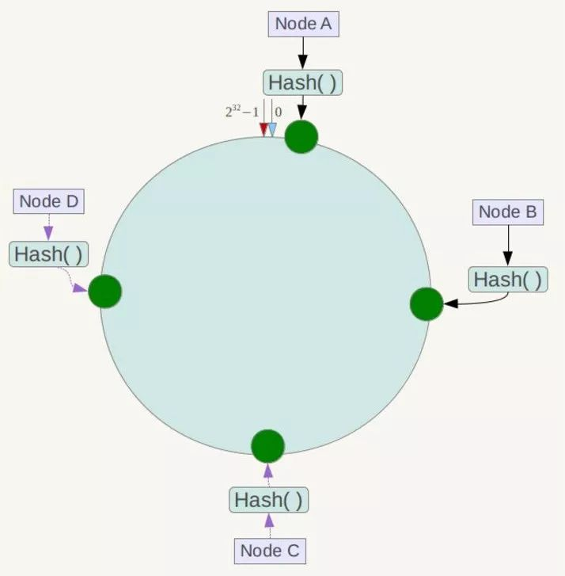

[TOC]

# Redis及缓存

## Redis

### 什么是Redis？redis有什么优缺点

Redis 是基于内存的高性能 key-value 数据库

**优点**：

+ 速度快：因为数据存在内存中，类似于 HashMap ，HashMap 的优势就是查找和操作的时间复杂度都是O (1)
+ 支持丰富数据类型：String ，List，Set，Sorted Set，Hash.这里的数据类型指的是值的数据类型，而键的数据类型只能是字符串
+ 丰富的特性：订阅发布 Pub / Sub 功能，Key 过期策略，事务，支持多个 DB，计数
+ 支持事务
+ 持久化存储

缺点：

+ 由于 Redis 是内存数据库，所以，单台机器，存储的数据量，跟机器本身的内存大小相关。虽然 Redis 本身有 Key 过期策略，但是还是需要提前预估和节约内存。如果内存增长过快，需要定期删除数据
+ 如果进行完整重同步，由于需要生成 RDB 文件，并进行传输，会占用主机的 CPU ，并会消耗现网的带宽。不过 Redis2.8 版本，已经有部分重同步的功能，但是还是有可能有完整重同步的。比如，新上线的备机。
+ 修改配置文件，进行重启，将硬盘中的数据加载进内存，时间比较久。在这个过程中，Redis 不能提供服务。

### Redis的线程模型

redis 内部使用文件事件处理器 file event handler，这个文件事件处理器是单线程的，所以 redis 才叫做单线程的模型。它采用 IO 多路复用机制同时监听多个 socket，将产生事件的 socket 压入内存队列中，事件分派器根据 socket 上的事件类型来选择对应的事件处理器进行处理。

文件事件处理器的结构包含 4 个部分：

+ 多个 socket
+ IO 多路复用程序
+ 文件事件分派器
+ 事件处理器（连接应答处理器、命令请求处理器、命令回复处理器）

多个 socket 可能会并发产生不同的操作，每个操作对应不同的文件事件，但是 IO 多路复用程序会监听多个 socket，会将产生事件的 socket 放入队列中排队，事件分派器每次从队列中取出一个 socket，根据 socket 的事件类型交给对应的事件处理器进行处理

-------

补充：

redis 服务端进程初始化的时候，会将 server socket 的 `AE_READABLE` 事件与连接应答处理器关联。

客户端 socket01 向 redis 进程的 server socket 请求建立连接，此时 server socket 会产生一个 AE_READABLE 事件，IO 多路复用程序监听到 server socket 产生的事件后，将该 socket 压入队列中。文件事件分派器从队列中获取 socket，事件会交给连接应答处理器。创建一个能与客户端通信的 socket01，并将该 socket01 的 `AE_READABLE` 事件与命令请求处理器关联。

假设此时客户端发送了一个 set key value 请求，此时 redis 中的 socket01 会产生 AE_READABLE 事件，IO 多路复用程序将 socket01 压入队列，此时事件分派器从队列中获取到 socket01 产生的 `AE_READABLE` 事件，由于前面 socket01 的 `AE_READABLE` 事件已经与命令请求处理器关联，因此事件分派器将事件交给命令请求处理器来处理。命令请求处理器读取 socket01 的 key value 并在自己内存中完成 key value 的设置。操作完成后，它会将 socket01 的 `AE_WRITABLE` 事件与命令回复处理器关联。

如果此时客户端准备好接收返回结果了，那么 redis 中的 socket01 会产生一个 AE_WRITABLE 事件，同样压入队列中，事件分派器找到相关联的命令回复处理器，由命令回复处理器对 socket01 输入本次操作的一个结果，比如 ok，之后解除 socket01 的 AE_WRITABLE 事件与命令回复处理器的关联。

参考：

<https://github.com/doocs/advanced-java/blob/master/docs/high-concurrency/redis-single-thread-model.md>

### 为什么 Redis 单线程模型也能效率这么高？

+ 纯内存访问，
+ 核心是基于非阻塞的 IO 多路复用机制
+ 单线程避免了多线程的频繁上下文切换问题
+ Redis 全程使用 hash 结构，读取速度快，还有一些特殊的数据结构，对数据存储进行了优化，如压缩表，对短数据进行压缩存储，再如，跳表，使用有序的数据结构加快读取的速度

### Redis为采取单线程的优点与缺点

优点:
1. 单线程可以简化数据结构和算法的实现
2. 单线程避免了线程切换和竞态产生的消耗

缺点：如果某个命令执行时间过长，会阻塞其他命令，因此Redis是面向快速执行场景的数据库

### redis 和 memcached 的区别

+ redis支持更丰富的数据类型（支持更复杂的应用场景）：Redis不仅仅支持简单的k/v类型的数据，同时还提供list，set，zset，hash等数据结构的存储。+ memcache支持简单的数据类型，String。
+ Redis支持数据的持久化，可以将内存中的数据保持在磁盘中，重启的时候可以再次加载进行使用,而Memecache把数据全部存在内存之中。
+ 集群模式：memcached没有原生的集群模式，需要依靠客户端来实现往集群中分片写入数据；但是 redis 目前是原生支持 cluster 模式的.
+ Memcached是多线程，非阻塞IO复用的网络模型；Redis使用单线程（处理命令）的多路 IO 复用模型。

### redis 常见数据结构以及使用场景分析

这里常见的数据结构都是指值，键是不分数据结构的 

1. String：字符串类型可以是String，数字（整数或者浮点数）或者二进制
2. List：链表，存储多个有序的字符串，可以有重复
3. SET：集合，保存多个字符串，并且没有重复
4. Hash：包含键值对的无序散列表
5. Sorted Set：有序的不可重复集合，元素间的顺序由score指定

### 常见数据结构的应用场景
* String
  * 缓存：缓存层加速读写和降低后端压力
  * 计数：利用自增（incr）命令和redis单线程执行命令的特性
  * 共享session：session集中管理
  * 限速（限制访问频率）：也是利用incr命令对某个key的值进行自增，其上界为限制次数
* List
  * 消息队列：lpush+brpop组合可实现阻塞队列
  * 文章列表：每篇文章以hash结构存储，所有文章存入列表中,评论列表
* Set
  * 标签：给用户打上标签，或者给标签添加用户
* Sort Set
  * 排行榜系统，例如根据用户的赞数来排行
* hash
  * 缓存对象，免去了序列化和反序列化的步骤

### redis的内部编码


* String类型
字符串类型的内部编码有三种，Redis根据当前值的类型和长度决定使用哪种内部编码实现。
  * int:8字节的长整型
  * embstr:小于等于39个字节的字符串
  * raw：大于等于39个字节的字符串
* List类型
  当哈希类型的field的个数小于配置值（默认512）并且所有值的大小都小于配置值（默认64字节）时，采用ziplist编码，否则用linkedlist
  * ziplist(压缩列表)
  * linkedlist
* Set类型
  当集合中的元素都是整数且个数小于指定值（默认512），选择inset为内部实现，否则选择hashtable
  * inset(整数集合)
  * hashtable(哈希表)
* Sort Set类型
  当哈希类型的field的个数小于配置值（默认512）并且所有值的大小都小于配置值（默认64字节）时，采用ziplist编码，否则用skiplist编码
  * ziplist
  * skiplist
* hash类型
  当哈希类型的field的个数小于配置值（默认512）并且所有值的大小都小于配置值（默认64字节）时，采用ziplist编码，否则就采用hashtable
  * ziplist
  * hashtable

### Redis如何遍历key

`keys *`可以遍历，但时间太长，可能会造成阻塞

scan可以渐进式的遍历，`scan cursor [match pattern] [count number]` 

cursor是必需的，表示游标，第一次从0开始，，每次scan遍历完都会返回当前游标的值，直到游标值为0，表示遍历结束

match pattern是可选参数，它的作用的是做模式的匹配，类似于keys后面的模式

count number是可选参数，它的作用是表明每次要遍历的键个数，默认
值是10

每次scan返回的值包括两个部分：第一个部分就是下次scan需要的cursor，第二个部分是10个键

Redis提供了面向哈希类型、集合类型、有序集合的扫描遍历命令，分别是hscan、sscan、zscan

### Redis Pipelining

管道

一次请求/响应服务器能实现处理新的请求即使旧的请求还未被响应。这样就可以将多个命令发送到服务器，而不用等待回复，最后在一个步骤中读取该答复

可以用于大量数据插入

### redis过期时间，redis的数据过期策略

redis可以对key设置过期时间，在set key时指定expire time。可以用于验证码的有效期、登录信息定时过期等

过期策略是指当 Redis 中缓存的 key 过期了，Redis 如何处理。

Redis的过期策略是：**定期删除+惰性删除​**

定期删除​就是Redis默认每隔100ms就随机抽取（全局扫描太耗性能）一些设置了过期时间的key，检查其是否过期，如果过期就删除。​

但定期删除由于**随机**可能导致很多过期key到了时间并没有删掉，所以就要用到惰性删除，也就是说，在获取某个key的时候，redis会先检查下，这个key是否已经过期了，如果过期了则删除，不返回任何东西。

但这样​还是会存在问题，也就是如果定期删除漏删了很多过期的key，然后因为没触发惰性删除，就会有大量过期key堆积在内存中，导redis内存耗尽，这时就要走**内存淘汰机制**。

### redis的内存淘汰机制

所谓内存淘汰机制就是指redis所使用的内存达到指定值（redis.conf中使用`maxmemory <bytes>`指定最大内存，如果为0表示内存没有限制）时如何选取淘汰的键值以减小内存

`maxmemory-policy 淘汰机制`指定选用的淘汰机制

redis 提供 6种数据淘汰策略：

+ volatile-lru：从已设置过期时间的集合中挑选最近最少使用的数据淘汰
+ volatile-ttl：从已设置过期时间的集合中挑选将要过期的数据淘汰
+ volatile-random：从已设置过期时间的集合中任意选择数据淘汰
+ allkeys-lru：从所有数据中，移除最近最少使用的key（这个是最常用的）
+ allkeys-random：从所有数据中任意选择数据淘汰
+ no-eviction：直接返回OOM异常

### redis 持久化机制，如何创建快照

持久化数据是将内存数据写入硬盘，主要是为了重用数据，如机器重启、故障后恢复数据，或者是为了将数据备份

持久化主要是做灾难恢复、数据恢复

redis持久化机制：

+ 快照（snapshotting，RDB）：通过创建快照来获得存储在内存里面的数据在某个时间点上的副本。Redis创建快照之后，可以对快照进行备份，可以将快照复制到其他服务器从而创建具有相同数据的服务器副本（Redis主从结构，主要用来提高Redis性能），还可以将快照留在原地以便重启服务器的时候使用。
    快照持久化是Redis默认采用的持久化方式。
    配置：

    ```java
    save 900 1              #在900秒(15分钟)之后，如果至少有1个key发生变化，Redis就会自动触发BGSAVE命令创建快照。
    save 300 10            #在300秒(5分钟)之后，如果至少有10个key发生变化，Redis就会自动触发BGSAVE命令创建快照。
    save 60 10000        #在60秒(1分钟)之后，如果至少有10000个key发生变化，Redis就会自动触发BGSAVE命令创建快照
    ```

+ 只追加文件（append-only file,AOF）:与快照持久化相比，AOF持久化 的实时性更好。配置`appendonly yes`开启AOF。开启AOF持久化后每执行一条会更改Redis中的数据的命令，Redis就会将该命令写入硬盘中的AOF文件，**AOF记录的是命令**。AOF文件的保存位置和RDB文件的位置相同，都是通过dir参数设置的，默认的文件名是appendonly.aof。有3种不同的AOF持久化方式：
  + appendfsync always     每次有数据修改发生时都会写入AOF文件,这样会严重降低Redis的速度
  + appendfsync everysec  每秒钟同步一次，显示地将多个写命令同步到硬盘：推荐，IO读写不会过于频繁，同时数据只可能会丢失1s内的数据
  + appendfsync no      让操作系统决定何时进行同步

    **AOF的缺点**：AOF文件的体积太大。AOF在某个角度可以将数据丢失降低到最小而且对性能影响也很小，但在极端的情况下，体积不断增大的AOF文件很可能会用完硬盘空间。如果AOF体积过大，那么还原操作执行时间就可能会非常长

**优缺点**：

+ RDB
  + RDB生成多个数据文件，表示某个时刻的数据，适合做冷备
  + RDB通过fork子进程来持久化，对Redis影响较小
  + 恢复更快
  + RDB可能会丢失数据，因为通常是每隔5min持久化
+ AOF
  + AOF 可以更好的保护数据不丢失，一般 AOF 会每隔 1 秒，通过一个后台线程执行一次fsync操作
  + 写入性能非常高，而且文件不容易破损
  + AOF 日志文件的命令通过非常可读的方式进行记录，这个特性非常适合做灾难性的误删除的紧急恢复
  + AOF 日志文件通常比 RDB 数据快照文件更大
  + 每秒写入，可能会降低Redis性能

**AOF文件过大解决**：

通过重写来解决，命令`BGREWRITEAOF`，AOF重写时是通过子进程读取数据库状态来建立新的AOF文件，并不是读取旧的AOF的文件。在重写期间，会建立护一个 AOF 重写缓冲区，该缓冲区会在子进程创建新AOF文件期间，记录服务器执行的所有写命令。当子进程完成创建新AOF文件的工作之后，服务器会将重写缓冲区中的所有内容追加到新AOF文件的末尾，使得新旧两个AOF文件所保存的数据库状态一致。最后服务器用新的AOF文件替换旧的AOF文件

通过设定`auto-aof-rewrite-percentage`（AOF文件比上次重写增加的体积，达到这个百分比重写）和`auto-aof-rewrite-min-size`（AOF达到文件大小）指定何时进行AOF重写

redis 4.0后支持RDB和AOF的混合方式。`aof-use-rdb-preamble`开启。如果把混合持久化打开，AOF 重写的时候就直接把 RDB 的内容写到 AOF 文件开头。好处是可以结合 RDB 和 AOF 的优点, 快速加载同时避免丢失过多的数据。缺点： AOF 里面的 RDB 部分是压缩格式不再是 AOF 格式，可读性较差。

**创建快照**：

+ BGSAVE命令： 客户端向Redis发送 BGSAVE命令 来创建一个快照。对于支持BGSAVE命令的平台来说（基本上所有平台支持，除了Windows平台），Redis会调用fork来创建一个子进程，然后子进程负责将快照写入硬盘，而父进程则继续处理命令请求。
+ SAVE命令： 客户端还可以向Redis发送 SAVE命令 来创建一个快照，接到SAVE命令的Redis服务器在快照创建完毕之前不会再响应任何其他命令。SAVE命令不常用，我们通常只会在没有足够内存去执行BGSAVE命令的情况下，又或者即使等待持久化操作执行完毕也无所谓的情况下，才会使用这个命令。
+ save选项： 如果用户设置了save选项（一般会默认设置），比如 save 60 10000，那么从Redis最近一次创建快照之后开始算起，当“60秒之内有10000次写入”这个条件被满足时，Redis就会自动触发BGSAVE命令。
+ SHUTDOWN命令： 当Redis通过SHUTDOWN命令接收到关闭服务器的请求时，或者接收到标准TERM信号时，会执行一个SAVE命令，阻塞所有客户端，不再执行客户端发送的任何命令，并在SAVE命令执行完毕之后关闭服务器。
+ 一个Redis服务器连接到另一个Redis服务器： 当一个Redis服务器连接到另一个Redis服务器，并向对方发送SYNC命令来开始一次复制操作的时候，如果主服务器目前没有执行BGSAVE操作，或者主服务器并非刚刚执行完BGSAVE操作，那么主服务器就会执行BGSAVE命令

### bgsave的原理是什么？

fork和cow，fork是指redis通过创建子进程来进行bgsave操作，cow指的是copy on write，子进程创建后，父子进程共享数据段，父进程继续提供读写服务，写脏的页面数据会逐渐和子进程分离开来。

采用cow技术，暂时使子进程共用父进程的地址空间，并且将子进程的访问权限改为只读。如果当有进程（父进程或者子进程）试图修改其中的某个区域的话，则内核将为这个区域制作一个副本。简单来说，就是子进程拥有父进程虚拟地址空间的副本，并且暂时共享父进程的物理内存，对此内存只拥有只读权限，然后当有进程试图修改这些区域的时候，内核将为子进程制作一个该区域的副本。

### redis 事务

Redis 通过 MULTI、EXEC、WATCH 等命令来实现事务(transaction)功能。事务提供了一种将多个命令请求打包，然后一次性、按顺序地执行多个命令的机制，并且在事务执行期间，服务器不会中断事务而改去执行其他客户端的命令请求，它会将事务中的所有命令都执行完毕，然后才去处理其他客户端的命令请求。

在传统的关系式数据库中，常常用 ACID 性质来检验事务功能的可靠性和安全性。在 Redis 中，事务总是具有原子性（Atomicity)、一致性(Consistency)和隔离性（Isolation），并且当 Redis 运行在某种特定的持久化模式下时，事务也具有持久性（Durability）

### Redis主从

redis 实现高并发主要依靠主从架构，一主多从，单主用来写入数据，单机几万 QPS（每秒查询率），多从用来查询数据，多个从实例可以提供每秒 10w 的 （每秒查询次数）

主从架我：一主多从，主负责写，并且将数据复制到其它的 slave 节点，从节点负责读。所有的读请求全部走从节点

#### Redis Replication（Redis复制）的核心机制

+ Redis 采用异步方式复制数据到 slave 节点
+ 一个 master node 是可以配置多个 slave node 的；
+ slave node 也可以连接其他的 slave node；
+ slave node 做复制的时候，不会 block master node 的正常工作
+ slave node 在做复制的时候，也不会 block 对自己的查询操作，它会用旧的数据集来提供服务；但是复制完成的时候，需要删除旧数据集，加载新数据集，这个时候就会暂停对外服务了
+ slave node 主要用来进行横向扩容，做读写分离，扩容的 slave node 可以提高读的吞吐量

如果采用了主从架构，那么建议必须开启 master node 的持久化，不建议用 slave node 作为 master node 的数据热备，因为那样的话，如果你关掉 master 的持久化，可能在 master 宕机重启的时候数据是空的，然后可能一经过复制， slave node 的数据也丢了

master 的各种备份方案，也需要做。万一本地的所有文件丢失了，从备份中挑选一份 rdb 去恢复 master，这样才能确保启动的时候，是有数据的

#### redis 主从复制的核心原理

+ 当启动一个 slave node 的时候，它会发送一个 PSYNC 命令给 master node
+ 如果这是 slave node 初次连接到 master node，那么会触发一次 full resynchronization 全量复制。此时master会fork一个进程生成RDB快照，同时还会将从客户端 client 新收到的所有写命令缓存在内存中。
+ RDB 文件生成完毕后， master 会将这个 RDB 发送给 slave，slave 会先写入本地磁盘，然后再从本地磁盘加载到内存中，接着 master 会将内存中缓存的写命令发送到 slave，slave 也会同步这些数据。
+ slave node 如果跟 master node 有网络故障，断开了连接，会自动重连，连接之后 master node 仅会复制给 slave 部分缺少的数据

**断点续传**：如果主从复制过程中，网络连接断掉了，那么可以接着上次复制的地方，继续复制下去，而不是从头开始复制一份

master node 会在内存中维护一个 backlog，master 和 slave 都会保存一个 replica offset 还有一个 master run id，offset 就是保存在 backlog 中的。如果 master 和 slave 网络连接断掉了，slave 会让 master 从上次 replica offset 开始继续复制，如果没有找到对应的 offset，那么就会执行一次 resynchronization

在确定master节点时是通过id确定的，如果根据 host+ip 定位 master node，是不靠谱的，如果 master node 重启或者数据出现了变化，那么 slave node 应该根据不同的 run id 区分

master 在内存中直接创建 RDB，然后发送给 slave，不会在自己本地磁盘创建RDB。只需要在配置文件中开启 `repl-diskless-sync yes` 即可

**slave 不会过期 key**，只会等待 master 过期 key。如果 master 过期了一个 key，或者通过 LRU 淘汰了一个 key，那么会模拟一条 del 命令发送给 slav

#### 主从复制完整流程

+ slave node 启动时，会在自己本地保存 master node 的信息，包括 master node 的host和ip，此时复制未完成
+ slave node 内部有个定时任务，每秒检查是否有新的 master node 要连接和复制，如果发现，就跟 master node 建立 socket 网络连接。然后 slave node 发送 ping 命令给 master node。如果 master 设置了 requirepass，那么 slave node 必须发送 masterauth 的口令过去进行认证。master node 第一次执行全量复制，将所有数据发给 slave node。而在后续，master node 持续将写命令，异步复制给 slave node
+ 全量复制：第一次是全量复制
  + master将rdb快照文件发送给 slave node，如果 rdb 复制时间超过 60秒（repl-timeout），那么 slave node 就会认为复制失败，可以适当调大这个参数master node。
  + 在生成 rdb 时，会将所有新的写命令缓存在内存中，在 slave node 保存了 rdb 之后，再将新的写命令复制给 slave node。
  + 如果在复制期间，内存缓冲区持续消耗超过 64MB，或者一次性超过 256MB，那么停止复制，复制失败。
  + slave node 接收到 rdb 之后，清空自己的旧数据，然后重新加载 rdb 到自己的内存中，同时基于旧 的数据版本对外提供服务。
  + 如果 slave node 开启了 AOF，那么会立即执行 BGREWRITEAOF，重写 AOF
+ 增量复制：如果全量复制过程中，网络连接断掉，那么slave重新连接 master 时，会触发增量复制。master 直接从自己的 backlog 中获取部分丢失的数据，发送给slave，默认backlog 就是 1MB。master 就是根据 slave 发送的 psync 中的 offset 来从 backlog 中获取数据的。
+ heartbeat：主从节点互相都会发送 heartbeat 信息。master 默认每隔 10秒 发送一次 heartbeat，slave node 每隔 1秒 发送一个 heartbeat
+ 异步复制：master 每次接收到写命令之后，先在内部写入数据，然后异步发送给 slave node

### Redis高可用（哨兵）

主从架构中若master出问题则无法写数据，所以需要高可用架构，也就是故障转移或者主备切换。在master故障时，将某个 slave自动切换为 master

哨兵主要有以下功能：

+ 集群监控：负责监控 redis master 和 slave 进程是否正常工作。
+ 消息通知：如果某个 redis 实例有故障，那么哨兵负责发送消息作为报警通知给管理员
+ 故障转移：如果 master node 挂掉了，会自动转移到 slave node 上。
+ 配置中心：如果故障转移发生了，通知 client 客户端新的 master 地址

哨兵本身也是分布式的，故障转移时，判断一个 master node 是否宕机了，需要大部分的哨兵都同意才行，涉及到了分布式选举的问题。即使部分哨兵节点挂掉了，哨兵集群还是能正常工作的

**哨兵**：

+ 哨兵至少需要 3 个实例，来保证自己的健壮性。
+ 哨兵 + redis 主从的部署架构，是不保证数据零丢失的，只能保证 redis 集群的高可用性

选举需要至少一半加1个节点，如果是2个哨兵，若有一个哨兵宕机则无法确定新的master，所以至少需要3个

哨兵数最好是奇数个

####  哨兵主备切换的数据丢失问题

主备切换的过程，可能会导致数据丢失：

+ 异步复制导致的数据丢失
  因为 master->slave 的复制是异步的，所以可能有部分数据还没复制到 slave，master 就宕机了，此时这部分数据就丢失了 
+ 脑裂导致的数据丢失：脑裂，也就是说，某个 master 所在机器突然脱离了正常的网络，跟其他 slave 机器不能连接，但是实际上 master 还运行着。此时哨兵可能就会认为 master 宕机了，然后开启选举，将其他 slave 切换成了 master。这个时候，集群里就会有两个 master ，也就是所谓的脑裂。
此时虽然某个 slave 被切换成了 master，但是可能 client 还没来得及切换到新的 master，还继续向旧 master 写数据。因此旧 master 再次恢复的时候，会被作为一个 slave 挂到新的 master 上去，自己的数据会清空，重新从新的 master 复制数据。而新的 master 并没有后来 client 写入的数据，因此，这部分数据也就丢失了

#### 主观下线和客观下线

sdown 是主观宕机，就一个哨兵如果自己觉得一个 master 宕机了，那么就是主观宕机
odown 是客观宕机，如果 quorum 数量的哨兵都觉得一个 master 宕机了，那么就是客观宕机

sdown 达成的条件很简单，如果一个哨兵 ping 一个 master，超过了 down-after-milliseconds 指定的毫秒数之后，就主观认为 master 宕机了；如果一个哨兵在指定时间内，收到了 quorum 数量的其它哨兵也认为那个 master 是 sdown 的，那么就认为是 odown 了。

#### 哨兵流程

Sentinel通过三个定时监控任务完成对各个节点发现和监控：

1. 每隔10秒，每个Sentinel节点会向主节点和从节点发送info命令获取
最新的拓扑结构。向主节点执行info命令，获取从节点的信息，能够感知出新的从节点。节点不可达或者故障转移后，可以通过info命令实时更新节点拓扑信息
2. 每隔2秒，每个Sentinel节点会向Redis数据节点的`__sentinel__:hello`频道上发送该Sentinel节点对于主节点的判断以及当前Sentinel节点的信息，每个Sentinel节点也会订阅该频道，来了解其他
Sentinel节点以及它们对主节点的判断。所以能够通过发布/订阅来发现新的Sentinel节点，通过这个频道实现Sentinel节点之间交换主节点的状态
3. 每隔1秒，每个Sentinel节点会向主节点、从节点、其余Sentinel节点
发送一条ping命令做一次心跳检测，来确认这些节点当前是否可达。这个定时任务是节点失败判定的重要依据

主观下线：

每个Sentinel节点会每隔1秒对主节点、从节点、其他Sentinel节点发送ping命令做心跳检测，当这些节点超过down-after-milliseconds没有进行有效回复，Sentinel节点就会对该节点做失败判定

当Sentinel主观下线的节点是主节点时，该Sentinel节点会通过`sentinel is-master-down-by-addr`命令向其他Sentinel节点询问对主节点的判断，当超过`<quorum>`个数，Sentinel节点认为主节点确实有问题，这时该Sentinel节点会做出客观下线的决定

客观下线后就需要先选取领导者Sentinel节点，采用Raft算法，用于找到一个Sentinel节点作为领导者进行故障转移

Sentinel节点发现自己的票数已经大于等于max（quorum，num（sentinels）/2+1），那么它将成为领导者，也就是超过一半的哨兵同意。

然后该节点执行主备切换，主备切换时会考虑以下信息：

+ 跟 master 断开连接的时长
+ slave 优先级，slave priority 越低，优先级就越高
+ 复制 offset，复制了越多的数据，offset 越靠后，优先级就越高
+ run id：run id 比较小的 slave

quorum指当大于等于这个数的哨兵认为节点下线，则该节点客观下线

### redis集群

但是当数据量过大到一台服务器存放不下的情况时，主从模式或sentinel模式就不能满足需求了，这个时候需要对存储的数据进行分片，将数据存储到多个Redis实例中。cluster模式的出现就是为了解决单机Redis容量有限的问题，将Redis的数据根据一定的规则分配到多台机器。

redis cluster

（1）自动将数据进行分片，每个master上放一部分数据 
（2）提供内置的高可用支持，部分master不可用时，还是可以继续工作的

在redis cluster架构下，每个redis要放开两个端口号，比如一个是6379，另外一个就是加10000的端口号，比如16379

16379端口号是用来进行节点间通信的，也就是cluster bus的东西，集群总线。cluster bus的通信，用来进行故障检测，配置更新，故障转移授权。6379是用于客户端连接的命令端口

#### 集群节点间的内部通信机制

集群元数据的维护有两种方式：集中式、Gossip 协议。redis cluster 节点间采用 gossip 协议进行通信。

+ 集中式：集群元数据（节点信息、故障等等）存储在某个节点上
+ gossip协议：所有节点都持有一份元数据，不同的节点如果出现了元数据的变更，就不断将元数据发送给其它的节点，让其它节点也进行元数据的变更
  每个节点都有一个专门用于节点间通信的端口，就是自己提供服务的端口号+10000。每个节点每隔一段时间都会往另外几个节点发送 ping 消息，同时其它几个节点接收到 ping 之后返回 pong

gossip 协议包含多种消息，包含 ping,pong,meet,fail 等等

+ meet：某个节点发送 meet 给新加入的节点，让新节点加入集群中，然后新节点就会开始与其它节点进行通信。
其实内部就是发送了一个 gossip meet 消息给新加入的节点，通知那个节点去加入我们的集群。
+ ping：每个节点都会频繁给其它节点发送 ping，其中包含自己的状态还有自己维护的集群元数据，互相通过 ping 交换元数据。
+ pong：返回 ping 和 meeet，包含自己的状态和其它信息，也用于信息广播和更新。
+ fail：某个节点判断另一个节点 fail 之后，就发送 fail 给其它节点，通知其它节点说，某个节点宕机啦


**ping 消息**:

ping 时要携带一些元数据，如果很频繁，可能会加重网络负担。

每个节点每秒会执行 10 次 ping，每次会选择 5 个最久没有通信的其它节点。当然如果发现某个节点通信延时达到了 `cluster_node_timeout / 2`，那么立即发送 ping，避免数据交换延时过长，落后的时间太长了。比如说，两个节点之间都 10 分钟没有交换数据了，那么整个集群处于严重的元数据不一致的情况，就会有问题。所以 cluster_node_timeout 可以调节，如果调得比较大，那么会降低 ping 的频率。

每次 ping，会带上自己节点的信息，还有就是带上 1/10 其它节点的信息，发送出去，进行交换。至少包含 3 个其它节点的信息，最多包含 总节点数减 2 个其它节点的信息

#### 分布式寻址算法：一致性hash

由于Redis集群中会有多台Redis，在查询时需要定位到key所属的Redis，这时候可以用Hash，如有3台，可以将key对3取模确定所在的Redis

但如果服务器数量变动时，所有缓存的位置都要发生改变。比如此时增加一台Redis,key需要对5取模，此时缓存的位置要发生改变，所以在一定时间内缓存是失效的，会导致大量缓存重建

**一致性Hash算法**：

一致性Hash算法是对 2^32 取模。一致性Hash算法将整个哈希值空间组织成一个虚拟的圆环，如假设某哈希函数H的值空间为0-2^32-1（即哈希值是一个32位无符号整形），整个哈希环如下：


整个空间按顺时针方向组织，圆环的正上方的点代表0，0点右侧的第一个点代表1，以此类推，2、3、4、5、6……直到 2^32 -1，也就是说0点左侧的第一个点代表 2^32 -1， 0和 2^32 -1在零点中方向重合，我们把这个由2^32个点组成的圆环称为Hash环

下一步将各个服务器使用Hash进行一个哈希，具体可以选择服务器的IP或主机名作为关键字进行哈希，这样每台机器就能确定其在哈希环上的位置

将四台服务器使用IP地址哈希后在环空间的位置如下



下面需要确定数据所在的服务器的位置：将数据key使用相同的函数Hash计算出哈希值，并确定此数据在环上的位置，从此位置沿环顺时针“行走”，第一台遇到的服务器就是其应该定位到的服务器

例如我们有Object A、Object B、Object C、Object D四个数据对象，经过哈希计算后，在环空间上的位置如下。根据一致性Hash算法，数据A会被定为到Node A上，B被定为到Node B上，C被定为到Node C上，D被定为到Node D上


如果一个节点挂了，受影响的数据仅仅是此节点到环空间前一个节点（沿着逆时针方向行走遇到的第一个节点）之间的数据，其它不受影响。比如Node C不幸宕机，可以看到此时对象A、B、D不会受到影响，只有C对象被重定位到Node D。如果在系统中增加一台服务器Node X，此时对象Object A、B、D不受影响，只有对象C需要重定位到新的Node X


但如果服务节点太少时，容易因为节点分部不均匀而造成数据倾斜（被缓存的对象大部分集中缓存在某一台服务器上）问题。一致性 hash 算法引入了**虚拟节点机制**，即对每一个节点计算多个 hash（可以通过在服务器IP或主机名后面增加编号实现），每个计算结果位置都放置一个虚拟节点。这样每台服务器会有多个节点，这样数据就能够相对均匀

参考：

+ <https://zhuanlan.zhihu.com/p/34985026>
+ <https://github.com/doocs/advanced-java/blob/master/docs/high-concurrency/redis-cluster.md>

#### 一致性Hash总结版

一致性Hash也是通过取模实现，是对2^32取模，首先对节点取模（可以用IP或主机名取模），确定节点位置，然后定位数据，对key取模确定key在环中的位置，接着从此位置沿环顺时针“行走”，遇到第一个节点就是key所在的Redis节点。若有节点的增加和删除，只会影响到此节点到前一个节点（逆时针）之间的数据。

通过虚拟节点来解决节点较少时数据分布不均匀的情况

#### Redis cluster的hash slot算法

redis cluster 有固定的 16384 个 hash slot，对每个 key 计算 CRC16 值，然后对 16384 取模，可以获取 key 对应的 hash slot

redis cluster 中每个 master 都会持有部分 slot，比如有 3 个 master，那么可能每个 master 持有 5000 多个 hash slot。hash slot 让 node 的增加和移除很简单，增加一个 master，就将其他 master 的 hash slot 移动部分过去，减少一个 master，就将它的 hash slot 移动到其他 master 上去。移动 hash slot 的成本是非常低的。客户端的 api，可以对指定的数据，让他们走同一个 hash slot，通过 hash tag 来实现

任何一台机器宕机，另外两个节点，不影响的。因为 key 找的是 hash slot

#### redis cluster 的高可用与主备切换原理

1. 判断节点宕机：如果一个节点认为另外一个节点宕机，那么就是 pfail，主观宕机。如果多个节点都认为另外一个节点宕机了，那么就是 fail，客观宕机。
在 cluster-node-timeout 内，某个节点一直没有返回 pong，那么就被认为 pfail。
如果一个节点认为某个节点 pfail 了，那么会在 gossip ping 消息中，ping 给其他节点，如果超过半数的节点都认为 pfail 了，那么就会变成 fail
2. 从节点过滤：对宕机的 master node，从其所有的 slave node 中，选择一个切换成 master node。
    检查每个 slave node 与 master node 断开连接的时间，如果超过了 cluster-node-timeout * cluster-slave-validity-factor，那么就没有资格切换成 master
3. 从节点选举：每个从节点，都根据自己对 master 复制数据的 offset，来设置一个选举时间，offset 越大（复制数据越多）的从节点，选举时间越靠前，优先进行选举。
所有的 master node 开始 slave 选举投票，给要进行选举的 slave 进行投票，如果大部分 master node（N/2 + 1）都投票给了某个从节点，那么选举通过，那个从节点可以切换成 master。
从节点执行主备切换，从节点切换为主节点。

### Redis集群方案应该怎么做？都有哪些方案？

twemproxy：(中间代理)

大概概念是，它类似于一个代理方式，使用方法和普通redis无任何区别，设置好它下属的多个redis实例后，使用时在本需要连接redis的地方改为连接twemproxy，它会以一个代理的身份接收请求并使用一致性hash算法，将请求转接到具体redis，将结果再返回twemproxy。使用方式简便(相对redis只需修改连接端口)，对旧项目扩展的首选。 问题：twemproxy自身单端口实例的压力，使用一致性hash后，对redis节点数量改变时候的计算值的改变，数据无法自动移动到新的节点。

codis：(中间代理)

目前用的最多的集群方案，基本和twemproxy一致的效果，但它支持在 节点数量改变情况下，旧节点数据可恢复到新hash节点。

redis cluster3.0自带的集群：(路由转发)

特点在于他的分布式算法不是一致性hash，而是hash槽的概念，以及自身支持节点设置从节点。具体看官方文档介绍。

在业务代码层实现，起几个毫无关联的redis实例，在代码层，对key 进行hash计算，然后去对应的redis实例操作数据。 这种方式对hash层代码要求比较高，考虑部分包括，节点失效后的替代算法方案，数据震荡后的自动脚本恢复，实例的监控，等等。

### Redis实现消息队列

一般使用 list 结构作为队列，rpush 生产消息，lpop 消费消息。当 lpop 没有消息的时候，要适当 sleep 一会再重试。在消费时可以用blpop，没有消息的时候，它会阻塞住直到消息到来

如果需要生产一次消费多次，可以使用 pub / sub 主题订阅者模式，可以实现 1:N 的消息队列

 pub / sub缺点：在消费者下线的情况下，生产的消息会丢失

  redis 如何实现延时队列：使用 sortedset ，拿时间戳作为 score ，消息内容作为 key 调用 zadd 来生产消息，消费者用 zrangebyscore 指令获取 N 秒之前的数据轮询进行处理。

### Redis与数据库的数据一致性解决方案

#### 数据库与缓存读写模式策略

写完数据库后是否需要马上更新缓存还是直接删除缓存？

1. 如果写数据库的值与更新到缓存值是一样的，不需要经过任何的计算，可以马上更新缓存，但是如果对于那种写数据频繁而读数据少的场景并不合适这种解决方案，因为也许还没有查询就被删除或修改了，这样会浪费时间和资源
2. 如果写数据库的值与更新缓存的值不一致，写入缓存中的数据需要经过几个表的关联计算后得到的结果插入缓存中，那就没有必要马上更新缓存，只有删除缓存即可，等到查询的时候在去把计算后得到的结果插入到缓存中即可。

**所以一般的策略是当更新数据时，先删除缓存数据，然后更新数据库，而不是更新缓存，等要查询的时候才把最新的数据更新到缓存**

#### 数据库与缓存双写情况下导致数据不一致问题

**场景一**

当更新数据时，如更新某商品的库存，当前商品的库存是100，现在要更新为99，先更新数据库更改成99，然后删除缓存，发现删除缓存失败了，这意味着数据库存的是99，而缓存是100，这导致数据库和缓存不一致。

**场景一解决方案**

这种情况应该是先删除缓存，然后在更新数据库，如果删除缓存失败，那就不要更新数据库，如果说删除缓存成功，而更新数据库失败，那查询的时候只是从数据库里查了旧的数据而已，这样就能保持数据库与缓存的一致性。

**场景二**

在高并发的情况下，如果当删除完缓存的时候，这时去更新数据库，但还没有更新完，另外一个请求来查询数据，发现缓存里没有，就去数据库里查，还是以上面商品库存为例，如果数据库中产品的库存是100，那么查询到的库存是100，然后插入缓存，插入完缓存后，原来那个更新数据库的线程把数据库更新为了99，导致数据库与缓存不一致的情况

**场景二解决方案**

遇到这种情况，可以用队列的去解决这个问，创建几个队列，如20个，根据商品的ID去做hash值，然后对队列个数取摸，当有数据更新请求时，先把它丢到队列里去，当更新完后在从队列里去除，如果在更新的过程中，遇到以上场景，先去缓存里看下有没有数据，如果没有，可以先去队列里看是否有相同商品ID在做更新，如果有也把查询的请求发送到队列里去，然后同步等待缓存更新完成。
这里有一个优化点，如果发现队列里有一个查询请求了，那么就不要放新的查询操作进去了，用一个while（true）循环去查询缓存，循环个200MS左右，如果缓存里还没有则直接取数据库的旧数据，一般情况下是可以取到的。


在高并发下解决场景二要注意的问题
（1）读请求时长阻塞
 由于读请求进行了非常轻度的异步化，所以一定要注意读超时的问题，每个读请求必须在超时间内返回，该解决方案最大的风险在于可能数据更新很频繁，导致队列中挤压了大量的更新操作在里面，然后读请求会发生大量的超时，最后导致大量的请求直接走数据库，像遇到这种情况，一般要做好足够的压力测试，如果压力过大，需要根据实际情况添加机器。
（2）请求并发量过高
 这里还是要做好压力测试，多模拟真实场景，并发量在最高的时候QPS多少，扛不住就要多加机器，还有就是做好读写比例是多少
（3）多服务实例部署的请求路由
可能这个服务部署了多个实例，那么必须保证说，执行数据更新操作，以及执行缓存更新操作的请求，都通过nginx服务器路由到相同的服务实例上
（4）热点商品的路由问题，导致请求的倾斜
某些商品的读请求特别高，全部打到了相同的机器的相同丢列里了，可能造成某台服务器压力过大，因为只有在商品数据更新的时候才会清空缓存，然后才会导致读写并发，所以更新频率不是太高的话，这个问题的影响并不是很大，但是确实有可能某些服务器的负载会高一些。

#### 有人推荐先更新数据库，在删除缓存

**这种情况不存在并发问题么？**

不是的。假设这会有两个请求，一个请求A做查询操作，一个请求B做更新操作，那么会有如下情形产生：

（1）缓存刚好失效；

（2）请求A查询数据库，得一个旧值；

（3）请求B将新值写入数据库；

（4）请求B删除缓存；

（5）请求A将查到的旧值写入缓存；

ok，如果发生上述情况，确实是会发生脏数据。

**然而，发生这种情况的概率又有多少呢？**

发生上述情况有一个先天性条件，就是中步骤（3）的写数据库操作比步骤（2）的读数据库操作耗时更短，才有可能使得步骤（4）先于步骤（5）。可是，大家想想，数据库的读操作的速度远快于写操作的（不然做读写分离干嘛，做读写分离的意义就是因为读操作比较快，耗资源少），因此步骤（3）耗时比步骤（2）更短，这一情形很难出现。

假设，有人非要抬杠，有强迫症，一定要解决怎么办？

**如何解决上述并发问题？**

首先，给缓存设有效时间是一种方案。其次，采用策略2（先删除缓存，再更新数据库）里给出的异步延时删除策略，保证读请求完成以后，再进行删除操作。

### Redis-优化详解

1. 尽量使用短的key

2. 避免使用keys *，用scan代替

3. 在存到redis之前先将数据压缩下

   redis为每种数据类型都提供了两种内部编码方式，在不同的情况下redis会自动调整合适的编码方式。

4. 设置key有效期

   我们应该尽可能的利用key有效期。比如一些临时数据（短信校验码），过了有效期Redis就会自动为你清除！

5. 选择回收策略（maxmemory-policy）

   当 Redis 的实例空间被填满了之后，将会尝试回收一部分key。根据你的使用方式，强烈建议使用 volatile-lru（默认）策略——前提是你对key已经设置了超时。但如果你运行的是一些类似于 cache 的东西，并且没有对 key 设置超时机制，可以考虑使用 allkeys-lru 回收机制。maxmemory-samples 3 是说每次进行淘汰的时候 会随机抽取3个key 从里面淘汰最不经常使用的（默认选项）

6. 使用bit位级别操作和byte字节级别操作来减少不必要的内存使用。

   bit位级别操作：GETRANGE, SETRANGE, GETBIT and SETBIT
   byte字节级别操作：GETRANGE and SETRANGE

7. 尽可能地使用hashes哈希存储

8. 当业务场景不需要数据持久化时，关闭所有的持久化方式可以获得最佳的性能。

9. 想要一次添加多条数据的时候可以使用管道。

10. 限制redis的内存大小（64位系统不限制内存，32位系统默认最多使用3GB内存）
    数据量不可预估，并且内存也有限的话，尽量限制下redis使用的内存大小，这样可以避免redis使用swap分区或者出现OOM错误。（使用swap分区，性能较低，如果限制了内存，当到达指定内存之后就不能添加数据了，否则会报OOM错误。可以设置maxmemory-policy，内存不足时删除数据。）

11. SLOWLOG [get/reset/len]

    slowlog-log-slower-than 它决定要对执行时间大于多少微秒(microsecond，1秒 = 1,000,000 微秒)的命令进行记录。
    slowlog-max-len 它决定 slowlog 最多能保存多少条日志，当发现redis性能下降的时候可以查看下是哪些命令导致的。

### Redis 的并发竞争问题如何解决，了解 Redis 事务的 CAS 操作吗

Redis为单进程单线程模式，采用队列模式将并发访问变为串行访问。Redis本身没有锁的概念，Redis对于多个客户端连接并不存在竞争，但是在Jedis客户端对Redis进行并发访问时会发生连接超时、数据转换错误、阻塞、客户端关闭连接等问题，这些问题均是由于客户端连接混乱造成。对此有2种解决方法：

1.客户端角度，为保证每个客户端间正常有序与Redis进行通信，对连接进行池化，同时对客户端读写Redis操作采用内部锁synchronized。

2.服务器角度，利用setnx实现锁。

MULTI，EXEC，DISCARD，WATCH 四个命令是 Redis 事务的四个基础命令。其中：

MULTI，告诉 Redis 服务器开启一个事务。注意，只是开启，而不是执行 

EXEC，告诉 Redis 开始执行事务 

DISCARD，告诉 Redis 取消事务 

WATCH，监视某一个键值对，它的作用是在事务执行之前如果监视的键值被修改，事务会被取消。 

可以利用watch实现cas乐观锁 

#### Redis命令队列

Redis 允许一个客户端不间断执行多条命令：发送 MULTI 后，用户键入多条命令；再发送 EXEC 即可不间断执行之前输入的多条命令。因为，Redis 是单进程单线的工作模式，因此多条命令的执行是不会被中断的。

内部实现不难：Redis 服务器收到来自客户端的 MULTI 命令后，为客户端保存一个命令队列结构体，直到收到 EXEC 后才开始执行命令队列中的命令。

#### 键值的监视

Redis 的官方文档上说，WATCH 命令是为了让 Redis 拥有 check-and-set(CAS) 的特性。CAS 的意思是，一个客户端在修改某个值之前，要检测它是否更改；如果没有更改，修改操作才能成功。

```redis
WATCH key [key ...]
```

#### redis 事务的执行与取消

当用户发出 EXEC 的时候，在它 MULTI 命令之后提交的所有命令都会被执行。从代码的实现来看，如果客户端监视的数据被修改，它会被标记 REDIS_DIRTY_CAS，会调用 discardTransaction() 从而取消该事务。特别的，用户开启一个事务后会提交多个命令，如果命令在入队过程中出现错误，譬如提交的命令本身不存在，参数错误和内存超额等，都会导致客户端被标记 REDIS_DIRTY_EXEC，被标记 REDIS_DIRTY_EXEC 会导致事务被取消。

因此总结一下：

- REDIS_DIRTY_CAS 更改的时候会设置此标记
- REDIS_DIRTY_EXEC 命令入队时出现错误，此标记会导致 EXEC 命令执行失败

被监视的键值被修改或者命令入队出错都会导致事务被取消

#### Redis事务

**原子性**，即一个事务中的所有操作，要么全部完成，要么全部不完成，不会结束在中间某个环节。Redis 事务不支持原子性，最明显的是 Redis 不支持回滚操作。一致性，在事务开始之前和事务结束以后，数据库的完整性没有被破坏。这一点，Redis 事务能够保证。

**隔离性**，当两个或者多个事务并发访问（此处访问指查询和修改的操作）数据库的同一数据时所表现出的相互关系。Redis 不存在多个事务的问题，因为 Redis 是单进程单线程的工作模式。

**持久性**，在事务完成以后，该事务对数据库所作的更改便持久地保存在数据库之中，并且是完全的。Redis 提供两种持久化的方式，即 RDB 和 AOF。RDB 持久化只备份当前内存中的数据集，事务执行完毕时，其数据还在内存中，并未立即写入到磁盘，所以 RDB 持久化不能保证 Redis 事务的持久性。AOF的持久性也是不完整的。

### redis的并发竞争问题如何解决?

Redis为单进程单线程模式，采用队列模式将并发访问变为串行访问。Redis本身没有锁的概念，Redis对于多个客户端连接并不存在竞争，但是在Jedis客户端对Redis进行并发访问时会发生连接超时、数据转换错误、阻塞、客户端关闭连接等问题，这些问题均是

由于客户端连接混乱造成。对此有2种解决方法：

　　　1.客户端角度，为保证每个客户端间正常有序与Redis进行通信，对连接进行池化，同时对客户端读写Redis操作采用内部锁synchronized。

　　　2.服务器角度，利用setnx实现锁。

　　　注：对于第一种，需要应用程序自己处理资源的同步，可以使用的方法比较通俗，可以使用synchronized也可以使用lock；第二种需要用到Redis的setnx命令，但是需要注意一些问题。

### Redis集群方案应该怎么做？都有哪些方案？

twemproxy：(中间代理)

大概概念是，它类似于一个代理方式，使用方法和普通redis无任何区别，设置好它下属的多个redis实例后，使用时在本需要连接redis的地方改为连接twemproxy，它会以一个代理的身份接收请求并使用一致性hash算法，将请求转接到具体redis，将结果再返回twemproxy。使用方式简便(相对redis只需修改连接端口)，对旧项目扩展的首选。 问题：twemproxy自身单端口实例的压力，使用一致性hash后，对redis节点数量改变时候的计算值的改变，数据无法自动移动到新的节点。

codis：(中间代理)

目前用的最多的集群方案，基本和twemproxy一致的效果，但它支持在 节点数量改变情况下，旧节点数据可恢复到新hash节点。

redis cluster3.0自带的集群：(路由转发)

特点在于他的分布式算法不是一致性hash，而是hash槽的概念，以及自身支持节点设置从节点。具体看官方文档介绍。

在业务代码层实现，起几个毫无关联的redis实例，在代码层，对key 进行hash计算，然后去对应的redis实例操作数据。 这种方式对hash层代码要求比较高，考虑部分包括，节点失效后的替代算法方案，数据震荡后的自动脚本恢复，实例的监控，等等。

### Redis支持的Java客户端都有哪些？官方推荐用哪个？

Redisson、Jedis、lettuce等等，官方推荐使用Redisson。

### Redis集群最大节点个数是多少？

16384个。

### Redis集群如何选择数据库？

Redis集群目前无法做数据库选择，默认在0数据库。

### Redis分区有什么缺点？

- 涉及多个key的操作通常不会被支持。例如你不能对两个集合求交集，因为他们可能被存储到不同的Redis实例（实际上这种情况也有办法，但是不能直接使用交集指令）。
- 同时操作多个key,则不能使用Redis事务.
- 分区使用的粒度是key，不能使用一个非常长的排序key存储一个数据集（The partitioning granularity is the key, so it is not possible to shard a dataset with a single huge key like a very big sorted set）.
- 当使用分区的时候，数据处理会非常复杂，例如为了备份你必须从不同的Redis实例和主机同时收集RDB / AOF文件。
- 分区时动态扩容或缩容可能非常复杂。Redis集群在运行时增加或者删除Redis节点，能做到最大程度对用户透明地数据再平衡，但其他一些客户端分区或者代理分区方法则不支持这种特性。然而，有一种预分片的技术也可以较好的解决这个问题。

### Redis持久化数据和缓存怎么做扩容？

- 如果Redis被当做缓存使用，使用一致性哈希实现动态扩容缩容。
- 如果Redis被当做一个持久化存储使用，必须使用固定的keys-to-nodes映射关系，节点的数量一旦确定不能变化。否则的话(即Redis节点需要动态变化的情况），必须使用可以在运行时进行数据再平衡的一套系统，而当前只有Redis集群可以做到这样。

### 分布式Redis是前期做还是后期规模上来了再做好？为什么？

既然Redis是如此的轻量（单实例只使用1M内存）,为防止以后的扩容，最好的办法就是一开始就启动较多实例。即便你只有一台服务器，你也可以一开始就让Redis以分布式的方式运行，使用分区，在同一台服务器上启动多个实例。

一开始就多设置几个Redis实例，例如32或者64个实例，对大多数用户来说这操作起来可能比较麻烦，但是从长久来看做这点牺牲是值得的。

这样的话，当你的数据不断增长，需要更多的Redis服务器时，你需要做的就是仅仅将Redis实例从一台服务迁移到另外一台服务器而已（而不用考虑重新分区的问题）。一旦你添加了另一台服务器，你需要将你一半的Redis实例从第一台机器迁移到第二台机器。

### Twemproxy是什么？

Twemproxy是Twitter维护的（缓存）代理系统，代理Memcached的ASCII协议和Redis协议。它是单线程程序，使用c语言编写，运行起来非常快。它是采用Apache 2.0 license的开源软件。 Twemproxy支持自动分区，如果其代理的其中一个Redis节点不可用时，会自动将该节点排除（这将改变原来的keys-instances的映射关系，所以你应该仅在把Redis当缓存时使用Twemproxy)。 Twemproxy本身不存在单点问题，因为你可以启动多个Twemproxy实例，然后让你的客户端去连接任意一个Twemproxy实例。 Twemproxy是Redis客户端和服务器端的一个中间层，由它来处理分区功能应该不算复杂，并且应该算比较可靠的。

### Redis的内存用完了会发生什么？

如果达到设置的上限，Redis的写命令会返回错误信息（但是读命令还可以正常返回。）或者你可以将Redis当缓存来使用配置淘汰机制，当Redis达到内存上限时会冲刷掉旧的内容。

### Redis是单线程的，如何提高多核CPU的利用率？

可以在同一个服务器部署多个Redis的实例，并把他们当作不同的服务器来使用，在某些时候，无论如何一个服务器是不够的， 所以，如果你想使用多个CPU，你可以考虑一下分片（shard）

### 一个Redis实例最多能存放多少的keys？List、Set、Sorted Set他们最多能存放多少元素？

理论上Redis可以处理多达$2^{32}$的keys，并且在实际中进行了测试，每个实例至少存放了2亿5千万的keys。我们正在测试一些较大的值。

任何list、set、和sorted set都可以放$2^{32}$个元素。

换句话说，Redis的存储极限是系统中的可用内存值。

### 修改配置不重启Redis会实时生效吗？

针对运行实例，有许多配置选项可以通过 CONFIG SET 命令进行修改，而无需执行任何形式的重启。 从 Redis 2.2 开始，可以从 AOF 切换到 RDB 的快照持久性或其他方式而不需要重启 Redis。检索 ‘CONFIG GET *’ 命令获取更多信息。

但偶尔重新启动是必须的，如为升级 Redis 程序到新的版本，或者当你需要修改某些目前 CONFIG 命令还不支持的配置参数的时候。

### Jedis连接池

Jedis实例不是线程安全的,所以不可以多个线程共用一个Jedis实例，但是创建太多的实现也不好因为这意味着会建立很多sokcet连接。  JedisPool是一个线程安全的网络连接池。可以用JedisPool创建一些可靠Jedis实例，可以从池中获取Jedis实例，使用完后再把Jedis实例还回JedisPool。这种方式可以避免创建大量socket连接并且会实现高效的性能. 

### 基于Redission的分布式锁

在分布式环境中，很多场景，如：秒杀、ID生成... 都需要分布式锁。分布式锁的实现，可以基于redis的setnx，zk的临时节点。。。redis官方推荐的方法——redission。

**实现要点**

1. 互斥性，同一时刻，智能有一个客户端持有锁。
2. 防止死锁发生，如果持有锁的客户端崩溃没有主动释放锁，也要保证锁可以正常释放及其他客户端可以正常加锁。
3. 加锁和释放锁必须是同一个客户端。
4. 容错性，只有redis还有节点存活，就可以进行正常的加锁解锁操作

引用的redisson最近发布的版本3.2.3，不同的版本可能实现锁的机制并不相同，早期版本好像是采用简单的setnx，getset等常规命令来配置完成，而后期由于redis支持了脚本Lua变更了实现原理。

setnx需要配合getset以及事务来完成，这样才能比较好的避免死锁问题，而新版本由于支持lua脚本，可以避免使用事务以及操作多个redis命令，语义表达更加清晰一些。

**setnx:Redis Setnx（SET if Not eXists） 命令在指定的 key 不存在时，为 key 设置指定的值。**


**为什么要使用lua语言**
因为一大堆复杂的业务逻辑，可以通过封装在lua脚本中发送给redis，保证这段复杂业务逻辑执行的原子性

lua加锁代码为：

```lua
if (redis.call('exists', KEYS[1]) == 0) then 
        redis.call('hset', KEYS[1], ARGV[2], 1);
         redis.call('pexpire', KEYS[1], ARGV[1]); 
         return nil;
          end;
if (redis.call('hexists', KEYS[1], ARGV[2]) == 1) then
        redis.call('hincrby', KEYS[1], ARGV[2], 1);
        redis.call('pexpire', KEYS[1], ARGV[1]); 
        return nil;
        end;
return redis.call('pttl', KEYS[1]);
```

加锁后：分布式锁key的数据结构为：

```json
key:
{
    加锁的客服端ID：1
}
```

**锁互斥机制**

如果在这个时候，另一个客户端(客户端2)来尝试加锁，执行了同样的一段lua脚本，会怎样呢？

第一个if判断会执行“exists myLock”，发现myLock这个锁key已经存在了。

接着第二个if判断会执行“hexists mylock 客户端id”，来判断myLock锁key的hash数据结构中，是否包含客户端2的ID，但是明显不是的，因为那里包含的是客户端1的ID。

所以，客户端2会获取到pttl myLock返回的一个数字，这个数字代表了myLock这个锁key的剩余生存时间。

比如还剩15000毫秒的生存时间。此时客户端2会进入一个while循环，不停的尝试加锁。

**可重入加锁机制**

分析上面lua代码
第一个if判断不成立，“exists myLock” 会显示锁key已经存在了

第二个if会成立，因为myLock的hash数据结构中包含的客户端1的ID，也就是“8743c9c0-0795-4907-87fd-6c719a6b4586:1”

此时就会执行可重入加锁的逻辑，用incrby这个命令，对客户端1的加锁次数，累加1

**释放锁机制**

Redisson释放锁的lua代码

```lua
if (redis.call('exists', KEYS[1]) == 0) then
       redis.call('publish', KEYS[2], ARGV[1]);
        return 1; 
        end;
if (redis.call('hexists', KEYS[1], ARGV[3]) == 0) then 
     return nil;
     end;
local counter = redis.call('hincrby', KEYS[1], ARGV[3], -1); 
if (counter > 0) then
     redis.call('pexpire', KEYS[1], ARGV[2]); 
     return 0; 
else redis.call('del', KEYS[1]); 
     redis.call('publish', KEYS[2], ARGV[1]); 
     return 1;
     end;
return nil;
```

执行lock.unlock()，就可以释放分布式锁，此时的业务逻辑也是非常简单的。

就是每次都对myLock数据结构中的那个加锁次数减1。如果发现加锁次数是0了，说明这个客户端已经不再持有锁了，此时就会用：“del myLock”命令，从redis里删除这个key。

然后另外的客户端2就可以尝试完成加锁了。

这就是所谓的分布式锁的开源Redisson框架的实现机制。

一般我们在生产系统中，可以用Redisson框架提供的这个类库来基于redis进行分布式锁的加锁与释放锁。

**watch dog自动延期机制**

1、客户端1加锁的锁key默认生存时间才30秒，如果超过了30秒，客户端1还想一直持有这把锁，怎么办呢？

Redisson中客户端1一旦加锁成功，就会启动一个watch dog看门狗，他是一个后台线程，会每隔10秒检查一下，如果客户端1还持有锁key，那么就会不断的延长锁key的生存时间。

2、如果负责存储这个分布式锁的Redission节点宕机后，而且这个锁正好处于锁住的状态时，这个锁会出现锁死的状态，为了避免这种情况的发生，Redisson提供了一个监控锁的看门狗，它的作用是在Redisson实例被关闭前，不断的延长锁的有效期。默认情况下，看门狗的续期时间是30s，也可以通过修改Config.lockWatchdogTimeout来另行指定。

另外Redisson 还提供了可以指定leaseTime参数的加锁方法来指定加锁的时间。超过这个时间后锁便自动解开了。不会延长锁的有效期！！！

**缺点**
最大的问题，就是如果你对某个redis master实例，写入了myLock这种锁key的value，此时会异步复制给对应的master slave实例。但是这个过程中一旦发生redis master宕机，主备切换，redis slave变为了redis master。接着就会导致，客户端2来尝试加锁的时候，在新的redis master上完成了加锁，而客户端1也以为自己成功加了锁。此时就会导致多个客户端对一个分布式锁完成了加锁。这时系统在业务上一定会出现问题，导致脏数据的产生。所以这个就是redis cluster，或者是redis master-slave架构的主从异步复制导致的redis分布式锁的最大缺陷：在redis master实例宕机的时候，可能导致多个客户端同时完成加锁。

### 分布式Session的一致性问题

#### 分布式session

单服务器web应用中，session信息只需存在该服务器中，这是我们前几年最常接触的方式，但是近几年随着分布式系统的流行，单系统已经不能满足日益增长的百万级用户的需求，集群方式部署服务器已在很多公司运用起来，当高并发量的请求到达服务端的时候通过负载均衡的方式分发到集群中的某个服务器，这样就有可能导致同一个用户的多次请求被分发到集群的不同服务器上，就会出现取不到session数据的情况，于是session的共享就成了一个问题。

假设用户包含登录信息的session都记录在第一台web-server上，反向代理如果将请求路由到另一台web-server上，可能就找不到相关信息，而导致用户需要重新登录。

#### 解决方案

##### Session复制

**思路**：多个web-server之间相互同步session，这样每个web-server之间都包含全部的session

**优点**：web-server支持的功能，应用程序不需要修改代码

**不足**：

- session的同步需要数据传输，占**内网带宽**，有时延
- 所有web-server都包含所有session数据，数据量受内存限制，无法水平扩展
- 有更多web-server时要歇菜

##### 客户端存储法

**思路**：服务端存储所有用户的session，内存占用较大，可以将session存储到浏览器cookie中，每个端只要存储一个用户的数据了

**优点**：服务端不需要存储

**缺点**：

- 每次http请求都携带session，占**外网带宽**
- 数据存储在端上，并在网络传输，存在泄漏、篡改、窃取等安全隐患
- session存储的数据大小受cookie限制

“端存储”的方案虽然不常用，但确实是一种思路。

##### 反向代理hash一致性

**思路**：web-server为了保证高可用，有多台冗余，反向代理层能不能做一些事情，让同一个用户的请求保证落在一台web-server上呢？

**方案一：四层代理hash**

反向代理层使用用户ip来做hash，以保证同一个ip的请求落在同一个web-server上

**方案二：七层代理hash**

反向代理使用http协议中的某些业务属性来做hash，例如sid，city_id，user_id等，能够更加灵活的实施hash策略，以保证同一个浏览器用户的请求落在同一个web-server上

**优点**：

- 只需要改nginx配置，不需要修改应用代码
- 负载均衡，只要hash属性是均匀的，多台web-server的负载是均衡的
- 可以支持web-server水平扩展（session同步法是不行的，受内存限制）

**不足**：

- 如果web-server重启，一部分session会丢失，产生业务影响，例如部分用户重新登录
- 如果web-server水平扩展，rehash后session重新分布，也会有一部分用户路由不到正确的session

session一般是有有效期的，所有不足中的两点，可以认为等同于部分session失效，一般问题不大。

对于四层hash还是七层hash，个人推荐前者：**让专业的软件做专业的事情**，反向代理就负责转发，尽量不要引入应用层业务属性，除非不得不这么做（例如，有时候多机房多活需要按照业务属性路由到不同机房的web-server）。

##### 后端统一集中存储

**思路**：将session存储在web-server后端的存储层，数据库或者缓存

**优点**：

- 没有安全隐患
- 可以水平扩展，数据库/缓存水平切分即可
- web-server重启或者扩容都不会有session丢失

**不足**：增加了一次网络调用，并且需要修改应用代码

对于db存储还是cache，个人推荐后者：session读取的频率会很高，数据库压力会比较大。如果有session高可用需求，cache可以做高可用，但大部分情况下session可以丢失，一般也不需要考虑高可用。

## 缓存

### 为什么需要缓存

缓存是存贮数据（使用频繁的数据）的临时地方

使用缓存的目的，就是提升读写性能。而实际业务场景下，更多的是为了提升读性能，带来更好的性能，更高的并发量。

使用缓存能够减小MySQL的读取压力

### 缓存算法有哪些

常见的缓存算法：

+ LRU（least recently used ，最近最少使用)
+ LFU（Least Frequently used ，最不经常使用)
+ FIFO（first in first out ，先进先出)

### 常见的常见的缓存工具和框架有哪些？

+ 本地缓存：Guava LocalCache、Ehcache、Caffeine 。
  Ehcache 的功能更加丰富，Caffeine 的性能要比 Guava LocalCache 好。
+ 分布式缓存：Redis、MemCache、Tair 。
  Redis 最为主流和常用。

### 什么是缓存雪崩缓存击穿如何防止缓存穿透、缓存雪崩和缓存击穿

**缓存雪崩**：

缓存同时大面积失效（过期），后面的请求都落到数据库上，造成数据库短时间内承受大量请求而崩掉

解决办法：
+ 事前：尽量保证整个 redis 集群的高可用性，发现机器宕机尽快补上。选择合适的内存淘汰策略，将过期时间分散。
+ 事中：本地ehcache缓存 + hystrix限流（DB限流）+服务降级，避免MySQL崩掉
+ 事后：利用 redis 持久化机制保存的数据尽快恢复缓存

本地缓存的实时性怎么保证:

+ 引入消息队列。在数据更新时，发布数据更新的消息；而进程中有相应的消费者消费该消息，从而更新本地缓存
+ 设置较短的过期时间，请求时从 DB 重新拉取

每个进程可能会本地缓存相同的数据，导致数据浪费？：方案一，需要配置本地缓存的过期策略和缓存数量上限

**缓存穿透**：

缓存穿透是指查询一条根本不存在的数据，缓存层和存储层都不会命中。

解决办法：

1. 布隆过滤器：将所有可能存在的数据哈希到一个足够大的bitmap中，一个一定不存在的数据会被 这个bitmap拦截掉，从而避免了对底层存储系统的查询压力。用布隆过滤器的逻辑：
    + 根据 KEY 查询缓存。如果存在对应的值，直接返回；如果不存在，继续向下执行。
   + 根据 KEY 查询在缓存 BloomFilter 的值。如果存在值，说明该 KEY 不存在对应的值，直接返回空；如果不存在值，继续向下执行。
    + 查询 DB 对应的值，如果存在，则更新到缓存，并返回该值。如果不存在值，更新到 缓存 BloomFilter 中，并返回空。
2. 缓存空对象：如果一个查询返回的数据为空（不管是数 据不存在，还是系统故障），我们就把这个空结果进行缓存，但它的过期时间会很短，最长不超过五分钟

缓存空对象：适用于1、数据命中不高 2、保证一致性。维护简单但需要过多的缓存空间

布隆过滤器：1、代码维护复杂 2、缓存空间占用小

**缓存击穿**:

缓存击穿，是指某个极度“热点”数据在某个时间点过期时，恰好在这个时间点对这个 KEY 有大量的并发请求过来，这些请求发现缓存过期一般都会从 DB 加载数据并回设到缓存，但是这个时候大并发的请求可能会瞬间 DB 压垮

缓存被“击穿”的问题，和缓存“雪崩“”的区别在于，前者针对某一 KEY 缓存，后者则是很多 KEY 

缓存被“击穿”的问题，和缓存“穿透“”的区别在于，这个 KEY 是真实存在对应的值的

解决：

+ 使用互斥锁：请求发现缓存不存在后，去查询 DB 前，使用分布式锁，保证有且只有一个线程去查询 DB ，并更新到缓存
+ 手动过期：缓存上从不设置过期时间，功能上将过期时间存在 KEY 对应的 VALUE 里，如果发现要过期，通过一个后台的异步线程进行缓存的构建，也就是“手动”过期。通过后台的异步线程，保证有且只有一个线程去查询 DB

### 布隆过滤器

### 缓存和数据库的一致性

## 补充

* Bitmap可以用来做独立用户统计，可以有效节省内存
* Redis的发布订阅机制可以作为简单的消息队列使用


## 问题

* 字典和跳跃表原理分析。
* 事件驱动模型。
* 主从复制原理。
* 集群与分布式。
* 事务原理。
* 线程安全问题。

常见的缓存策略有哪些，如何做到缓存(比如redis)与DB里的数据一致性，你们项目中用到了
https://blog.csdn.net/qq_28740207/article/details/80877079?depth_1-utm_source=distribute.pc_relevant.none-task&utm_source=distribute.pc_relevant.none-task
什么缓存系统，如何设计的。

如何防止缓存击穿和雪崩。

缓存数据过期后的更新如何设计。

redis的list结构相关的操作。

Redis的使用要注意什么，讲讲持久化方式，内存设置，集群的应用和优劣势，淘汰策略等。

当前redis集群有哪些玩法，各自优缺点，场景。

Memcache的原理，哪些数据适合放在缓存中。

redis和memcached 的内存管理的区别。

Redis的并发竞争问题如何解决，了解Redis事务的CAS操作吗。

Redis的选举算法和流程是怎样的。

redis的持久化的机制，aof和rdb的区别。

redis的集群怎么同步的数据的。

知道哪些redis的优化操作。

Reids的主从复制机制原理。

Redis的线程模型是什么。

请思考一个方案，设计一个可以控制缓存总体大小的自动适应的本地缓存。

如何看待缓存的使用（本地缓存，集中式缓存），简述本地缓存和集中式缓存和优缺点。

本地缓存在并发使用时的注意事项。

其他问题：
https://blog.csdn.net/qq_34988624/article/details/86412393