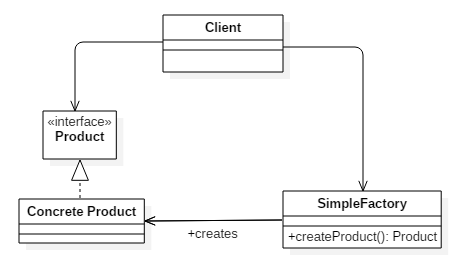
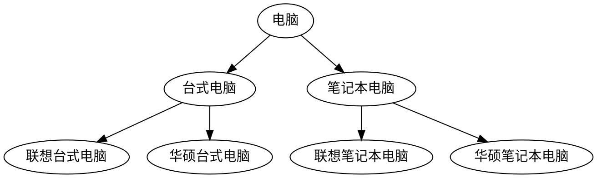
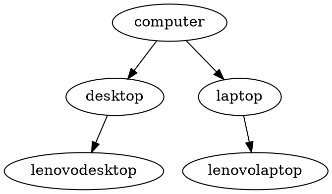

[TOC]

# 设计模式

## 设计原则

+ 单一职责原则：
+ 里氏替换原则：即父类出现的地方子类也可以出现
+ 依赖倒置原则：高层模块不依赖低层模块，两者都应依赖其抽象。抽象不依赖细节，细节依赖抽象
+ 接口隔离原则：接口尽可能细化
+ 迪米特原则：最少知识原则，一个对象对其他对象有最少的了解，只需要知道调用对象的对应的方法
+ 开闭原则：对扩展开放，对修改封闭

## 设计模式的作用

设计模式（Design pattern）是一套被反复使用、多数人知晓的、经过分类编目的、代码设计经验的总结。使用设计模式是为了可重用代码、让代码更容易被他人理解、保证代码可靠性

## 创建型

创建型的设计模式提供对象的创建和管理

### 单例模式

一个类只有一个实例。

懒加载的原因：采用饿汉模式，好处在于空间换时间，以后访问时就不需要再构造对象且无需考虑多线程问题；缺点在于无论是否使用实例对象，都会创建，占据了内存空间

JDK实例：Runtime类

  ```java
  /**
   * Created with IntelliJ IDEA.
   * Description:饿汉式单例
   * 优点：线程安全
   * 缺点：实例创建的时间无法自己控制
   *
   * @author : sxl_lab
   * @date : 2018-11-23
   * time : 21:00
   */
  public class Singleton {
      private static Singleton ourInstance = new   Singleton();
  
       private Singleton() {
          System.out.println("Singleton is created");
      }
  
      public static Singleton getInstance() {
          return ourInstance;
      }
  }
  
  /**
   * 线程安全的懒汉式单例
   * 优点：延迟加载
   * 缺点：使用线程同步，效率太低
   */
  class LazySingleton{
      private static LazySingleton singleton = null;
  
      private LazySingleton() {
          System.out.println("LazySingleton is   created");
      }
  
      // 通过synchronized关键字进行同步，防止对象被多次创  建
      public static synchronized LazySingleton  getInstance(){
          if (singleton == null){
              singleton = new LazySingleton();
          }
          return singleton;
      }
  }
  
  /**
   * 单例的双重检查实现[推荐用]
   * 线程安全；延迟加载；效率较高
   */
  class DoubleCheckLockSingleton{
      // 通过volatile禁止重排序 写在读之前
      private static volatile   DoubleCheckLockSingleton singleton = null;
  
      private DoubleCheckLockSingleton(){
          System.out.println  ("DoubleCheckLockSingleton is created");
      }
  
      public static DoubleCheckLockSingleton   getInstance(){
          if (singleton == null){
              //这里可能有多个线程进入
              synchronized(DoubleCheckLockSingleton.class){
                  //需要再次判断，因为可能有线程进入上层的null判断，可能存在其它线程已经将对象创建完成了，然后其它线程获得了锁，所以这里要重新判断是否为null
                  if (singleton == null){
                      //使用volatile的原因，在构造时并不是原子性的，主要分为3步：1.分配内存空间，2. 在分配的内存上初始化，3. 将变量指向分配的内存空间。问题就在这3步上，第1步没有问题，如果2，3发生重排，也就是3在2之前发生，此时3会导致singleton不为null，但所指向的内存上并未初始化。此时有另外的线程调用此方法，会检测到singleton不为null会直接返回sinleton，此时就会获得一个未初始化的对象
                      singleton = new   DoubleCheckLockSingleton();
                  }
              }
          }
          return singleton;
      }
  }
  
  /**
   * 单例的静态内部类[推荐用]
   * 优点：避免了线程不安全，延迟加载，效率高
   */
  class StaticSingleton{
      //私有构造函数
      private StaticSingleton(){
          System.out.println("StaticSingleton is   created");
      }

      private static class SingletonHolder{
          private static StaticSingleton singleton =   new StaticSingleton();
      }
  
      public static StaticSingleton getInstance(){
          return SingletonHolder.singleton;
      }
  }

  /**
   * 单例的枚举实现
   */
  public enum Singleton{
      INSTANCE;
      private String objName;

      public String getObjName() {
          return objName;
      }
  
      public void setObjName(String objName) {
          this.objName = objName;
      }
      public static void main(String[] args) {
          // 单例测试
          Singleton firstSingleton = Singleton.INSTANCE;
          firstSingleton.setObjName("firstName");
          System.out.println(firstSingleton.getObjName());
          Singleton secondSingleton = Singleton.INSTANCE;
          secondSingleton.setObjName("secondName");
          System.out.println(firstSingleton.getObjName());
          System.out.println(secondSingleton.getObjName());
  
          // 反射获取实例测试
          try {
              Singleton[] enumConstants = Singleton.class.getEnumConstants();
              for (Singleton enumConstant : enumConstants) {
                  System.out.println(enumConstant.getObjName());
              }
          } catch (Exception e) {
              e.printStackTrace();
          }
      }
  }
  /**
   * firstName
   * secondName
   * secondName
   * secondName
   */
  ```

  参见：https://www.cnblogs.com/zhaoyan001/p/6365064.html

项目中用到的单例：用于加载配置文件

### 简单工厂

意图：在创建一个对象时不向客户暴露内部细节，并提供一个创建对象的通用接口。
方法：简单工厂把实例化的操作单独放到一个类中，这个类就成为简单工厂类，让简单工厂类来决定应该用哪个具体子类来实例化。





```java
// 商品接口
public interface Product {
}
// 商品具体子类
public class ConcreteProduct1 implements Product {
}
public class ConcreteProduct2 implements Product {
}
public class ConcreteProduct3 implements Product {
}

// 简单工厂
public class SimpleFactory {
    public Product createProduct(int type) {
        if (type == 1) {
            return new ConcreteProduct1();
        } else if (type == 2) {
            return new ConcreteProduct2();
        }
        return new ConcreteProduct3();
    }
}

// 测试类
public class Client {

    public static void main(String[] args) {
        SimpleFactory simpleFactory = new SimpleFactory();
        Product product = simpleFactory.createProduct(1);
        // do something with the product
    }
}
```

### 工厂模式

定义：通过定义工厂父类负责定义创建对象的公共接口，而子类工厂则负责生成具体的对象。

作用：将类的实例化（具体产品的创建）延迟到工厂类的子类（具体工厂）中完成，即由子类来决定应该实例化（创建）哪一个类。


```java
//产品类同简单工厂模式

// 抽象工厂
public abstract class Factory {
    // 定义创建对象的公共接口
    public abstract Product factoryMethod();
}
// 具体工厂
//每个具体的产品都会有具体的工厂
public class ConcreteFactory extends Factory {
    public Product factoryMethod() {
        return new ConcreteProduct();
    }
}
public class ConcreteFactory1 extends Factory {
    public Product factoryMethod() {
        return new ConcreteProduct1();
    }
}
public class ConcreteFactory2 extends Factory {
    public Product factoryMethod() {
        return new ConcreteProduct2();
    }
}
// 测试类
public class Client {
    public static void main(String[] args) {
        // 创建具体工厂
        Factory factory = new ConcreteFactory();
        // 使用具体工厂的工厂方法创建对象
        Product product = factory.factoryMethod();
        // do something with the product
    }
}
```

### 抽象工厂模式

定义：提供一个创建一系列相关或相互依赖对象的接口，而无须指定它们具体的类；具体的工厂负责实现具体的产品实例。

> 抽象工厂模式与工厂方法模式最大的区别：抽象工厂中每个工厂可以创建多种类的产品；而工厂方法每个工厂只能创建一类


```java
// 抽象产品族类
public interface Product {
}
// 抽象产品类
public abstract class AbstractProductA implements Product{
}
public abstract class AbstractProductB implements Product{
}
// 具体产品类
public class ProductA1 extends AbstractProductA {
}
public class ProductA2 extends AbstractProductA {
}
public class ProductB1 extends AbstractProductB {
}
public class ProductB2 extends AbstractProductB {
}
// 抽象工厂类
public abstract class Factory {
    abstract Product createProductA();
    abstract Product createProductB();
}
// 具体工厂类
public class ConcreteFactory1 extends Factory {
   //当具体到一个产品族时，就是工厂方法模式
    Product createProductA() {
        return new ProductA1();
    }

    Product createProductB() {
        return new ProductB1();
    }
}
// 具体工厂类
public class ConcreteFactory2 extends Factory {
    Product createProductA() {
        return new ProductA2();
    }

    Product createProductB() {
        return new ProductB2();
    }
}
public class Client {
    public static void main(String[] args) {
        Factory factory = new ConcreteFactory1();
        Product productA = abstractFactory.createProductA();
        Product productB = abstractFactory.createProductB();
        // do something with productA and productB
    }
}
```

### 建造者模式(生成器模式)

创建型设计模式，又称生成器模式


```java
class Starbucks {
    private String size;
    private String drink;
    public void setSize(String size) {
        this.size = size;
    }
    public void setDrink(String drink) {
        this.drink = drink;
    }
}
//抽象builder
abstract class StarbucksBuilder {
    protected Starbucks starbucks;
    public Starbucks getStarbucks() {
        return starbucks;
    }
    public void createStarbucks() {
        starbucks = new Starbucks();
        System.out.println("a drink is created");
    }
    public abstract void buildSize();
    public abstract void buildDrink();
}
// 泡茶builder
class TeaBuilder extends StarbucksBuilder {
    public void buildSize() {
        starbucks.setSize("large");
        System.out.println("build large size");
    }
    public void buildDrink() {
        starbucks.setDrink("tea");
        System.out.println("build tea");
    }
}
// 泡咖啡builder
class CoffeeBuilder extends StarbucksBuilder {
    public void buildSize() {
        starbucks.setSize("medium");
        System.out.println("build medium size");
    }
    public void buildDrink() {
        starbucks.setDrink("coffee");
        System.out.println("build coffee");
    }
}
//指导如何封装builder
class Waiter {
    private StarbucksBuilder starbucksBuilder;
    public void setStarbucksBuilder(StarbucksBuilder builder) {
        starbucksBuilder = builder;
    }
    public Starbucks getstarbucksDrink() {
        return starbucksBuilder.getStarbucks();
    }
    public void constructStarbucks() {
        starbucksBuilder.createStarbucks();
        starbucksBuilder.buildDrink();
        starbucksBuilder.buildSize();
    }
}
//客户
public class Customer {
    public static void main(String[] args) {
        Waiter waiter = new Waiter();
        StarbucksBuilder coffeeBuilder = new CoffeeBuilder();
        //也可以用泡茶builder沏茶
        //StarbucksBuilder teaBuilder = new TeaBuilder();
        waiter.setStarbucksBuilder(coffeeBuilder);
        waiter.constructStarbucks();
        //取到饮料
        Starbucks drink = waiter.getstarbucksDrink(); 
    }
}
```

将各个模块的生成放到Builder中，产品的产生是由Director组装完成的

### 原型模式

 用原型实例指定创建对象的种类，并且通过复制这些原型创建新的对象

 

 ```java
//抽象原型
interface Prototype{
    Object cloneSelf();//克隆自身的方法
}
//具体原型
public class SimplePrototype implements Prototype,Cloneable {
    int value;
    //clone()实现
    @Override
    public Object cloneSelf() {
        SimplePrototype self = new SimplePrototype();
        self.value = value;
        return self;
    }
    //使用
    public static void main(String args[]){
        SimplePrototype simplePrototype = new SimplePrototype();
        simplePrototype.value = 500;
        SimplePrototype simplePrototypeClone = (SimplePrototype) simplePrototype.cloneSelf();
        System.out.println(simplePrototypeClone.value);
    }
}
//客户端使用
class Client{
    SimplePrototype prototype;
    public Client(SimplePrototype prototype){
        this.prototype = prototype;
    }
    public Object getPrototype(){
        return prototype.cloneSelf();
    }
}
 ```

 这个模式最简单的就是Java中对象的复制，重写clone方法即可

## 行为型

### 责任链模式

创建多个对象，使这些对象形成一条链，并沿着这条链传递请求，直到链上的某一个对象决定处理此请求。


```java
//抽象的请求处理者
public abstract class Handler {
    private Handler nextHandler;
    private int level;
    public Handler(int level) {
        this.level = level;
    }

    // 处理请求传递，注意final，子类不可重写
    public final void handleMessage(Demand demand) {
        //如果符合处理等级，处理
        if (level == demand.demandLevel()) {
            this.report(demand);
        } else {
            //交给上级处理，直到boss
            if (this.nextHandler != null) {
                System.out.println("事情太严重，需报告上一级");
                this.nextHandler.handleMessage(demand);
            } else {
                System.out.println("我就是boss，没有上头");
            }
        }
    }
    //设置上一级的Handler，如果本对象无法处理，则交给上一级
    public void setNextHandler(Handler handler) {
        this.nextHandler = handler;
    }

    // 抽象方法，子类实现
    public abstract void report(Demand demand);
}
//实际的请求处理者
public class TechnicalManager extends Handler {
    public TechnicalManager() {
        super(1);
    }

    @Override
    public void report(Demand demand) {
        System.out.println("需求：" + demand.detail());
        System.out.println(getClass().getSimpleName() + "：小猿我挺你，这个需求不干");
    }
}

// boss
public class Boss extends Handler {
    public Boss() {
        super(2);
    }

    @Override
    public void report(Demand demand) {
        System.out.println("需求：" + demand.detail());
        System.out.println(getClass().getSimpleName() + "：你们打一架吧，打赢的做决定");
    }
}
public class Client {
    public static void main(String[] args) {
        Demand demandA = new DemandA(); // 请求等级低
        Demand demandB = new DemandB(); // 请求等级高

        Boss boss = new Boss();
        TechnicalManager technicalManager = new TechnicalManager();
        technicalManager.setNextHandler(boss); // 设置下一级
        //这个请求上报给TechnicalManager,能够处理
        technicalManager.handleMessage(demandA);
        System.out.println("============================");
        //这个请求上报给TechnicalManager,不能够处理，交给Boss
        technicalManager.handleMessage(demandB);
    }
}
```

### 命令模式

将一个请求封装成一个对象，从而让你使用不同的请求把客户端参数化，对请求排队或者记录请求日志，可以提供命令的撤销和恢复功能

### 观察者模式

观察者模式又叫做发布-订阅模式，定义了对象间一对多的依赖关系，使得当对象状态发生变化时，所有依赖它的对象都会收到通知并且自动更新自己


```java
public abstract class Subject {

    /**
     * 观察者对象的集合
     */
    private List<Observer> observerList = new ArrayList<>();

    /**
     * 登记观察者
     *
     * @param observer
     */
    public void attach(Observer observer) {
        observerList.add(observer);
        System.out.println("增加了观察者：" + observer.getName());
    }

    /**
     * 删除观察者
     *
     * @param observer
     */
    public void dettach(Observer observer) {
        observerList.remove(observer);
        System.out.println("删除了观察者：" + observer.getName());
    }

    /**
     * 通知所有观察者
     */
    public void notifyObserver() {
        for (Observer observer : observerList) {
            observer.update("灰太狼要搞事情了");
        }
    }

}
//具体被观察者，继承抽象被观察者
public class Wolf extends Subject {

    public void invade(){

        System.out.println("灰太狼：我要搞事情了");
        // 通知所有观察者
        notifyObserver();
    }
}
//具体观察者，实现抽象观察者
public class PleasantSheep implements Observer{

    @Override
    public String getName() {
        return "喜羊羊";
    }

    /**
     * 具体业务逻辑
     */
    @Override
    public void update(String msg) {
        System.out.println("喜羊羊收到通知：" + msg);
    }

}
public class Client {

    public static void main(String[] args) {
        // 灰太狼--被观察者
        Wolf wolf = new Wolf();
        // 喜羊羊--观察者
        Observer pleasantSheep = new PleasantSheep();
        // 登记观察者
        wolf.attach(pleasantSheep);
        // 灰太狼入侵
        wolf.invade();
    }

}
```

优点

1. 观察者和被观察者之间抽象耦合。观察者模式容易扩展，被观察者只持有观察者集合，并不需要知道具体观察者内部的实现。
2. 对象之间的保持高度的协作。当被观察者发生变化时，所有被观察者都会通知到，然后做出相应的动作。

缺点

1. 如果观察者太多，被观察者通知观察者消耗的时间很多，影响系统的性能。
2. 当观察者集合中的某一观察者错误时就会导致系统卡壳，因此一般会采用异步方式。

### 策略

定义一系列算法，封装每个算法，并使它们可以互换。

### 模板方法

目的：定义算法框架，并将一些步骤的实现延迟到子类。
通过模板方法，子类可以重新定义算法的某些步骤，而不用改变算法的结构。


```java
// 抽象模板
public abstract class CaffeineBeverage {
    // 模板方法（一般加上final，不允许被复写）
    final void prepareRecipe() {
        // 调用基本方法
        boilWater();
        brew();
        pourInCup();
        addCondiments();
    }
    // 基本方法
    abstract void brew();
    abstract void addCondiments();
    void boilWater() {
        System.out.println("boilWater");
    }
    void pourInCup() {
        System.out.println("pourInCup");
    }
}
// 具体模板
public class Coffee extends CaffeineBeverage {
    @Override
    void brew() {
        System.out.println("Coffee.brew");
    }

    @Override
    void addCondiments() {
        System.out.println("Coffee.addCondiments");
    }
}
public class Tea extends CaffeineBeverage {
    @Override
    void brew() {
        System.out.println("Tea.brew");
    }

    @Override
    void addCondiments() {
        System.out.println("Tea.addCondiments");
    }
}
// 场景类
public class Client {
    public static void main(String[] args) {
        CaffeineBeverage caffeineBeverage = new Coffee();
        caffeineBeverage.prepareRecipe();
        System.out.println("-----------");
        caffeineBeverage = new Tea();
        caffeineBeverage.prepareRecipe();
    }
}
```

模板方法的优点：

* 封装不变部分，扩展可变部分
* 提取公共部分代码，便于维护
* 行为由父类控制，子类实现

缺点：子类对父类产生了影响，不利于代码阅读

应用场景：

* 多个子类有公共的方法，并且逻辑相同
* 重要复杂的算法可以把核心算法设计为模板方法
* 重构时，经常使用

### 解释器模式

### 迭代器模式

### 中介者模式

### 备忘录模式

### 状态模式

## 结构型

结构型模式(Structural Pattern)描述如何将类或者对象结合在一起形成更大的结构，就像搭积木，可以通过简单积木的组合形成复杂的、功能更为强大的结构

### 适配器模式

把一个类接口转换成另一个用户需要的接口

+ Target目标角色
+ Adaptee源角色
+ Adapter适配器角色

```java
public interface Target {
     //目标角色有自己的方法
     public void request();
}

public class ConcreteTarget implements Target {
     public void request() {
             System.out.println("if you need any help,pls call me!");   }
}

public class Adaptee {
     //原有的业务逻辑
     public void doSomething(){
             System.out.println("I'm kind of busy,leave me alone,pls!");
     }
}

//适配器，适配器需要继承target和adaptee
public class Adapter extends Adaptee implements Target {
     public void request() {
             super.doSomething();
     }
}

public class Client {
     public static void main(String[] args) {
             //原有的业务逻辑
             Target target = new ConcreteTarget();
             target.request();
             //现在增加了适配器角色后的业务逻辑
             Target target2 = new Adapter();
             target2.request();
     }
}
```

如果需要修改已经使用的接口时，可以考虑使用适配器。。比如系统扩展了，需要使用一个已有或新建立的类，但这个类又不符合系统的接口，怎么办？使用适配器模式

适配器应该是在项目修改时使用的。

### 桥接（Bridge）模式

将抽象和实现解耦，使得两者可以独立地变化

桥接模式应对的是由于实际的需要，某个类具有两个或两个以上的维度变化

如



如果按照上面的结构建立，则类的继承结构是



扩展性问题：如果新增平板电脑分类，需要添加 N 个品牌子类。如果新增索尼品牌，其他电脑分类也需要添加相应子类

这样的设计会很臃肿

将电脑类型和电脑品牌分离

```java
public interface Brand {

    void info();

}
class LenovoBrand implements Brand {
    @Override
    public void info() {
        System.out.println("联想");
    }
}
class AsusBrand implements Brand {
    @Override
    public void info() {
        System.out.println("华硕");
    }
}

//电脑
//用组合的方式增加
public abstract class Computer {
    protected Brand brand;
    public Computer(Brand brand) {
        this.brand = brand;

    }
    public void info() {
        this.brand.info();
    }

}
//不同的电脑类型
class Desktop extends Computer {
    public Desktop(Brand brand) {
        super(brand);
    }
    public void info() {
        super.info();
        System.out.println("台式电脑");
    }
}

class Laptop extends Computer {
    public Laptop(Brand brand) {
        super(brand);

    }
    public void info() {
        super.info();
        System.out.println("笔记本电脑");
    }
}
//使用
public class Client {
    public static void main(String[] args) {
        //在构建不同类型的电脑时，只需要传入品牌即可
        Computer computer = new Desktop(new LenovoBrand();
        computer.info();
    }

}
```

这样在增加电脑品牌时不需要为每种类型的电脑都增加一个类。只需要加入一个品牌。同样在增加电脑类型，也不用增加每种品牌的不同类型的电脑。只需要增加一个电脑类型即可


### 组合模式

将对象组合成树形结构来表示“整体/部分”层次关系，允许用户以相同的方式处理单独对象和组合对象

### 装饰模式


动态地给一个对象添加一些额外的职责


+ Component：接口，定义一个抽象接口，真实对象和装饰对象具有相同的接口，以便动态的添加职责。
+ ConcreteComponent：具体的对象。
+ Decorator：装饰类，继承了Component,从外类来扩展Component类的功能，并且持有一个构建引用，进行请求转发。
+ ConcreteDecorator：具体装饰类，用于给实际对象添加职责

```java
public abstract class Component {
     //抽象的方法
     public abstract void operate();
}
public class ConcreteComponent extends Component {
     //具体实现
     @Override
     public void operate() {
             System.out.println("do Something");
     }
}
// 抽象装饰者
public abstract class Decorator extends Component {
    //通常有一个被装饰者对象
     private Component component = null;        
     //通过构造函数传递被修饰者
     public Decorator(Component _component){
             this.component = _component;
     }
     //委托给被修饰者执行
     @Override
     public void operate() {
             this.component.operate();
     }
}
public class ConcreteDecorator1 extends Decorator {
     //定义被修饰者
     public ConcreteDecorator1(Component _component){
             super(_component);
     }
     //定义自己的修饰方法
     private void method1(){
             System.out.println("method1 修饰");
     }     //重写父类的Operation方法
     public void operate(){
             this.method1();
             super.operate();
     }
}
//实际的装饰器
public class ConcreteDecorator2 extends Decorator {
     //定义被修饰者
     public ConcreteDecorator2(Component _component){
             super(_component);
     }
     //定义自己的修饰方法
     private void method2(){
             System.out.println("method2修饰");
     }
     //重写父类的Operation方法
     public void operate(){
             super.operate();
             this.method2();
     }
}
//使用
public class Client {
     public static void main(String[] args) {
             Component component = new ConcreteComponent();
             //第一次修饰
             component = new ConcreteDecorator1(component);
             //第二次修饰
             component = new ConcreteDecorator2(component);
             //修饰后运行
             component.operate();
     }
}
```

典型的就是Java中的IO

InputStream 是抽象组件；

FileInputStream 是 InputStream 的子类，属于具体组件，提供了字节流的输入操作；

FilterInputStream 属于抽象装饰者，装饰者用于装饰组件，为组件提供额外的功能：

+ BufferedInputStream 为 FileInputStream 提供缓存的功能。
+ DataInputStream 装饰者提供了对更多数据类型进行输入的操作，比如 int、double 等基本类型

```java
File file=new File("nio.txt");
FileInputStream fileInputStream=new FileInputStream(file);
BufferedInputStream bufferedInputStream=new BufferedInputStream(fileInputStream);
```

### 外观模式

### 享元模式

### 代理模式

定义：给目标对象提供一个代理对象，并由代理对象控制对目标对象的引用（相当于中介的作用）


应用：

* Spring AOP

#### 静态代理

```java
/**
 * 抽象目标类
 */
public interface Subject {
    public void buyMac();
}

/**
 * 真实目标类
 */
public class RealSubject implements Subject{
    @Override
    public void buyMac() {  
        System.out.println("买一台Mac");
    }  
}
/**
 * 代理类
 * 实现目标类同样的接口
 */
public class Proxy  implements Subject{
  
    @Override
    public void buyMac(){
      //引用并创建真实对象实例，即”我“
      RealSubject realSubject = new RealSubject();
      //调用真实对象的方法，进行代理购买Mac
      realSubject.buyMac();
      //代理对象额外做的操作
      this.WrapMac();
    }

     public void WrapMac(){
      System.out.println("用盒子包装好Mac");
    }
}
/**
 * 场景类
 */
public class ProxyPattern {
    public static void main(String[] args){
    Subject proxy = new Proxy();
    proxy.buyMac();
    }
}
```

#### 动态代理

JDK动态代理的代理类在运行时自动生成，其本质上是借助了反射技术实现的。

```java
/**
 * Description:具体的invocation handler，该invocation handler会被关联到具体的动态代理类（即invoke中的proxy对象）
 */
public class DynamicProxy implements InvocationHandler {
    /**
     * 我们要代理的真实对象(即被代理对象)
     */
    private Object subject;

    public Object createProxy(Object subject){
        this.subject = subject;
        return Proxy.newProxyInstance(this.getClass().getClassLoader(), subject.getClass().getInterfaces(), this);
    }

    /**
     * @param proxy 代表动态生成的代理类的类对象
     * @param method 代表正在执行的方法
     * @param args 代表调用目标方法时传入的参数
     * @return
     * @throws Throwable
     */
    @Override
    public Object invoke(Object proxy, Method method, Object[] args) throws Throwable {
        // 在代理真实对象前我们可以添加一些自己的操作
        System.out.println("before rent house");

        System.out.println("Method:"+method);
        // 当代理对象调用真实对象的方法时，其会自动跳转到代理对象关联的handler对象的invoke方法来进行调用
        method.invoke(subject, args);

        // 在代理真实对象后我们也可以添加一些自己的操作
        System.out.println("after rent house");
        return null;
    }
}
/**
 * Description:客户端类
 */
public class Client {
    public static void main(String[] args) {
        // 创建一个实例对象，即被代理的对象
        Subject realSubject = new RealSubject();

        // 为realSubject创建代理类对象
        Subject proxy = (Subject) new DynamicProxy().createProxy(realSubject);

        // 打印代理类的Class名
        System.out.println(proxy.getClass().getName());

        // 代理执行方法
        proxy.rent();
        proxy.hello("world");
    }
}
```

CGlib动态代理

```java
/**
 * Created with IntelliJ IDEA.
 * Description:需要代理的类
 *
 */
public class RealSubject{
    public void rent() {
        System.out.println("I want to rent my house");
    }

    public void hello(String str) {
        System.out.println("hello:"+str);
    }
}

/**
 * Created with IntelliJ IDEA.
 * Description:CGlib动态代理类
 *
 */
public class CGLibProxy {
    Object subject;

    /**
     * 创建代理类对象
     * @param subject
     * @return
     */
    public Object createProxy(final Object subject){
        this.subject = subject;
        Enhancer enhancer = new Enhancer();
        enhancer.setSuperclass(subject.getClass());
        enhancer.setCallback(new MethodInterceptor() {
            @Override
            public Object intercept(Object o, Method method, Object[] objects, MethodProxy methodProxy) throws Throwable {
                System.out.println("before rent house");
                Object res = method.invoke(subject, objects);
                System.out.println("after rent house");
                return res;
            }
        });
        return enhancer.create();
    }
}

/**
 * Created with IntelliJ IDEA.
 * Description:客户端类
 * 
 */
public class Client {
    public static void main(String[] args) {
        RealSubject realSubject = new RealSubject();
        RealSubject proxy = (RealSubject) new CGLibProxy().createProxy(realSubject);
        proxy.rent();
        proxy.hello("world");
    }
}
```

* 理解 MVC，结合 SpringMVC 回答。
* 理解代理模式，结合 Spring 中的 AOP 回答。
* 分析 JDK 中常用的设计模式，例如装饰者模式、适配器模式、迭代器模式等。

## 比较

### 代理模式和装饰器模式

装饰器模式关注于在一个对象上动态的添加方法，然而代理模式关注于控制对对象的访问

用代理模式，代理类（proxy class）可以对它的客户隐藏一个对象的具体信息。因此，当使用代理模式的时候，我们常常在一个代理类中创建一个对象的实例。并且，当我们使用装饰器模 式的时候，我们通常的做法是将原始对象作为一个参数传给装饰者的构造器

装饰器模式是因为没法在编译器就确定一个对象的功能，需要运行时动态的给对象添加职责，所以只能把对象的功能拆成一个个的小部分，动态组装。装饰器可以多层嵌套

代理模式，侧重于不能直接访问一个对象，只能通过代理来间接访问